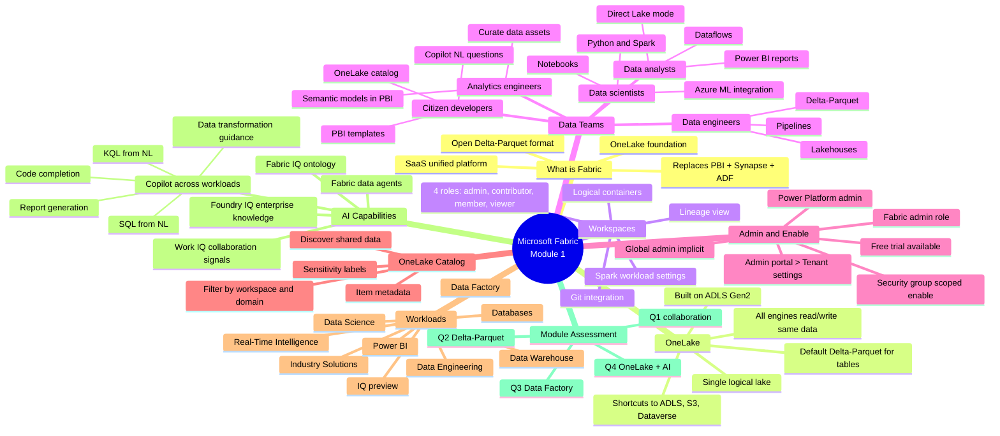

# Module 1 — Fabric End-to-End Analytics · Mind Map

## 🧭 How to view

- **Obsidian**: open this file, Obsidian will render the Mermaid block natively.
- **Web**: paste into <https://mermaid.live> for an editable SVG.
- **Export**: use the Mermaid CLI (`mmdc`) to render PNG/SVG.

## 🔗 Related

- [[_MOC]] — full module index
- [[Unit-1-Introduction]] · [[Unit-2-Explore-Analytics-Fabric]] · [[Unit-3-Data-Teams]] · [[Unit-4-Enable-and-Use-Fabric]] · [[Unit-5-Module-Assessment]] · [[Unit-6-Summary]]