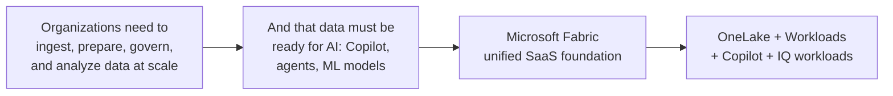

# Unit 1 — Introduction

> [!quote] Source
> Microsoft Learn · Module 1 · Unit 1 · "Introduction"
> <https://learn.microsoft.com/en-us/training/modules/introduction-end-analytics-use-microsoft-fabric/1-introduction/>

## 🎯 Purpose

A short framing unit that sets up the problem Fabric is built to solve before diving into the architecture. Typical opening paragraph introduces the **end-to-end analytics challenge**: ingestion, transformation, governance, and AI-readiness across fragmented tools.

> [!note] Note
> The literal source content for this intro page is minimal — the module officially states "In this module, you'll..." overview text. Treat this unit as **context-setting** and jump to [[Unit-2-Explore-Analytics-Fabric]] for the substantive content.

## 🔑 Key takeaways

- Microsoft Fabric is a **unified SaaS analytics platform** — single product, multiple integrated experiences.
- The platform is built around a **single data lake (OneLake)** that every compute engine reads/writes.
- The module's job is to give you a *bird's-eye view*; deeper architecture & admin topics come in later modules.

## 🧠 Visual

## 🧭 Next

→ [[Unit-2-Explore-Analytics-Fabric]]
← [[_MOC]]