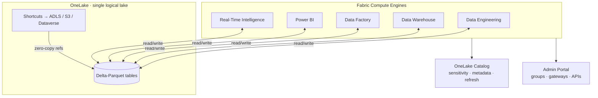

# Unit 2 — Explore end-to-end analytics with Microsoft Fabric

## 🎯 Why this matters

Fabric's value proposition is **a single product replacing a stack of fragmented tools** (Power BI, Azure Synapse, Azure Data Factory, plus governance). The architectural trick: *one* lake, *open* format, *all* engines.

## 🏛️ OneLake

> [!info] Definition
> **OneLake** is Fabric's centralized data storage architecture. It enables collaboration by **eliminating the need to move or copy data between systems**. OneLake unifies your data across regions and clouds into a **single logical lake without moving or duplicating data**.

| Property | Detail |
|----------|--------|
| Foundation | Built on **Azure Data Lake Storage Gen2 (ADLS Gen2)** |
| Supported formats | **Delta**, **Parquet**, **CSV**, **JSON** |
| Default tabular format | **Delta-Parquet** (used by all analytical engines) |
| Multi-region / multi-cloud | Unified logically — **no data movement** |
| Compute engines | Data Engineering, Data Warehouse, Data Factory, Power BI, Real-Time Intelligence all access the same OneLake |

### Shortcuts

> [!tip] Shortcuts
> References to files or storage locations **inside OneLake or in external data sources** such as Azure Data Lake Storage, Amazon S3, or Dataverse.
>
> - Access existing data **without copying** it.
> - Keeps Fabric **in sync with the source**.
> - Foundation of **zero-copy** integration patterns.

### Why this matters for AI

> [!important] Core insight
> Because all Fabric workloads store data in OneLake using an **open format**, AI capabilities (Copilot, data agents) can access the **same governed data** as your reports and dashboards — **without separate data preparation pipelines**.
>
> The work you do to ingest, prepare, and govern data in Fabric is what makes that data **available for AI workloads**.

## 🗂️ Workspaces

> [!info] Definition
> Logical containers that **organize and manage** your data, reports, and other assets. They provide a **clear separation of resources**, making it easier to **control access and maintain security**.

- Each workspace has its **own set of permissions** → only authorized users can view/modify contents.
- Support **team collaboration** + **strict access control** for business and IT users.
- Allow you to **manage compute resources** and **integrate with Git** for version control.
- You can **optimize performance and cost** by configuring compute settings.
- Git integration → **track changes, collaborate on code, maintain history**.

## 🛡️ Administration and governance

> [!info] Centralized
> Fabric's OneLake is **centrally governed and open for collaboration**. Data is **secured and governed in one place**, so users can find and access the data they need.

**Admin portal** centralizes:

- Groups & permissions
- Data sources & gateways
- Usage & performance monitoring
- **Fabric admin APIs and SDKs** → automate tasks, integrate with other systems

**OneLake catalog** supports governance with:

- Sensitivity labels
- Item metadata
- Data refresh status
- Insights + recommended actions

## 🧠 Visual

## 🔑 Key terms (flashcards)

- **OneLake** — Fabric's single, unified data lake built on ADLS Gen2.
- **Shortcut** — A reference (not a copy) to data inside or outside OneLake.
- **Delta-Parquet** — The default open tabular format used by all Fabric engines.
- **Workspace** — A logical container for Fabric items, with its own permissions.
- **OneLake catalog** — The discovery and governance surface for data in Fabric.

## 🧭 Next

→ [[Unit-3-Data-Teams]]
← [[Unit-1-Introduction]]
↑ [[_MOC]]