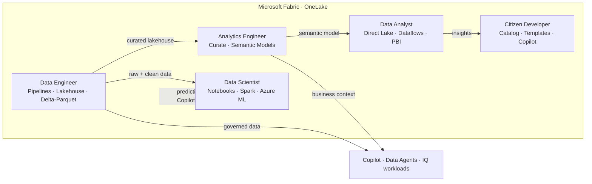
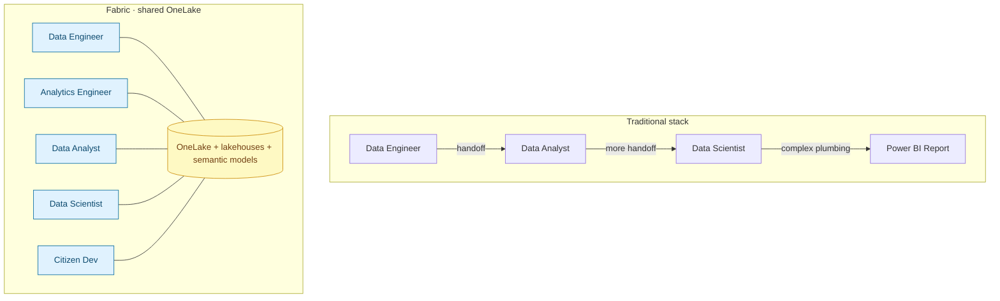

# Unit 3 — Explore data teams and Microsoft Fabric

## 🎯 Why this matters

Fabric's *organizational* value is breaking down role silos. The unit contrasts the **traditional handoff-heavy analytics process** with the **Fabric collaborative model** where each role works on the *same* data in OneLake.

## 🚧 Traditional roles and challenges

> [!warning] Pain points before Fabric

| Role | What they did | Pain |
|------|---------------|------|
| **Data engineer** | Process & curate data for analysts | Heavy coordination, delays, misinterpretation |
| **Data analyst** | Downstream transformations → Power BI reports | Time-consuming, lacks context, disconnected from raw data |
| **Data scientist** | Integrate ML with existing systems | Complex plumbing, hard to ship data-driven insights |

## 🤝 Evolution of collaborative workflows

> [!success] Fabric's promise
> Fabric unifies tools into a **SaaS platform**. Different roles **collaborate effectively without duplicating efforts**.

### Role-by-role

#### 🛠️ Data engineers
- Ingest, transform, load data **directly into OneLake** using **Pipelines** (automated, schedulable).
- Store data in **lakehouses** using the **Delta-Parquet** format — efficient storage + versioning.
- Use **Notebooks** for advanced scripting on complex transformations.

#### 🔗 Analytics engineers
- **Bridge** data engineering and analysis.
- Curate data assets in **lakehouses**, ensure **data quality**, enable **self-service analytics**.
- Create **semantic models in Power BI** to organize and present data effectively.

#### 📊 Data analysts
- Transform data **upstream** using **dataflows**.
- Connect **directly** to OneLake with **Direct Lake mode** → less downstream transformation.
- Build interactive reports more efficiently with **Power BI**.

#### 🔬 Data scientists
- Use **integrated notebooks** (Python + Spark) to build/test ML models.
- Store/access data in **lakehouses**, integrate with **Azure Machine Learning** to operationalize & deploy.
- Their predictions can serve as **grounding data for Copilot and AI agents**.

#### 🧑‍🤝‍🧑 Low-to-no-code users / citizen developers
- Discover curated datasets via the **OneLake catalog**.
- Use **Power BI templates** to spin up reports & dashboards quickly.
- Use **dataflows** for simple ETL — no data engineer required.
- **Ask questions of their data in natural language using Copilot**.

> [!important] Foundation for AI
> Every role contributes to the organization's ability to use AI effectively.
>
> - **Data engineers** who maintain clean, well-governed data in OneLake build the **foundation** that Copilot and AI agents rely on.
> - **Analytics engineers** who create consistent **semantic models** give AI tools the **business context** needed to generate accurate, meaningful answers.

## 🧠 Visual — role map

## 🧠 Visual — before vs after

## 🔑 Key terms (flashcards)

- **Direct Lake mode** — Power BI connects directly to OneLake without import-mode duplication.
- **Semantic model** — A business-friendly abstraction of tables/relationships that Power BI reports consume.
- **Self-service analytics** — Business users build their own reports on curated, governed data.
- **Grounding data** — The high-quality data that an LLM/agent uses as its source of truth.

## 🧭 Next

→ [[Unit-4-Enable-and-Use-Fabric]]
← [[Unit-2-Explore-Analytics-Fabric]]
↑ [[_MOC]]