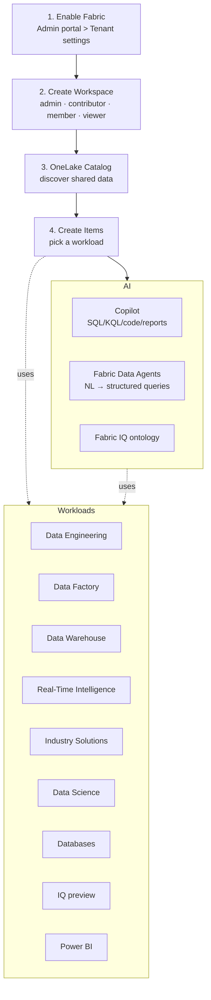
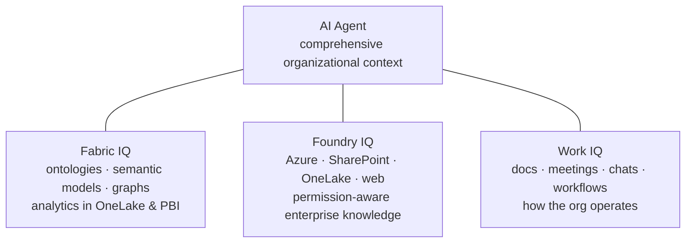

# Unit 4 — Enable and use Microsoft Fabric

> [!quote] Source
> Microsoft Learn · Module 1 · Unit 4 · "Enable and use Microsoft Fabric"
> <https://learn.microsoft.com/en-us/training/modules/introduction-end-analytics-use-microsoft-fabric/4-use-fabric/>

## 🎯 The unit in one sentence

**Get Fabric turned on, build a workspace, find data via OneLake catalog, pick a workload to create your first item, and know what AI features you can use.**

## 👤 Who enables Fabric?

Before exploring end-to-end capabilities, **Fabric must be enabled for your organization**. You usually need to work with IT. Eligible roles:

| Role | Scope |
|------|-------|
| **Fabric administrator** | Manages Fabric settings & configurations |
| **Power Platform administrator** | Oversees Power Platform services, including Fabric |
| **Global administrator** | Has **implicit Fabric admin rights** through organization-wide permissions |

## 🔓 Enable Microsoft Fabric

> [!info] Where
> **Admin portal → Tenant settings** in the Power BI service.

- Enable for the **entire organization** *or* scoped to specific **Microsoft 365 / Microsoft Entra security groups**.
- Admins can **delegate** enablement to other users **at the capacity level**.

> [!tip] Not using Fabric or Power BI yet?
> Sign up for a [free Fabric trial](https://learn.microsoft.com/en-us/fabric/get-started/fabric-trial).

## 🗂️ Create workspaces

> [!info] Definition
> **Workspaces** are **collaborative environments** where you create/manage items like lakehouses, warehouses, and reports.
> All data is stored in **OneLake** and accessed through workspaces. Workspaces also support a **data lineage view** — visual map of data flow & dependencies.

### Workspace settings you can configure

- License type to use Fabric features
- **OneDrive** access for the workspace
- **Azure Data Lake Gen2 Storage** connection
- **Git integration** for version control
- **Spark workload settings** for performance optimization

### Workspace roles

Four roles, applied to **all items** in the workspace → reserve for collaboration.

| Role | Use it for |
|------|------------|
| **Admin** | Full control |
| **Contributor** | Create/edit items |
| **Member** | Contribute + share |
| **Viewer** | Read-only |

> [!warning] Granular access
> For more granular access control, use **item-level permissions** based on business needs.

## 🔎 Discover data with OneLake catalog

> [!info] Purpose
> The **OneLake catalog** helps you **find and access** data sources within your organization. You can explore and connect to data sources, ensuring you have the right data. You only see items **shared with you**.

Discovery tips:

- **Narrow** results by **workspaces** or **domains** (if implemented).
- Explore **default categories** to quickly locate relevant data.
- **Filter** by **keyword** or **item type**.

## 🧱 Create items with Fabric workloads

After creating a Fabric-enabled workspace, you can start creating **items**. Each **workload** in Fabric offers different item types for storing, processing, and analyzing data.

### The 9 workloads

| # | Workload | What it's for |
|---|----------|---------------|
| 1 | **Data Engineering** | Lakehouses + operationalize workflows to build, transform, share data estate |
| 2 | **Data Factory** | **Ingest**, **transform**, **orchestrate** data |
| 3 | **Data Warehouse** | Combine multiple sources in a traditional warehouse for analytics |
| 4 | **Real-Time Intelligence** | Process, monitor, analyze **streaming** data |
| 5 | **Industry Solutions** | Out-of-the-box industry data solutions |
| 6 | **Data Science** | Detect trends, identify outliers, predict values using ML |
| 7 | **Databases** | Create/manage databases with insert/query/extract tools |
| 8 | **IQ (preview)** | Unify data across OneLake, organize by business language using **ontologies**, **graphs**, **semantic models** |
| 9 | **Power BI** | Reports & dashboards for data-driven decisions |

> [!note] Integration story
> Fabric integrates capabilities from existing Microsoft tools — **Power BI**, **Azure Synapse Analytics**, **Azure Data Factory** — into one platform.
> Also supports a **data mesh** architecture → **decentralized data ownership** with **centralized governance**.
> Eliminates the need for direct Azure resource access, simplifying data workflows.

## 🤖 AI capabilities in Microsoft Fabric

Fabric includes features that support **AI development** as well as **AI-powered productivity** across workloads.

### 🧠 Fabric IQ (preview)

> [!info] Definition
> A Fabric workload for **unifying data across OneLake** and organizing it according to the **language of your business**.
>
> Core item: the **ontology** — defines your **business concepts, relationships, and rules** so that AI agents can reason across domains using **consistent business language** rather than raw table schemas.

### The three IQ workloads

> [!important] Three IQs, one goal
> Fabric IQ is **one of three** IQ workloads Microsoft provides to give agents access to different aspects of your organization.

| IQ workload | What it models | Used by agents to... |
|-------------|----------------|---------------------|
| **Fabric IQ** | Business data (ontologies, semantic models, graphs) | Reason over analytics in **OneLake & Power BI** |
| **Foundry IQ** | Structured + unstructured data across **Azure, SharePoint, OneLake, web** | Access **permission-aware enterprise knowledge** |
| **Work IQ** | Collaboration signals from **documents, meetings, chats, workflows** | Get insight into **how your organization operates** |

> [!tip] Use them together
> Each IQ is **standalone** but they can be combined to provide **comprehensive organizational context** for agents.

### 💬 Fabric data agents

> [!info] Definition
> Let you build **conversational interfaces** where users ask questions about organizational data in **natural language**. Agents translate those questions into **structured queries** across your lakehouses, warehouses, and semantic models.

In the Fabric IQ workload, data agents can connect to your **ontology** as a source → understand & use business concepts when answering.

### ✨ Copilot across workloads

> [!info] What it is
> **Microsoft Copilot in Fabric** is a **generative AI assistant** available across **all Fabric workloads**. Helps data professionals and business users complete common tasks more efficiently.

| Capability | What it does |
|------------|--------------|
| **Code completion & generation** | Intelligent code suggestions in notebooks · generates **SQL** from natural language · translates questions into **Kusto Query Language (KQL)** for real-time analysis |
| **Data transformation guidance** | In **Data Factory** — code generation for data transformation + plain-language explanations of complex logic (for citizen and professional wranglers) |
| **Report & insight generation** | In **Power BI** — generates reports automatically, creates page summaries, lets business users ask questions about their data in natural language |

> [!warning] Admin control
> Copilot in Microsoft Fabric is **enabled by default**. Administrators can **disable** Copilot from the **Admin portal → Tenant settings** or control access for specific **security groups** or **at the capacity level**.

## 🧠 Visual — what this unit gave you

## 🧠 Visual — IQ workload triangle

## 🔑 Key terms (flashcards)

- **Capacity** — A Fabric resource allocation that admins can delegate enablement to.
- **Data lineage view** — Visual map of data flow & item dependencies in a workspace.
- **Ontology** — Business-language model of concepts, relationships & rules (Fabric IQ's core item).
- **Data mesh** — Decentralized data ownership with centralized governance (Fabric supports this).
- **KQL (Kusto Query Language)** — Query language for real-time analytics in Fabric.
- **Direct Lake mode** — Power BI reads OneLake data directly, no duplication (see [[Unit-3-Data-Teams]]).
- **Domain** — A grouping of workspaces for catalog filtering & governance.

## 🧭 Next

→ [[Unit-5-Module-Assessment]]
← [[Unit-3-Data-Teams]]
↑ [[_MOC]]