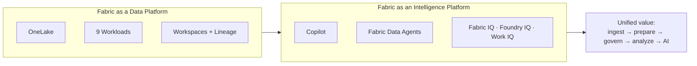

# Unit 6 — Summary

> [!quote] Source
> Microsoft Learn · Module 1 · Unit 6 · "Summary"
> <https://learn.microsoft.com/en-us/training/modules/introduction-end-analytics-use-microsoft-fabric/6-summary/>

## 📝 Verbatim recap

> Organizations need to ingest, prepare, govern, and analyze data at scale. They also need that data to be ready for AI workloads like copilots, agents, and machine learning models.
>
> Microsoft Fabric provides a unified foundation for both. In this module, you explored Fabric's OneLake storage architecture, the workloads that serve different analytics needs, and how data teams collaborate within the platform.
>
> You also learned how AI capabilities build on top of well-governed data. Copilot provides intelligent assistance across every workload, data agents let users query organizational data in natural language, and Fabric IQ is a workload that helps agents reason across domains using consistent business language. Together with Foundry IQ and Work IQ, these capabilities position Fabric as both a data platform **and** an intelligence platform.

## 🧠 Key takeaway diagram

## 🔑 One-paragraph synthesis

Fabric collapses what used to be a stack — Power BI + Synapse + ADF + separate governance tooling — into **one SaaS product** sitting on **OneLake**. Data engineers, analytics engineers, analysts, data scientists, and citizen developers all share that lake, each doing the work that fits their role. On top, **Copilot** speeds up code/SQL/KQL/report work, **data agents** turn natural-language questions into structured queries, and the **IQ workloads** (Fabric, Foundry, Work) give AI agents the business-language, enterprise-knowledge, and collaboration-signal context they need. Result: one platform for data **and** intelligence.

## 📚 Learn more (Microsoft docs)

- [What's new in Microsoft Fabric?](https://learn.microsoft.com/en-us/fabric/fundamentals/whats-new)
- [Migrate to Microsoft Fabric](https://learn.microsoft.com/en-us/fabric/fundamentals/migration)

## 🧭 Done with Module 1

← [[Unit-5-Module-Assessment]]
↑ [[_MOC]]

Next module candidate (per typical DP-600 path): **"Implement a data warehouse with Microsoft Fabric"** or **"Implement a lakehouse with Microsoft Fabric"**.