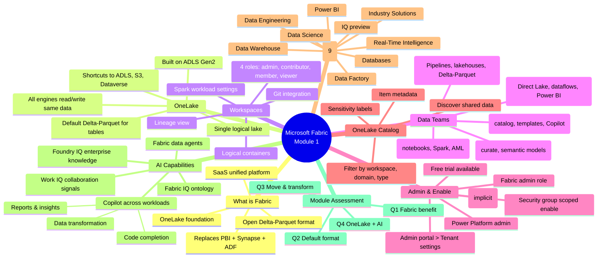

# Module 1 — Introduction to end-to-end analytics using Microsoft Fabric

> [!info] Module map
> This is the foundation module for the **Fabric Analytics Engineer** track. It explains *why* Fabric exists (silos, multiple tools, expensive copy jobs), *what* the platform contains (OneLake + 9 workloads + 3 IQ workloads + Copilot), and *how* to start (enable Fabric → workspace → items).

## 🎯 Learning objectives (synthesized from unit-level goals)

By the end of this module you should be able to:

1. **Describe** Microsoft Fabric as a unified SaaS analytics platform built on a single storage lake (OneLake).
2. **Identify** the roles that benefit from Fabric and explain how collaboration changes across data engineers, analytics engineers, data analysts, data scientists, and citizen developers.
3. **Enable** Microsoft Fabric for an organization and **create** a Fabric-enabled workspace.
4. **Discover** data using the OneLake catalog and **create** items across Fabric workloads.
5. **Explain** how AI capabilities (Copilot, data agents, IQ workloads) layer on top of governed data in OneLake.

## 🧠 Module mind map

> [!tip] How to use
> The mind map below is duplicated as a standalone Mermaid file (`Module-1-Mind-Map.md`) you can open in Obsidian's Mermaid preview or the [Mermaid Live Editor](https://mermaid.live). It is the **single-page view** of the entire module.

## 📑 Unit breakdown

| # | Unit | XP | Minutes | Focus |
|---|------|----|---------|-------|
| 1 | [Introduction](./Unit-1-Introduction.md) | 100 | 2 | Why Fabric exists |
| 2 | [Explore end-to-end analytics with Fabric](./Unit-2-Explore-Analytics-Fabric.md) | 100 | 5 | OneLake, shortcuts, governance |
| 3 | [Explore data teams and Microsoft Fabric](./Unit-3-Data-Teams.md) | 100 | 4 | Roles & collaborative workflows |
| 4 | [Enable and use Microsoft Fabric](./Unit-4-Enable-and-Use-Fabric.md) | 100 | 7 | Admin enable, workspaces, workloads, AI |
| 5 | [Module assessment](./Unit-5-Module-Assessment.md) | 200 | 3 | 4 knowledge-check questions |
| 6 | [Summary](./Unit-6-Summary.md) | 100 | 1 | Recap + learn-more links |

**Total: 700 XP · ~23 minutes**

## 🔗 Knowledge-check answers (unit 5)

| Q | Question | Correct answer |
|---|----------|---------------|
| 1 | What is a key benefit of using Microsoft Fabric in data projects? | **It provides a single, integrated environment for collaboration on data projects.** |
| 2 | What is the default storage format for Fabric's OneLake? | **Delta-Parquet** |
| 3 | Which Fabric experience is used to move and transform data? | **Data Factory** |
| 4 | Why is OneLake's unified storage model important for AI capabilities in Fabric? | **AI tools like Copilot and data agents can access the same governed data without separate preparation pipelines.** |

## 🧭 Downstream links

- [[Unit-1-Introduction]] · [[Unit-2-Explore-Analytics-Fabric]] · [[Unit-3-Data-Teams]] · [[Unit-4-Enable-and-Use-Fabric]] · [[Unit-5-Module-Assessment]] · [[Unit-6-Summary]]
- [[Module-1-Mind-Map]]
- Career/DP-600 index (parent MOC) — *to be created*

## 📚 External references

- Microsoft Learn module page: <https://learn.microsoft.com/en-us/training/modules/introduction-end-analytics-use-microsoft-fabric/>
- Fabric trial: <https://learn.microsoft.com/en-us/fabric/get-started/fabric-trial>
- Workspaces doc: <https://learn.microsoft.com/en-us/fabric/get-started/workspaces>
- Fabric admin docs: <https://learn.microsoft.com/en-us/fabric/admin>