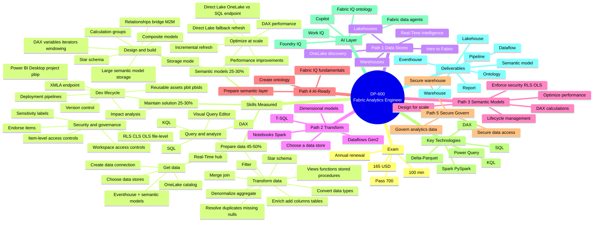

# DP-600 · Fabric Analytics Engineer · Master Mind Map

## 🧭 Related

- [[_MOC]] — DP-600 master index
- [[Study-Guide-Skills-Measured]] — exam-skill-objective breakdown
- [[Change-Log]] — exam version diff
- [[Learning-Paths/Path-1-Explore-Data-Stores]]
- [[Learning-Paths/Path-2-Design-Transform-Data]]
- [[Learning-Paths/Path-3-Design-Manage-Semantic-Models]]
- [[Learning-Paths/Path-4-Prepare-AI-Ready-Data]]
- [[Learning-Paths/Path-5-Secure-Govern-Data]]