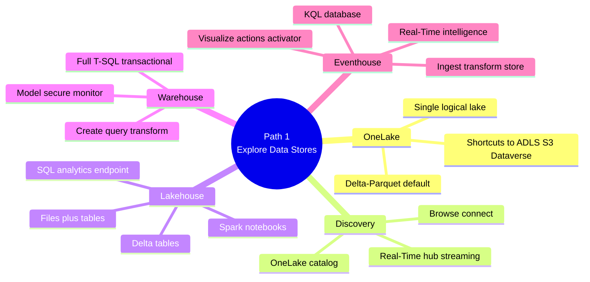

# Learning Path 1 — Explore Analytics Data Stores

> [!info] Why this path
> Establishes the **OneLake foundation** + the **three analytical data stores** (lakehouse, warehouse, eventhouse). You can't prepare data well until you know where it lives.

## 🎯 Outcomes

- Describe Microsoft Fabric's unified analytics platform and OneLake
- Browse, connect, and discover data across the org
- Create and query a lakehouse, warehouse, and eventhouse

## 📋 Prerequisites

- Familiarity with data concepts and terminology

## 📚 Modules

| # | Module | XP | Duration | Units |
|---|--------|----|----------|-------|
| 1 | [Introduction to end-to-end analytics using Microsoft Fabric](https://learn.microsoft.com/en-us/training/modules/introduction-end-analytics-use-microsoft-fabric/) | 700 | 22 min | 6 |
| 2 | [Discover and connect to data in OneLake](https://learn.microsoft.com/en-us/training/modules/discover-data-onelake/) | 800 | 51 min | 7 |
| 3 | [Get started with lakehouses in Microsoft Fabric](https://learn.microsoft.com/en-us/training/modules/get-started-lakehouses/) | 800 | 58 min | 7 |
| 4 | [Get started with data warehouses in Microsoft Fabric](https://learn.microsoft.com/en-us/training/modules/get-started-data-warehouse/) | 1000 | 1h 16m | 9 |
| 5 | [Get started with Real-Time Intelligence in Microsoft Fabric](https://learn.microsoft.com/en-us/training/modules/get-started-kusto-fabric/) | 1100 | 1h 13m | 10 |

**Total: 4,400 XP · 4h 40m**

## 🔍 Module-by-module units

### M1 · Introduction to Fabric ([../01-Module-Intro-to-Fabric/])

Units: Introduction · Explore end-to-end analytics · Data teams · Enable & use Fabric · Assessment · Summary

> [!note] Already documented
> Module 1 has full per-unit notes in `../01-Module-Intro-to-Fabric/_MOC.md`.

### M2 · Discover and connect to data in OneLake

1. Introduction (2 min)
2. Understand OneLake (5 min)
3. Browse and connect to data in OneLake (5 min)
4. Discover streaming data in Real-Time hub (4 min)
5. **Exercise** — Discover and connect to data in OneLake (30 min)
6. Knowledge check (3 min)
7. Summary (2 min)

### M3 · Get started with lakehouses in Microsoft Fabric

1. Introduction (2 min)
2. Describe lakehouse features and capabilities (5 min)
3. Ingest and transform data in a lakehouse (7 min)
4. Query and analyze lakehouse data (7 min)
5. **Exercise** — Create a Microsoft Fabric lakehouse (30 min)
6. Module assessment (5 min)
7. Summary (2 min)

### M4 · Get started with data warehouses in Microsoft Fabric

1. Introduction (3 min)
2. Understand data warehouses (7 min)
3. Understand data warehouses in Fabric (8 min)
4. Query and transform data (6 min)
5. Model data in a warehouse (7 min)
6. Secure and monitor a warehouse (4 min)
7. **Exercise** — Create and query a warehouse (30 min)
8. Module assessment (10 min)
9. Summary (1 min)

### M5 · Get started with Real-Time Intelligence in Microsoft Fabric

1. Introduction (2 min)
2. What is real-time data analytics? (5 min)
3. Real-Time Intelligence in Fabric (8 min)
4. Ingest and transform real-time data (6 min)
5. Store and query real-time data (5 min)
6. Visualize real-time data (2 min)
7. Automate actions (4 min)
8. **Exercise** — Get started with Real-Time Intelligence (30 min)
9. Module assessment (10 min)
10. Summary (1 min)

## 🧠 Path mind map

## 🎯 Exam-objective coverage

| Exam topic | Module |
|------------|--------|
| OneLake catalog | M2 |
| Real-Time hub | M2 |
| Choose data stores (lakehouse/warehouse/eventhouse) | M3, M4, M5 |
| Get data via connections | M2, M3 |
| KQL for real-time | M5 |
| SQL for lakehouse/warehouse | M3, M4 |
| Visual Query Editor | M3, M4 |

## 🔗 Related

- [[../_MOC]] — DP-600 master index
- [[../Study-Guide-Skills-Measured]] — exam objectives
- [[../Learning-Paths/Path-2-Design-Transform-Data]] — next path