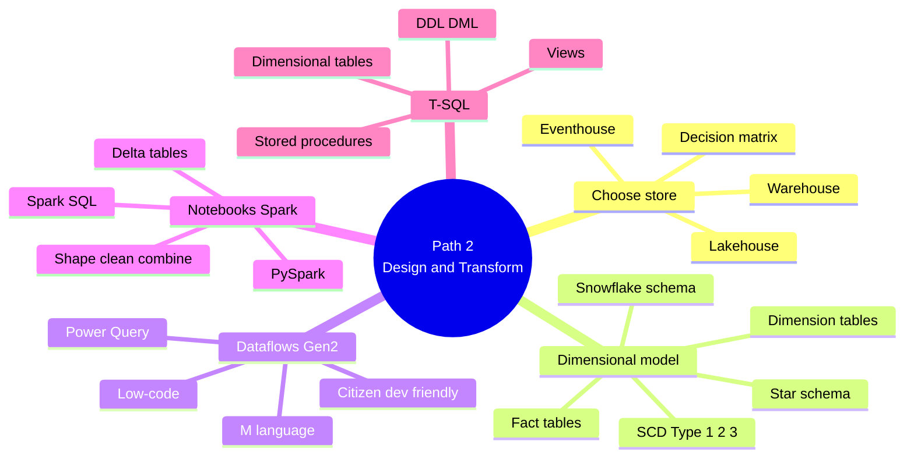

# Learning Path 2 — Design and Transform Analytics Data

> [!info] Why this path
> Covers the **45–50% exam domain "Prepare data"** head-on. Three transformation tools (Dataflows Gen2, Notebooks/Spark, T-SQL) + the dimensional modeling foundation they all build on.

## 🎯 Outcomes

- Choose the right analytical data store for each scenario
- Design star schemas (fact & dimension tables, SCD)
- Apply transformations using Dataflows Gen2 (Power Query), Spark notebooks, and T-SQL

## 📋 Prerequisites

- Experience working with data stores such as lakehouses or warehouses
- Familiarity with SQL query syntax
- Understanding of data modeling concepts (tables, relationships, keys)

## 📚 Modules

| # | Module | XP | Duration | Units |
|---|--------|----|----------|-------|
| 1 | [Choose data stores in Microsoft Fabric](https://learn.microsoft.com/en-us/training/modules/choose-data-store-fabric/) | 1200 | 38 min | 8 |
| 2 | [Design dimensional models for analytics in Microsoft Fabric](https://learn.microsoft.com/en-us/training/modules/design-dimensional-models-fabric/) | 900 | 1h 3m | 8 |
| 3 | [Transform data using Dataflows Gen2 in Microsoft Fabric](https://learn.microsoft.com/en-us/training/modules/fabric-transform-data-dataflows/) | 800 | 1h 1m | 7 |
| 4 | [Transform data using notebooks in Microsoft Fabric](https://learn.microsoft.com/en-us/training/modules/fabric-transform-data-notebooks/) | 900 | 1h 8m | 8 |
| 5 | [Transform data using T-SQL in Microsoft Fabric](https://learn.microsoft.com/en-us/training/modules/fabric-transform-data-tsql/) | 900 | 1h 24m | 8 |

**Total: 4,700 XP · 5h 14m**

## 🔍 Module-by-module units

### M1 · Choose data stores in Microsoft Fabric

1. Introduction (2 min)
2. Describe analytical data store options (6 min)
3. Evaluate lakehouse capabilities (6 min)
4. Evaluate warehouse capabilities (6 min)
5. Evaluate eventhouse capabilities (5 min)
6. **Case study** — Choose data stores for an integrated analytics solution (8 min)
7. Module assessment (3 min)
8. Summary (2 min)

### M2 · Design dimensional models for analytics

1. Introduction (2 min)
2. Describe dimensional schema types (6 min)
3. Design fact tables (7 min)
4. Design dimension tables (6 min)
5. Implement slowly changing dimensions (7 min)
6. **Exercise** — Design and implement a dimensional model (30 min)
7. Knowledge check (3 min)
8. Summary (2 min)

### M3 · Transform data using Dataflows Gen2

1. Introduction (2 min)
2. Understand Dataflows Gen2 (8 min)
3. Transform data with Power Query (10 min)
4. Optimize Dataflows Gen2 performance (6 min)
5. **Exercise** — Transform data with Dataflows Gen2 (30 min)
6. Knowledge check (3 min)
7. Summary (2 min)

### M4 · Transform data using notebooks

1. Introduction (2 min)
2. Describe notebooks in Fabric (5 min)
3. Shape and clean data (10 min)
4. Combine and aggregate data (10 min)
5. Write and size Delta tables (6 min)
6. **Exercise** — Transform data with notebooks (30 min)
7. Knowledge check (3 min)
8. Summary (2 min)

### M5 · Transform data using T-SQL

1. Introduction (2 min)
2. Transform data with T-SQL queries (10 min)
3. Create views for reusable logic (6 min)
4. Build stored procedures (8 min)
5. Implement dimensional tables (8 min)
6. **Exercise** — Transform data with T-SQL (45 min)
7. Knowledge check (3 min)
8. Summary (2 min)

## 🧠 Path mind map

## 🎯 Exam-objective coverage

| Exam topic | Module |
|------------|--------|
| Choose between different data stores | M1 |
| Views, functions, stored procedures | M5 |
| Enrich data — new columns/tables | M3, M4, M5 |
| Star schema for lakehouse/warehouse | M2 |
| Denormalize / aggregate / merge / join | M2, M3, M4, M5 |
| Resolve duplicates, missing, null | M3, M4 |
| Convert column data types | M3, M4 |
| Filter data | M3, M4, M5 |
| Visual Query Editor / SQL | M1, M2, M5 |

## 🔗 Related

- [[../_MOC]]
- [[../Learning-Paths/Path-1-Explore-Data-Stores]] — previous
- [[../Learning-Paths/Path-3-Design-Manage-Semantic-Models]] — next