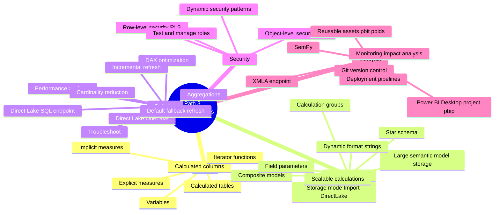

# Learning Path 3 — Design and Manage Semantic Models

> [!info] Why this path
> This is the **deepest path** — it IS the analyst role. Maps directly to the **25–30% "Implement and manage semantic models"** exam domain, and also feeds the dev-lifecycle half of "Maintain a data analytics solution".

## 🎯 Outcomes

- Author DAX calculations (measures, columns, tables, iterators)
- Design semantic models for scale (storage modes, star schema, large models, composite)
- Diagnose and fix performance bottlenecks (Performance analyzer, DAX tuning, aggregations, Direct Lake)
- Implement row-level and object-level security
- Manage lifecycle: reusable assets, Git, XMLA endpoint, deployment pipelines, SemPy, monitoring

## 📋 Prerequisites

- Experience building reports in Power BI
- Familiarity with DAX syntax (measures, calculated columns)
- Understanding of dimensional data modeling

## 📚 Modules

| # | Module | XP | Duration | Units |
|---|--------|----|----------|-------|
| 1 | [Create DAX calculations in semantic models](https://learn.microsoft.com/en-us/training/modules/dax-power-bi-create-calculations/) | 1000 | 1h 25m | 9 |
| 2 | [Design semantic models for scale in Microsoft Fabric](https://learn.microsoft.com/en-us/training/modules/design-semantic-models-scale/) | 900 | 1h 5m | 8 |
| 3 | [Optimize semantic model performance](https://learn.microsoft.com/en-us/training/modules/optimize-semantic-model-performance/) | 1000 | 1h 18m | 9 |
| 4 | [Enforce semantic model security](https://learn.microsoft.com/en-us/training/modules/enforce-semantic-model-security/) | 800 | 1h 7m | 7 |
| 5 | [Manage the semantic model development lifecycle](https://learn.microsoft.com/en-us/training/modules/manage-semantic-model-lifecycle/) | 1000 | 1h 26m | 9 |

**Total: 4,700 XP · 6h 21m**

## 🔍 Module-by-module units

### M1 · Create DAX calculations in semantic models

1. Introduction (2 min)
2. Create calculated tables (8 min)
3. Create calculated columns (6 min)
4. Understand implicit measures (6 min)
5. Create explicit measures (7 min)
6. Use iterator functions (7 min)
7. **Exercise** — Create DAX calculations (45 min)
8. Check your knowledge (3 min)
9. Summary (1 min)

### M2 · Design semantic models for scale

1. Introduction (2 min)
2. Choose a storage mode (7 min)
3. Design star schema for semantic models (7 min)
4. Design scalable calculations (7 min)
5. Configure settings for scale (7 min)
6. **Exercise** — Design a semantic model for scale (30 min)
7. Module assessment (3 min)
8. Summary (2 min)

### M3 · Optimize semantic model performance

1. Introduction (3 min)
2. Use Performance analyzer to diagnose issues (10 min)
3. Optimize DAX calculations (10 min)
4. Reduce cardinality for better performance (6 min)
5. Implement aggregations (8 min)
6. Troubleshoot common performance issues (6 min)
7. **Exercise** — Diagnose and fix a slow report (30 min)
8. Knowledge check (3 min)
9. Summary (2 min)

### M4 · Enforce semantic model security

1. Introduction (3 min)
2. Implement row-level security (12 min)
3. Apply object-level security (8 min)
4. Test security and manage roles (9 min)
5. **Exercise** — Implement RLS for a semantic model (30 min)
6. Module assessment (3 min)
7. Summary (2 min)

### M5 · Manage the semantic model development lifecycle

1. Introduction (2 min)
2. Create reusable Power BI assets (5 min)
3. Manage Power BI content in version control (7 min)
4. Manage semantic models with the XMLA endpoint (9 min)
5. Deploy content through stages (7 min)
6. Maintain and monitor semantic models (6 min)
7. **Exercise** — Manage semantic models through their lifecycle (45 min)
8. Module assessment (3 min)
9. Summary (2 min)

## 🧠 Path mind map

## 🎯 Exam-objective coverage

| Exam topic | Module |
|------------|--------|
| DAX variables, iterators, windowing, information functions | M1, M3 |
| Calculation groups, dynamic format strings, field parameters | M2 |
| Large semantic model storage format | M2 |
| Composite models | M2 |
| Storage mode | M2 |
| Star schema for semantic model | M2 |
| Bridge tables / M2M relationships | M2 |
| Performance improvements in queries/visuals | M3 |
| DAX performance | M3 |
| Direct Lake + fallback + refresh behavior | M3 |
| Direct Lake on OneLake vs SQL endpoint | M3 |
| Incremental refresh | M3 |
| RLS / OLS | M4 |
| Version control for a workspace | M5 |
| `.pbip` | M5 |
| Deployment pipelines | M5 |
| Impact analysis | M5 |
| XMLA endpoint | M5 |
| Reusable assets (`.pbit`, `.pbids`, shared semantic models) | M5 |

## 🔗 Related

- [[../_MOC]]
- [[../Learning-Paths/Path-2-Design-Transform-Data]] — previous
- [[../Learning-Paths/Path-4-Prepare-AI-Ready-Data]] — next