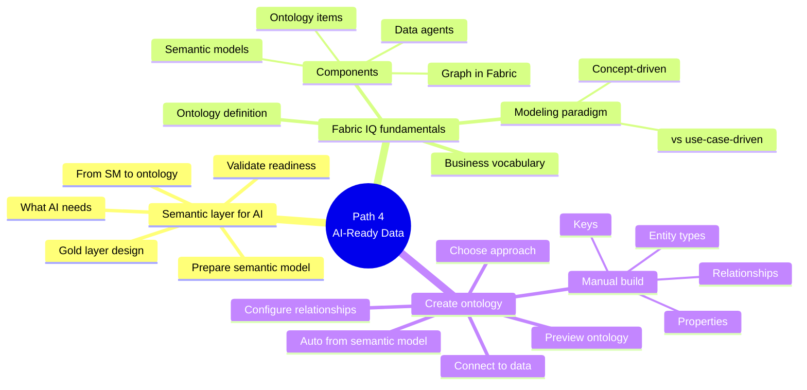

# Learning Path 4 — Prepare AI-Ready Analytics Data

> [!info] Why this path
> The newest path in the curriculum. Covers **Fabric IQ**, **ontologies**, and how to make your gold layer & semantic models AI-ready (Copilot, data agents, enterprise knowledge graph).

## 🎯 Outcomes

- Design gold layers & semantic models that AI agents can consume accurately
- Explain Fabric IQ's ontology-driven modeling
- Build an ontology manually or auto-generate one from a Power BI semantic model
- Connect an ontology to OneLake data sources

## 📋 Prerequisites

- Experience designing and publishing semantic models in Microsoft Fabric
- Familiarity with DAX measures and relationships
- Basic understanding of how AI agents consume structured data

## 📚 Modules

| # | Module | XP | Duration | Units |
|---|--------|----|----------|-------|
| 1 | [Prepare the semantic layer for AI in Microsoft Fabric](https://learn.microsoft.com/en-us/training/modules/fabric-prepare-semantic-layer/) | 1000 | 1h 19m | 9 |
| 2 | [Understand Microsoft Fabric IQ fundamentals](https://learn.microsoft.com/en-us/training/modules/understand-fabric-iq-fundamentals/) | 700 | 37 min | 6 |
| 3 | [Create an ontology with Fabric IQ](https://learn.microsoft.com/en-us/training/modules/create-ontology-with-fabric-iq/) | 1200 | 2h 23m | 11 |

**Total: 2,900 XP · 4h 19m**

## 🔍 Module-by-module units

### M1 · Prepare the semantic layer for AI in Microsoft Fabric

1. Introduction (3 min)
2. Understand what AI needs from your data (8 min)
3. Design gold layers with AI in mind (8 min)
4. Prepare a semantic model for AI (10 min)
5. From semantic models to enterprise ontology (10 min)
6. Validate AI readiness (5 min)
7. **Exercise** — Prepare a semantic model for AI (30 min)
8. Module assessment (3 min)
9. Summary (2 min)

### M2 · Understand Microsoft Fabric IQ fundamentals

1. Introduction (3 min)
2. Get started with Fabric IQ (8 min)
3. Explore Microsoft Fabric IQ components (8 min)
4. Understand the ontology modeling paradigm (10 min)
5. Module assessment (5 min)
6. Summary (3 min)

### M3 · Create an ontology with Fabric IQ

1. Introduction (3 min)
2. Choose an ontology creation approach (7 min)
3. Build an ontology manually (10 min)
4. Generate an ontology from a Power BI semantic model (7 min)
5. Connect an ontology to data (10 min)
6. Configure ontology relationships (8 min)
7. Preview the ontology (5 min)
8. **Exercise** — Build an ontology manually (45 min)
9. **Exercise** — Generate an ontology from a Power BI semantic model (40 min)
10. Module assessment (5 min)
11. Summary (3 min)

## 🧠 Path mind map

## 🎯 Exam-objective coverage

| Exam topic | Module |
|------------|--------|
| OneLake integration for semantic models | M1, M3 |
| Implement & manage semantic models (preparation for AI) | M1 |
| Fabric data agents (understanding) | M2 |

## 🔗 Related

- [[../_MOC]]
- [[../Learning-Paths/Path-3-Design-Manage-Semantic-Models]] — previous
- [[../Learning-Paths/Path-5-Secure-Govern-Data]] — next