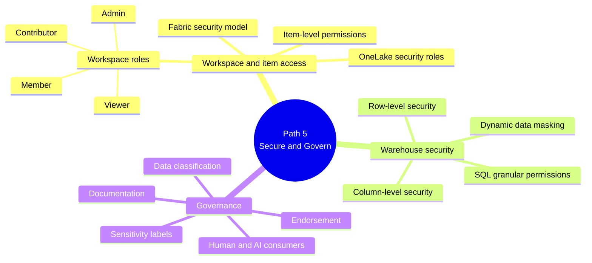

# Learning Path 5 — Secure and Govern Analytics Data

> [!info] Why this path
> Maps directly to the **"Implement security and governance"** sub-domain of **Domain 1 (25–30%)**. Cross-cutting concern — read last so you have the data and modeling context already.

## 🎯 Outcomes

- Configure workspace roles, item permissions, OneLake security roles
- Secure a warehouse (dynamic data masking, RLS, CLS, SQL granular permissions)
- Govern analytics data: classification, sensitivity labels, endorsement, documentation

## 📋 Prerequisites

- Experience administering Microsoft Fabric workspaces
- Familiarity with role-based access control concepts
- Understanding of data sensitivity classification and labeling

## 📚 Modules

| # | Module | XP | Duration | Units |
|---|--------|----|----------|-------|
| 1 | [Secure data access in Microsoft Fabric](https://learn.microsoft.com/en-us/training/modules/secure-data-access-in-fabric/) | 800 | 1h 10m | 7 |
| 2 | [Secure a Microsoft Fabric data warehouse](https://learn.microsoft.com/en-us/training/modules/secure-data-warehouse-in-microsoft-fabric/) | 900 | 1h 14m | 8 |
| 3 | [Govern analytics data in Microsoft Fabric](https://learn.microsoft.com/en-us/training/modules/fabric-govern-analytics-data/) | — | — | — |

**Total: 3h 21m**

## 🔍 Module-by-module units

### M1 · Secure data access in Microsoft Fabric

1. Introduction (2 min)
2. Understand the Fabric security model (3 min)
3. Configure workspace and item permissions (5 min)
4. Apply granular permissions (4 min)
5. **Exercise** — Secure data access in Microsoft Fabric (45 min)
6. Module assessment (10 min)
7. Summary (1 min)

### M2 · Secure a Microsoft Fabric data warehouse

1. Introduction (2 min)
2. Explore dynamic data masking (5 min)
3. Implement row-level security (5 min)
4. Implement column-level security (3 min)
5. Configure SQL granular permissions using T-SQL (4 min)
6. **Exercise** — Secure a warehouse in Microsoft Fabric (45 min)
7. Module assessment (8 min)
8. Summary (2 min)

### M3 · Govern analytics data in Microsoft Fabric

(Full unit list was not returned by the page; typical structure mirrors other Fabric modules: Introduction → classification → sensitivity labels → endorsement → documentation → exercise → assessment → summary)

> [!note] Module-level XP not displayed
> Microsoft Learn did not surface the XP for module 3 on the path overview page.

## 🧠 Path mind map

## 🎯 Exam-objective coverage

| Exam topic | Module |
|------------|--------|
| Workspace-level access controls | M1 |
| Item-level access controls | M1 |
| Row-level, column-level, object-level, file-level | M1, M2 |
| Sensitivity labels | M3 |
| Endorse items | M3 |

## 🔗 Related

- [[../_MOC]]
- [[../Learning-Paths/Path-4-Prepare-AI-Ready-Data]] — previous
- [[../Learning-Paths/Path-1-Explore-Data-Stores]] — back to start