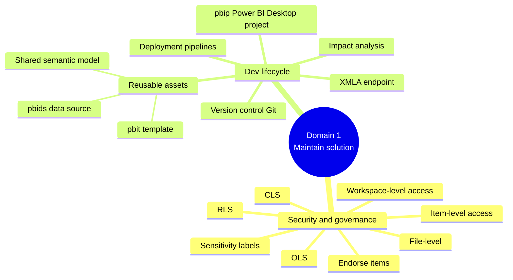

# Domain 1 · Maintain a Data Analytics Solution (25–30%)

> [!quote] Source
> Microsoft Learn · Study guide for Exam DP-600 · Domain 1
> <https://learn.microsoft.com/en-us/credentials/certifications/resources/study-guides/dp-600#maintain-a-data-analytics-solution-2530>

## 📊 What's tested

Two sub-domains:

1. **Implement security and governance**
2. **Maintain the analytics development lifecycle**

## 🔐 1.1 Implement security and governance

| Objective | What it means |
|-----------|---------------|
| Implement **workspace-level** access controls | Admin / Contributor / Member / Viewer roles at workspace scope |
| Implement **item-level** access controls | Permission to a single item (lakehouse, report, semantic model) |
| Implement **row-level, column-level, object-level, file-level** access control | Granular permissions on data inside a model/store |
| Apply **sensitivity labels** to items | Microsoft Purview labels for classification |
| **Endorse** items | Mark items as certified/promoted for discoverability & trust |

## 🔁 1.2 Maintain the analytics development lifecycle

| Objective | What it means |
|-----------|---------------|
| Configure **version control** for a workspace | Git integration for the workspace |
| Create and manage a **Power BI Desktop project (`.pbip`)** | Plain-text folder format for source control |
| Create and configure **deployment pipelines** | Dev → Test → Prod pipelines for content |
| Perform **impact analysis** of downstream dependencies | Lineage + dependency analysis from lakehouses, warehouses, dataflows, semantic models |
| Deploy and manage semantic models via the **XMLA endpoint** | Tabular model XMLA read/write |
| Create and update **reusable assets** | `.pbit` (template), `.pbids` (data source), shared semantic models |

## 📚 Where to study

| Objective | Learning Path · Module |
|-----------|------------------------|
| Workspace-level access | Path 5 · M1 (Secure data access) |
| Item-level access | Path 5 · M1 |
| RLS / CLS / OLS / file-level | Path 5 · M2 (Secure a warehouse) · Path 3 · M4 (Enforce semantic model security) |
| Sensitivity labels · endorse | Path 5 · M3 (Govern analytics data) |
| Version control · `.pbip` · deployment pipelines · impact analysis · XMLA · reusable assets | Path 3 · M5 (Manage the semantic model development lifecycle) |

## 🧠 Mind map

## 🔗 Related

- [[../_MOC]]
- [[../Study-Guide-Skills-Measured]]
- [[Domain-2-Prepare-Data]]
- [[Domain-3-Semantic-Models]]
- [[../Learning-Paths/Path-3-Design-Manage-Semantic-Models]]
- [[../Learning-Paths/Path-5-Secure-Govern-Data]]