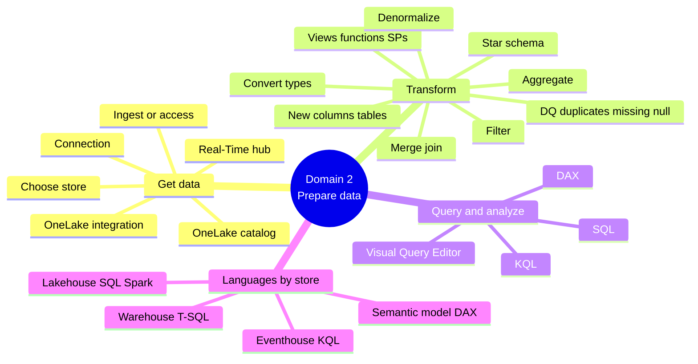

# Domain 2 · Prepare Data (45–50%)

> [!quote] Source
> Microsoft Learn · Study guide for Exam DP-600 · Domain 2
> <https://learn.microsoft.com/en-us/credentials/certifications/resources/study-guides/dp-600#prepare-data-4550>

> [!important] The biggest exam domain
> Nearly **half** the exam is in this domain. If you shortchange one area, don't make it this one.

## 📊 What's tested

Three sub-domains:

1. **Get data**
2. **Transform data**
3. **Query and analyze data**

## 📥 2.1 Get data

| Objective | What it means |
|-----------|---------------|
| Create a **data connection** | Wire up a source via connector / pipeline / dataflow |
| Discover data via **OneLake catalog** and **Real-Time hub** | Browse & find existing data assets |
| **Ingest or access** data as needed | Bring it in (copy/ingest) or reference it (shortcut) |
| **Choose between different data stores** | Lakehouse vs warehouse vs eventhouse |
| Implement **OneLake integration for Eventhouse and semantic models** | OneLake shortcuts → KQL database; OneLake → semantic model |

## 🔄 2.2 Transform data

| Objective | What it means |
|-----------|---------------|
| Create **views, functions, stored procedures** | Reusable logic at the warehouse / SQL endpoint |
| Enrich data by adding **new columns or tables** | Derived columns, lookup tables |
| Implement a **star schema** for lakehouse/warehouse | Fact + dimension tables |
| **Denormalize** data | Flatten joins for performance |
| **Aggregate** data | Roll-ups, summarization |
| **Merge or join** data | Combine tables |
| Identify and resolve **duplicate data, missing data, null values** | Data quality |
| **Convert column data types** | Cast / type safety |
| **Filter** data | WHERE / Power Query filter / KQL where |

## 🔎 2.3 Query and analyze data

Four languages × four engines:

| Tool | Use it for |
|------|------------|
| **Visual Query Editor** | Low-code data shaping in dataflows / Power BI |
| **SQL** | Lakehouse SQL analytics endpoint, warehouse |
| **KQL** | Eventhouse, Real-Time Intelligence |
| **DAX** | Semantic model measures, calculated columns |

> [!tip] Memorize the language → store mapping
> | Store | Primary query language |
> |-------|------------------------|
> | Lakehouse | SQL (analytics endpoint), Spark |
> | Warehouse | T-SQL |
> | Eventhouse | KQL |
> | Semantic model | DAX |

## 📚 Where to study

| Objective | Learning Path · Module |
|-----------|------------------------|
| Data connection, OneLake catalog, Real-Time hub | Path 1 · M2 (Discover & connect in OneLake) |
| Choose between data stores | Path 2 · M1 (Choose data stores) |
| OneLake integration for Eventhouse & semantic models | Path 4 · M1, M3 |
| Views / functions / stored procedures / star schema / denormalize / aggregate / join / filter | Path 2 · M2 (Dimensional models) + M5 (T-SQL) |
| Enrich (new columns/tables) · convert types · resolve DQ issues | Path 2 · M3 (Dataflows Gen2) + M4 (Notebooks) |
| Visual Query Editor | Path 2 · M3 |
| SQL | Path 2 · M2/M5 + Path 1 · M3/M4 |
| KQL | Path 1 · M5 (Real-Time Intelligence) |
| DAX | Path 3 · M1 (Create DAX calculations) |

## 🧠 Mind map

## 🔗 Related

- [[../_MOC]]
- [[../Study-Guide-Skills-Measured]]
- [[Domain-1-Maintain-Solution]]
- [[Domain-3-Semantic-Models]]
- [[../Learning-Paths/Path-1-Explore-Data-Stores]]
- [[../Learning-Paths/Path-2-Design-Transform-Data]]
- [[../Learning-Paths/Path-4-Prepare-AI-Ready-Data]]