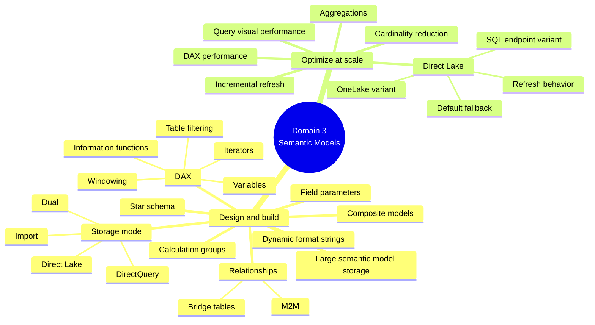

# Domain 3 · Implement and Manage Semantic Models (25–30%)

> [!quote] Source
> Microsoft Learn · Study guide for Exam DP-600 · Domain 3
> <https://learn.microsoft.com/en-us/credentials/certifications/resources/study-guides/dp-600#implement-and-manage-semantic-models-2530>

## 📊 What's tested

Two sub-domains:

1. **Design and build semantic models**
2. **Optimize enterprise-scale semantic models**

## 🧮 3.1 Design and build semantic models

| Objective | What it means |
|-----------|---------------|
| Choose a **storage mode** | Import · DirectQuery · Direct Lake · Dual |
| Implement a **star schema** for a semantic model | Fact + dimension tables in the model layer |
| Implement **relationships** | Bridge tables for M2M, regular FK joins |
| **DAX** — variables, iterators, table filtering, windowing, information functions | The core calculation authoring skill |
| Implement **calculation groups** | Reusable calculation patterns across measures |
| **Dynamic format strings** | Conditional measure formatting (e.g. currency based on selection) |
| **Field parameters** | User-driven slicers over measures/dimensions |
| **Large semantic model storage format** | Power BI Premium feature for >10 GB models |
| Design and build **composite models** | Mix storage modes in one model |

## ⚡ 3.2 Optimize enterprise-scale semantic models

| Objective | What it means |
|-----------|---------------|
| Implement **performance improvements** in queries and report visuals | Reduce visual payload, use slicers, page-level filters |
| Improve **DAX performance** | Avoid expensive iterators over high-cardinality cols, use CALCULATE smartly |
| Configure **Direct Lake** (default fallback, refresh behavior) | OneLake → semantic model without import-mode caching |
| Choose between **Direct Lake on OneLake** vs **Direct Lake on SQL analytics endpoint** | OneLake = Delta tables direct; SQL endpoint = via warehouse SQL |
| Implement **incremental refresh** for semantic models | Partition-based refresh policy |

## 📚 Where to study

| Objective | Learning Path · Module |
|-----------|------------------------|
| DAX variables / iterators / windowing / info functions | Path 3 · M1 (Create DAX calculations) |
| Calculation groups · dynamic format strings · field parameters | Path 3 · M2 (Design semantic models for scale) |
| Large semantic model storage · composite models · storage mode · star schema for SM | Path 3 · M2 |
| Bridge tables · M2M | Path 3 · M2 |
| Query/visual performance · DAX perf · aggregations · troubleshoot · cardinality | Path 3 · M3 (Optimize semantic model performance) |
| Direct Lake + fallback + refresh | Path 3 · M3 |
| Direct Lake on OneLake vs SQL endpoint | Path 3 · M3 |
| Incremental refresh | Path 3 · M3 |

## 🧠 Mind map

## 🧠 Storage mode decision cheat sheet

| Mode | Use when | Trade-off |
|------|----------|-----------|
| **Import** | Model fits in memory; latency matters | Refresh overhead |
| **DirectQuery** | Massive or fast-changing data; fresh results needed | Slower visuals, limited DAX |
| **Direct Lake** | Data is in OneLake Delta; you want freshness + speed | Needs OneLake + Fabric capacity |
| **Dual** | Mix — most queries Import, occasional lookups DirectQuery | More complex to design |
| **Composite** | Multiple storage modes in one model | Aggregation strategy required |

## 🔗 Related

- [[../_MOC]]
- [[../Study-Guide-Skills-Measured]]
- [[Domain-1-Maintain-Solution]]
- [[Domain-2-Prepare-Data]]
- [[../Learning-Paths/Path-3-Design-Manage-Semantic-Models]]
- [[../Learning-Paths/Path-4-Prepare-AI-Ready-Data]]