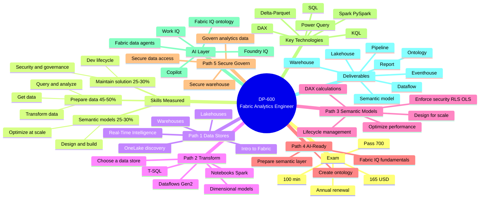

# DP-600 — Master Index

> [!quote] Official description
> Exam **DP-600**: Implementing Analytics Solutions Using Microsoft Fabric
> Subject matter expertise in designing, creating, and managing analytical assets (semantic models, warehouses, lakehouses).

## 🎯 Certification at a glance

| Field | Value |
|-------|-------|
| Level | Intermediate |
| Product | Microsoft Fabric |
| Roles | Data Engineer · Data Analyst |
| Subject | Data analytics |
| Renewal | Annual (free online assessment) |
| Last updated | 2026-07-21 |
| Price | $165 USD |
| Duration | 100 minutes |
| Pass score | 700 / 1000 |

## 📊 Skills at a glance (as of 2026-07-21)

| Domain | Weight |
|--------|--------|
| **Maintain a data analytics solution** | 25–30% |
| **Prepare data** | 45–50% |
| **Implement and manage semantic models** | 25–30% |

## 📚 Curriculum: 5 Learning Paths · 21 Modules · ~150 units

| # | Learning Path | Duration | XP | Modules |
|---|---------------|----------|----|---------|
| 1 | [Explore Analytics Data Stores in Microsoft Fabric](./Learning-Paths/Path-1-Explore-Data-Stores.md) | 4h 40m | 4,400 | 5 |
| 2 | [Design and Transform Analytics Data in Microsoft Fabric](./Learning-Paths/Path-2-Design-Transform-Data.md) | 5h 14m | 4,700 | 5 |
| 3 | [Design and Manage Semantic Models in Microsoft Fabric](./Learning-Paths/Path-3-Design-Manage-Semantic-Models.md) | 6h 21m | 4,700 | 5 |
| 4 | [Prepare AI-Ready Analytics Data in Microsoft Fabric](./Learning-Paths/Path-4-Prepare-AI-Ready-Data.md) | 4h 19m | 2,900 | 3 |
| 5 | [Secure and Govern Analytics Data in Microsoft Fabric](./Learning-Paths/Path-5-Secure-Govern-Data.md) | 3h 21m | — | 3 |
| | **Total** | **~23h 55m** | **~16,700+ XP** | **21 modules** |

## 🧠 Domain → Learning Path crosswalk

| Exam Domain (weight) | Map to Learning Paths |
|----------------------|------------------------|
| **Maintain a data analytics solution** (25–30%) | Path 5 (Secure & Govern) · Path 3 (Lifecycle module) |
| **Prepare data** (45–50%) | Path 1 (Storage) · Path 2 (Transform) · Path 4 (AI-ready gold layer) |
| **Implement and manage semantic models** (25–30%) | Path 3 (all 5 modules) · Path 4 (semantic layer prep) |

## 🧠 Master mind map



## 🗂️ Folder map

```
DP-600-Microsoft-Fabric-Analytics-Solution-Associate/
├── 01-Module-Intro-to-Fabric/        ← existing per-module notes (Module 1)
│   ├── _MOC.md
│   ├── Module-1-Mind-Map.md
│   ├── Unit-1 … Unit-6
│
└── 02-Study-Guide-Index/              ← this folder
    ├── _MOC.md                        (this file)
    ├── DP-600-Mind-Map.md
    ├── Study-Guide-Skills-Measured.md (exam-domain summary)
    ├── Change-Log.md
    │
    ├── Learning-Paths/
    │   ├── Path-1-Explore-Data-Stores.md
    │   ├── Path-2-Design-Transform-Data.md
    │   ├── Path-3-Design-Manage-Semantic-Models.md
    │   ├── Path-4-Prepare-AI-Ready-Data.md
    │   └── Path-5-Secure-Govern-Data.md
    │
    └── Skill-Domains/
        ├── Domain-1-Maintain-Solution.md
        ├── Domain-2-Prepare-Data.md
        └── Domain-3-Semantic-Models.md
```

## 🔗 Useful links

- Study guide: <https://learn.microsoft.com/en-us/credentials/certifications/resources/study-guides/dp-600>
- Exam page: <https://learn.microsoft.com/en-us/credentials/certifications/exams/dp-600>
- Course: <https://learn.microsoft.com/en-us/training/courses/dp-600t00/>
- Practice assessment: <https://learn.microsoft.com/en-us/credentials/certifications/exams/dp-600/practice/assessment?assessment-type=practice&assessmentId=90>
- Exam sandbox: <https://aka.ms/examdemo>
- Renewal: <https://learn.microsoft.com/en-us/credentials/certifications/renew-your-microsoft-certification>
- Exam Readiness Zone: <https://learn.microsoft.com/en-us/shows/exam-readiness-zone/>
- Data Exposed: <https://learn.microsoft.com/en-us/shows/data-exposed/>
- Certification poster PDF: <https://arch-center.azureedge.net/Credentials/Certification-Poster_en-us.pdf>

## 📝 Learning order (recommended)

1. **Path 1** — establish the OneLake + storage foundation
2. **Path 2** — learn to transform and shape data
3. **Path 3** — semantic models (the heart of the analyst role)
4. **Path 4** — AI-readiness layer (Fabric IQ)
5. **Path 5** — security & governance (cross-cutting concern, save for last)
6. Practice assessment + review Change Log before booking exam

---

> [!tip] How to use this index
> - Click any path in the curriculum table to drill into the per-module breakdown.
> - The mind map is duplicated as a standalone file [[DP-600-Mind-Map]] for full-screen rendering.
> - Cross-reference skill domain pages to see exam-objective → learning-path → module mapping.