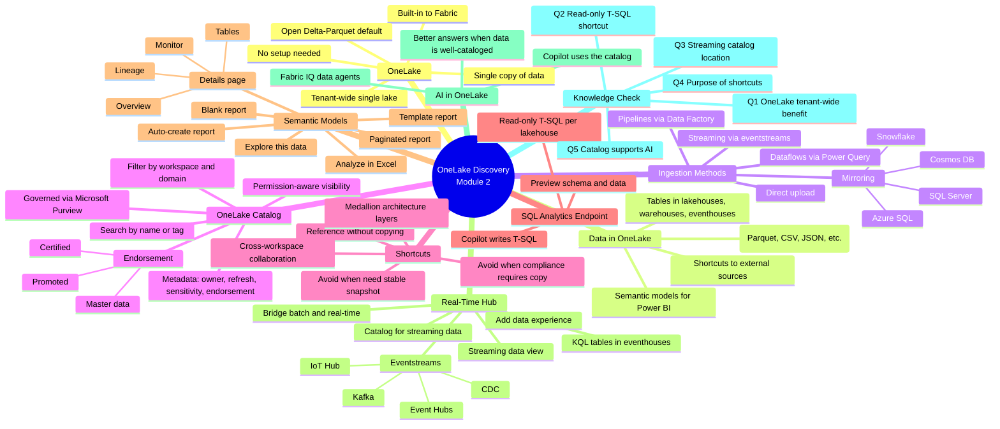

# Module 2 — Discover OneLake · Mind Map

## 🧭 How to view

- **Obsidian**: open this file, Obsidian will render the Mermaid block natively.
- **Web**: paste into <https://mermaid.live> for an editable SVG.
- **Export**: use the Mermaid CLI (`mmdc`) to render PNG/SVG.

## 🔗 Related

- [[_MOC]] — full module index
- [[Unit-1-Introduction]] · [[Unit-2-Understand-OneLake]] · [[Unit-3-Browse-Connect-OneLake]] · [[Unit-4-Discover-Streaming-Data]] · [[Unit-5-Exercise]] · [[Unit-6-Knowledge-Check]] · [[Unit-7-Summary]]
