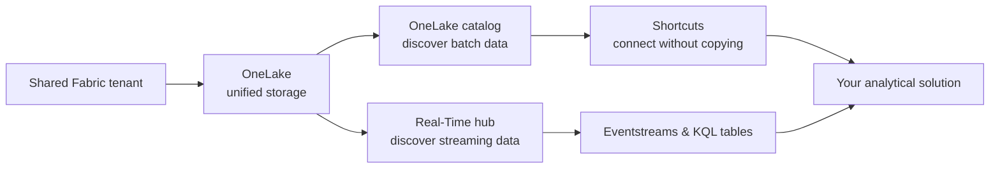

# Unit 1 — Introduction

## 🎯 Why this matters

Traditional analytics environments scatter data across separate storage accounts, databases, and file systems. Each team maintains its own copies, leading to **duplication**, **inconsistency**, and **wasted time searching for the right data**. Before you can transform data or build reports, you must first **discover what exists and where it lives**.

> [!quote] Scenario from the module
> Imagine your organization recently adopted Microsoft Fabric. Other teams have been creating lakehouses, warehouses, and streaming feeds, but you don't know what data exists or where to find it. You need to discover and connect to their data before you can build your analytical solutions. Navigating a shared data environment requires understanding OneLake's discovery and connection capabilities.

## 📚 What this module covers

> [!info] Module scope
> In this module, you explore how **OneLake** serves as a unified storage layer that brings all Fabric workloads together in one place. You learn to use the **OneLake catalog** to browse and find existing data across your organization, create **shortcuts** that connect to data, and discover streaming data sources through **Real-Time hub**.

## 🧭 Module roadmap

| # | Unit | What you learn |
|---|------|----------------|
| 2 | [[Unit-2-Understand-OneLake]] | What OneLake is, data types, ingestion methods, AI support |
| 3 | [[Unit-3-Browse-Connect-OneLake]] | Search the catalog, create shortcuts, use the SQL endpoint, explore semantic models |
| 4 | [[Unit-4-Discover-Streaming-Data]] | Real-Time hub: eventstreams, KQL tables, connectors |
| 5 | [[Unit-5-Exercise]] | Hands-on lab — build a lakehouse, shortcuts, query, semantic model |
| 6 | [[Unit-6-Knowledge-Check]] | 5 knowledge-check questions |
| 7 | [[Unit-7-Summary]] | Recap + further-reading links |

## 🔑 Key terms (flashcards)

- **OneLake** — Fabric's tenant-wide, unified data lake that all Fabric workloads share.
- **OneLake catalog** — Searchable inventory of all data items in a Fabric tenant.
- **Shortcut** — A pointer to data in another workspace or external system, with no data copy.
- **Real-Time hub** — Catalog of streaming data (eventstreams + KQL tables) in Fabric.
- **SQL analytics endpoint** — Read-only T-SQL interface automatically created for every lakehouse.

## 🧭 Next

→ [[Unit-2-Understand-OneLake]]
↑ [[_MOC]]
