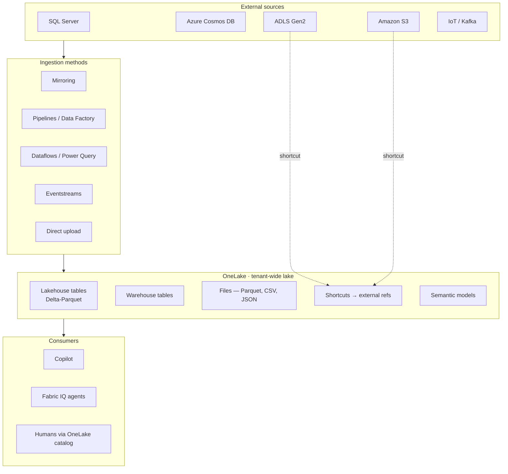

# Unit 2 — Understand OneLake

## 🎯 Why this matters

OneLake is the **foundation** of Microsoft Fabric's analytics platform. It provides a single, unified storage layer where all your data lives. Understanding OneLake changes how you think about data storage: instead of copying data between systems or managing multiple storage accounts, you work with **one centralized location** shared across all Fabric workloads.

## 🏛️ OneLake is tenant-wide

> [!info] Definition
> **OneLake** is a **tenant-wide data lake** built into every Fabric environment. When your organization enables Fabric, OneLake is automatically available. **No separate setup or configuration is required.**

With OneLake you get a **single copy of your data**. All Fabric workloads read from and write to the same storage location. This approach eliminates the traditional problem of data silos where each team or tool maintains its own copy.

| Property | Detail |
|----------|--------|
| Tenant scope | Built into every Fabric-enabled tenant |
| Setup | Automatic — no separate provisioning |
| Data copies | Single copy shared by all workloads |
| Consistency | When data changes, everyone sees the updated version immediately |
| Cost | Reduces storage costs by removing duplication |

## 🔍 Discover data with the OneLake catalog

The **OneLake catalog** is a searchable inventory of all data in OneLake. You can search by name, browse by workspace or domain, and view metadata such as descriptions, owners, and lineage. The catalog makes it possible to find relevant data even when you don't know exactly where it's stored.

> [!tip] Governance + security
> The catalog also provides **governance and security** capabilities. OneLake integrates with **Microsoft Purview** for data governance. You can classify data, apply sensitivity labels, and track data lineage. Access controls determine who can read or modify data — providing enterprise-grade controls to protect your data.

## 📦 Types of data in OneLake

OneLake stores data in **open formats**, which means your data isn't locked into a proprietary format. OneLake uses **Delta Lake** as the default table format, which stores data in open **Parquet** files. Any tool that understands Delta Lake or Parquet can access it, giving you flexibility in how you work with your data. Files in OneLake can be any format.

| Data type | Where it lives |
|-----------|----------------|
| **Tables** | Lakehouses, warehouses, eventhouses |
| **Files** | Parquet, CSV, JSON, and more |
| **Shortcuts** | References to external data with no copy |
| **Semantic models** | Power BI analytics assets |

> [!info] Shortcuts
> **Shortcuts** let you reference data in external locations like Azure Data Lake Storage, Amazon S3, or another OneLake location. The data stays where it is, but you can work with it as if it's part of your lakehouse. Shortcuts are useful when another team manages source data or when governance policies require data to remain in a specific location.

## 🚚 How data arrives in OneLake

Data can arrive in OneLake through several ingestion methods:

| Method | Description | Use case |
|--------|-------------|----------|
| **Mirroring** | Continuously replicates data from external databases (SQL Server, Azure SQL Database, Azure Cosmos DB, Snowflake). When source data changes, OneLake reflects those changes automatically. | Low-latency replication of operational stores |
| **Pipelines** | Orchestrate data movement and transformation using **Data Factory** capabilities. Copy data from various sources, apply transformations, load into OneLake. | Batch ETL/ELT at scale |
| **Dataflows** | Use **Power Query** to connect to sources, transform data, and load into OneLake. Familiar to Excel and Power BI users. | Self-service transformation |
| **Streaming** | Real-time data through **eventstreams**. Data flows continuously from sources like IoT devices, application logs, or clickstream events. | Real-time ingestion |
| **Direct upload** | Upload files directly to OneLake through the Fabric interface. | Small files, ad-hoc drops |

## 🤖 How OneLake supports your AI workflow

OneLake plays a foundational role in enabling AI within Fabric. To provide relevant insights, **Copilot** and **Fabric IQ** agents need to find and understand your data.

> [!quote] Module scenario
> When you ask Copilot a question like *"What were last quarter's sales trends?"*, it searches the **OneLake catalog** to locate relevant data. The same catalog you use to browse and discover assets **powers AI-driven assistance**.

> [!important] Core insight
> When data is scattered or poorly documented, even AI struggles to find it. Copilot can return more accurate results to consumers when your data has **clear names, descriptions, and metadata**. AI assistants help you more effectively when data is **discoverable and well-cataloged**.

## 🧠 Visual

## 🔑 Key terms (flashcards)

- **OneLake** — Tenant-wide unified data lake built into every Fabric environment.
- **Delta Lake** — Open table format that stores data in Parquet files; the default in OneLake.
- **OneLake catalog** — Searchable, permission-aware inventory of all data items in a tenant.
- **Shortcut** — A reference (not a copy) to data in another workspace or external system.
- **Mirroring** — Continuous replication of an external database into OneLake.
- **Dataflow** — Power Query-based self-service transformation that loads into OneLake.
- **Copilot** — AI assistant in Fabric that uses the OneLake catalog to locate data for queries.

## 🧭 Next

→ [[Unit-3-Browse-Connect-OneLake]]
← [[Unit-1-Introduction]]
↑ [[_MOC]]
