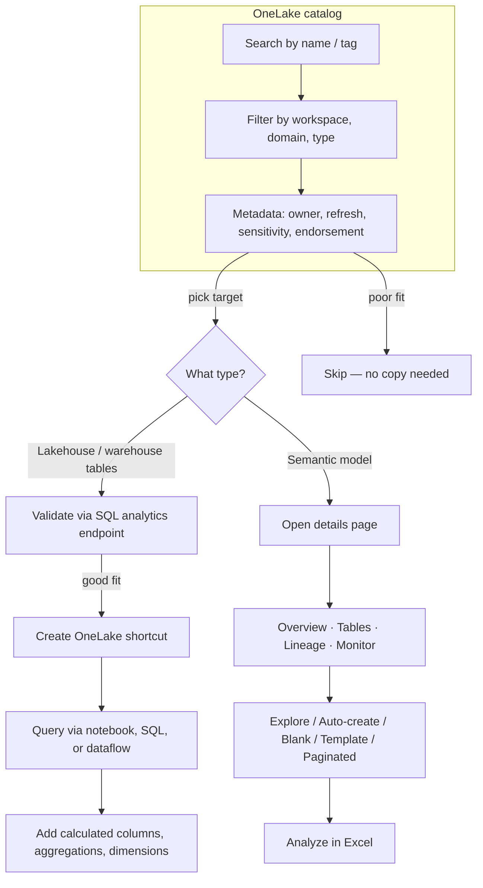

# Unit 3 — Browse and connect to data in OneLake

## 🎯 Why this matters

> [!quote] Scenario from the module
> Imagine you work at a retail organization where data lives across multiple workspaces. The data engineering team maintains cleansed data in their lakehouse, other departments have warehouses with business metrics, and analysts created semantic models. You need to find and connect to this data to **transform tables for analysis**, **create semantic models**, or **build reports**.

The **OneLake catalog** helps you find data items across your organization. Once you locate the data you need, you **connect to it** to build your analytical solutions.

## 🔎 Find data in the OneLake catalog

> [!info] Definition
> The **OneLake catalog** is a centralized discovery experience for all data items in your Microsoft Fabric tenant. You can search for items by name or tag, making it easy to locate specific items even in large organizations.

The catalog **respects access permissions**, which keeps sensitive data secure while enabling discovery of available resources. This permission-based visibility means different team members see different catalogs based on their roles.

### Metadata shown in the catalog

The catalog shows metadata for each item to help you understand what the item contains and whether it's approved for production use **before you start working with it**.

| Metadata field | What it tells you |
|----------------|-------------------|
| Name | Human-readable identifier |
| Type | Lakehouse, warehouse, semantic model, etc. |
| Owner | Who is responsible for the item |
| Last refresh time | How fresh the data is |
| Workspace location | Where the item lives |
| Sensitivity labels | Governance classification |
| Endorsement status | Certified / Promoted |

### Sensitivity labels

Your organization defines **sensitivity labels** to ensure proper governance over the data. These labels help you identify **highly sensitive data** and make informed decisions when granting access.

### Endorsement levels

> [!tip] Three endorsement levels
> **Endorsement** helps others find trusted content:
>
> - **Promoted** — The item is ready for sharing. Any user with write permissions can promote an item.
> - **Certified** — The item meets your organization's quality standards. Only authorized reviewers can certify items.
> - **Master data** — The item is an authoritative source of truth for core organizational data like customer lists or product codes. Only authorized reviewers can apply this label.
>
> All Fabric and Power BI items, **except dashboards**, can be promoted or certified. The *Master data* label applies only to data items, like lakehouses and semantic models.

> [!success] Why endorse?
> By using the catalog to discover existing data, you **reduce duplication** and **confusion** while **encouraging collaboration** in your organization.

## 🔗 Connect to data

Once you find lakehouse or warehouse tables in the catalog, you can connect them to your workspace to **transform and curate** the data for analysis.

### Shortcuts (the default connect pattern)

**Shortcuts** let you reference data from other workspaces **without copying or moving it**. Changes made in the source are immediately visible through the shortcut. This approach eliminates data duplication while enabling you to add business logic and transformations.

> [!tip] Cross-workspace collaboration
> Shortcuts support cross-workspace collaboration. For example, a data engineering team might maintain cleansed transaction tables in their lakehouse. You can create a shortcut to those tables from your analytics lakehouse, then transform them into business-ready datasets with **calculated columns**, **aggregations**, and **dimensional models**. Using shortcuts for separation also supports the **medallion architecture** to have different layers for **raw, enriched, and curated** data.

### SQL analytics endpoint for validation

> [!warning] Validate before shortcutting
> Before creating a shortcut, verify the data by using the **SQL analytics endpoint**. Every lakehouse includes a SQL analytics endpoint that provides read-only T-SQL access to tables. You can query the endpoint to preview data, check schema, and validate that it contains what you need. The endpoint uses familiar T-SQL syntax from SQL Server or Azure SQL Database.

> [!info] Copilot + T-SQL
> Copilot can assist with writing T-SQL queries when you work with the SQL analytics endpoint. This AI integration is how agents and Copilot query lakehouse data — the same patterns you use to explore and transform data.

### How to create a shortcut in a lakehouse

1. Open your lakehouse in the Fabric workspace.
2. Select **New shortcut** from the toolbar.
3. Choose **OneLake** as the shortcut source.
4. Browse to the workspace and lakehouse containing the data you want to reference.
5. Select the tables or folders to include in the shortcut.
6. Confirm the shortcut creation.

The shortcut appears in your lakehouse and you can query it like any other table. You can work with the shortcut by using **notebooks**, **SQL queries**, or **dataflows** to create fact and dimension tables, add calculated columns, or aggregate data for analysis.

> [!warning] When shortcuts are not the right tool
> Shortcuts might not suit your needs when:
> - You require a **stable snapshot** of data at a specific point in time.
> - **Network latency** impacts query performance.
> - **Compliance** requires physically separate copies.

## 📊 Work with semantic models

When you find semantic models in the catalog, you can **explore** and **connect** to them for reporting. Semantic models contain prebuilt relationships, calculations, and business metrics that make it easier to create reports.

### Semantic model details page

To evaluate whether a semantic model meets your needs, select it in the OneLake catalog and then select **Open**. The semantic model's details page opens, showing:

| Tab | What it shows |
|-----|---------------|
| **Overview** | Description, owner, refresh status, endorsement, sensitivity labels |
| **Tables** | Underlying table and column schema. Click the **binoculars icon** next to any table or column to explore sample data |
| **Lineage** | Visualizes upstream and downstream dependencies |
| **Monitor** | Refresh history and activity |

### Create content from a semantic model

Once you've confirmed the semantic model contains the data you need, use the **Explore this data** dropdown button to start building:

| Option | What it does |
|--------|--------------|
| **Explore this data** | Opens a lightweight tool for quick ad-hoc analysis with matrix visualizations |
| **Auto-create a report** | Automatically generates a summary report with key insights and visualizations |
| **Create a blank report** | Opens the report editing canvas to build a custom report |
| **Create from template** | Uses an existing report template as a starting point (if available) |
| **Create a paginated report** | Creates a formatted report suitable for printing or exporting |

You can also select **Analyze in Excel** to create a PivotTable connection, allowing you to analyze the semantic model using Excel's familiar interface.

## 🧠 Visual — discovery & connection flow

## 🔑 Key terms (flashcards)

- **OneLake catalog** — Centralized discovery surface for all data items in a Fabric tenant.
- **Sensitivity label** — Governance tag indicating the confidentiality of a data item.
- **Endorsement** — Quality/trust signal on a catalog item: Promoted, Certified, or Master data.
- **Shortcut** — A reference (not a copy) to data in another workspace or external system.
- **SQL analytics endpoint** — Read-only T-SQL interface auto-created for every lakehouse.
- **Semantic model** — A prebuilt Power BI model with relationships, calculations, and metrics.
- **Medallion architecture** — Layered data design (raw → enriched → curated) often built with shortcuts.

## 🧭 Next

→ [[Unit-4-Discover-Streaming-Data]]
← [[Unit-2-Understand-OneLake]]
↑ [[_MOC]]
