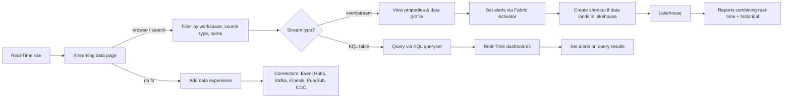

# Unit 4 — Discover streaming data in Real-Time hub

## 🎯 Why this matters

In the previous unit, you learned how to find and connect to **batch data** stored in lakehouses and warehouses. But data doesn't always arrive in batches — sometimes it flows **continuously**. Inventory levels change as products sell, transactions stream in from online customers, and IoT sensors send temperature readings every few seconds.

> [!info] Module scope
> Before you can incorporate streaming data into your solution, you need to find the right data using the **Real-Time hub**.

## 🔍 Discover streaming data

> [!info] Definition
> The **Real-Time hub** is the centralized catalog for discovering and managing streaming data across Microsoft Fabric. While the **OneLake catalog** shows batch data stored in lakehouses and warehouses, the **Real-Time hub** displays eventstreams and KQL tables that are actively running in your organization.

| Catalog | What it shows |
|---------|---------------|
| OneLake catalog | Batch data: lakehouses, warehouses, semantic models |
| Real-Time hub | Streaming data: eventstreams, KQL tables |

### Eventstreams

> [!info] Definition
> **Eventstreams** are continuous flows of data from sources like Azure Event Hubs, IoT devices, Apache Kafka, database change data capture (CDC), or custom applications. Each stream carries events as they happen, such as a customer completing a purchase or a sensor detecting a temperature change.

Common eventstream sources:

- **Azure Event Hubs**
- **IoT devices**
- **Apache Kafka**
- **Database CDC** (change data capture)
- **Custom applications**

### Eventhouses and KQL tables

Streaming data often flows into **eventhouses**, which are containers that hold one or more **KQL databases**. These databases store time- or event-based events and support fast querying using **Kusto Query Language (KQL)**. Data is automatically indexed and partitioned by ingestion time, enabling quick analysis even during continuous data ingestion.

> [!tip] Reuse before you build
> Just as you browse the OneLake catalog to find lakehouses, you browse the Real-Time hub to discover streaming data sources that other teams have already created. This discovery step helps you determine whether existing streams meet your needs. If a stream already captures the data you want, you can work with it directly rather than creating duplicate data pipelines.

## 🧭 Explore streaming data

To access Real-Time hub, select **Real-Time** from the left navigation in Fabric. The hub opens to the **Streaming data** page, which shows recently created eventstreams and KQL tables that you have access to.

You can browse streams by workspace, filter by source type, or search for specific stream names. When you select a stream, you see its details including:

- Stream name and source item (eventstream or KQL database)
- Item owner and workspace location
- Endorsement status
- **Sensitivity labels**

The stream details also show **activity information**. You can verify whether a stream is **actively receiving data** and when it last updated. This information helps you assess whether a stream is reliable for production use.

> [!warning] Validate before consuming
> Before using a data stream, review its **schema** and **sample data** to verify it contains the fields you need for your analytical work.

## 🛠️ Use discovered streams

Once you discover a stream that contains useful data, you have several options depending on whether it's an eventstream or a KQL table:

### For eventstreams

- View the stream's properties and data profile
- Set alerts using **Fabric Activator** to trigger actions when specific conditions occur
- Create shortcuts if the eventstream sends data to a lakehouse

### For KQL tables

- Query the data directly using a **KQL queryset** for real-time analysis
- Create visualizations in **Real-Time dashboards**
- Set alerts on query results

> [!tip] Branch from existing streams
> You can also create a **new eventstream** from the data you find, so you can transform and land the data as needed. This approach lets you add your own business logic and transformations without modifying the original stream.

> [!important] Bridge batch + real-time
> Real-time data can flow into **lakehouses** through eventstreams, creating a bridge between streaming and batch analytics. This architecture lets you build reports that combine **both** real-time and historical data.

## ➕ Add new streaming sources

While the **Streaming data** page helps you discover existing streams, Real-Time hub also provides the **Add data** experience for connecting new external sources. This option is useful when you need to bring in data that doesn't already exist in Fabric.

Select **Add data** to access connectors for:

| Category | Connectors |
|----------|------------|
| **Microsoft sources** | Azure Event Hubs, Azure IoT Hub, database CDC feeds |
| **Fabric events** | Workspace item changes, OneLake file operations |
| **Azure events** | Azure Blob Storage events |
| **External sources** | Apache Kafka, Amazon Kinesis, Google Cloud Pub/Sub |

> [!note] Beyond module scope
> Connecting and transforming new streaming sources involves more advanced configuration than is covered in this module. For more information, see [Overview of Microsoft Fabric eventstreams](https://learn.microsoft.com/en-us/fabric/real-time-intelligence/event-streams/overview).

## 🧠 Visual — streaming discovery flow

## 🔑 Key terms (flashcards)

- **Real-Time hub** — Centralized catalog for streaming data (eventstreams + KQL tables) in Fabric.
- **Eventstream** — Continuous flow of data from sources like Event Hubs, Kafka, IoT, or CDC.
- **Eventhouse** — Container holding one or more KQL databases for time-series data.
- **KQL (Kusto Query Language)** — Query language used to query real-time data in eventhouses.
- **KQL queryset** — Tool for writing and running KQL queries against eventhouse data.
- **Fabric Activator** — No-code alerting on streaming data conditions.
- **Add data experience** — Real-Time hub UI for connecting new external streaming sources.

## 🧭 Next

→ [[Unit-5-Exercise]]
← [[Unit-3-Browse-Connect-OneLake]]
↑ [[_MOC]]
