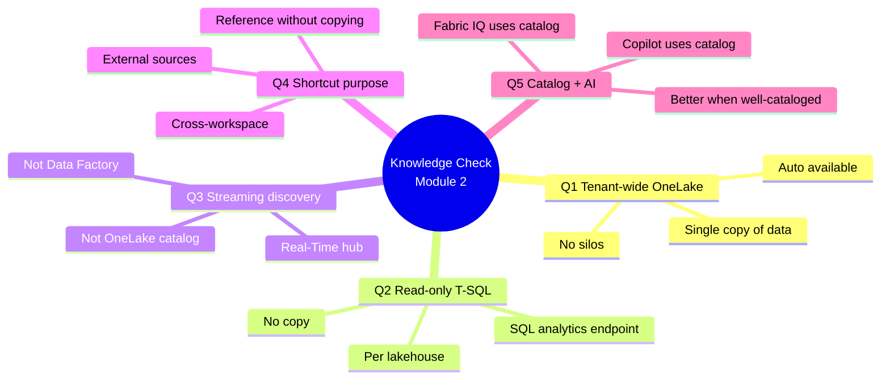

# Unit 6 — Knowledge check

> [!warning] Answer provenance
> Microsoft Learn intentionally does **not** publish the correct answers for knowledge-check questions. The answers below are **derived from the unit content** and the wording of each question. Treat them as best-effort study notes — verify against the live module if you fail the check.

## 📋 Questions

### Question 1
> What is the primary benefit of OneLake being a tenant-wide data lake?

- It automatically backs up data to multiple regions.
- **All Fabric workloads read from and write to the same storage location, eliminating data silos.** ✅
- It requires separate configuration for each workspace.

### Question 2
> An analytics engineer needs read-only access to tables in a lakehouse managed by another team. Which approach provides T-SQL query access without copying data?

- Create a shortcut to the lakehouse tables.
- **Use the lakehouse's SQL analytics endpoint.** ✅
- Copy the tables to a new lakehouse.

### Question 3
> Where would an analytics engineer discover eventstreams and streaming data sources in Microsoft Fabric?

- OneLake catalog
- **Real-Time hub** ✅
- Data Factory pipelines

### Question 4
> What is the purpose of shortcuts in OneLake?

- To compress data and reduce storage costs.
- **To reference data from other workspaces or external locations without copying it.** ✅
- To automatically synchronize data between lakehouses.

### Question 5
> How does well-cataloged data in OneLake support AI capabilities in Microsoft Fabric?

- It automatically trains machine learning models.
- **Copilot and Fabric IQ use the same catalog to search and locate relevant data for queries.** ✅
- It prevents unauthorized access to AI features.

## ✅ Answer key (derived)

| # | Correct answer | Source unit |
|---|----------------|-------------|
| 1 | All Fabric workloads read from and write to the same storage location, eliminating data silos. | [[Unit-2-Understand-OneLake]] |
| 2 | Use the lakehouse's SQL analytics endpoint. | [[Unit-3-Browse-Connect-OneLake]] |
| 3 | Real-Time hub | [[Unit-4-Discover-Streaming-Data]] |
| 4 | To reference data from other workspaces or external locations without copying it. | [[Unit-2-Understand-OneLake]] · [[Unit-3-Browse-Connect-OneLake]] |
| 5 | Copilot and Fabric IQ use the same catalog to search and locate relevant data for queries. | [[Unit-2-Understand-OneLake]] |

## 🧠 Why these answers (linking back to the module)

## 🎯 Re-study pointers

> [!tip] If you missed a question, re-read:
> - Q1 → "OneLake is tenant-wide" in [[Unit-2-Understand-OneLake]]
> - Q2 → "SQL analytics endpoint for validation" in [[Unit-3-Browse-Connect-OneLake]]
> - Q3 → "Discover streaming data" in [[Unit-4-Discover-Streaming-Data]]
> - Q4 → "Shortcuts" in [[Unit-2-Understand-OneLake]] and [[Unit-3-Browse-Connect-OneLake]]
> - Q5 → "How OneLake supports your AI workflow" in [[Unit-2-Understand-OneLake]]

## 🔑 Key terms (flashcards)

- **OneLake** — Tenant-wide unified lake; one copy of data, no silos.
- **SQL analytics endpoint** — Read-only T-SQL access to lakehouse tables.
- **Real-Time hub** — Catalog for streaming data only (eventstreams + KQL tables).
- **Shortcut** — Reference to data in another workspace or external source.
- **Copilot / Fabric IQ** — AI in Fabric that uses the OneLake catalog to locate data.

## 🧭 Next

→ [[Unit-7-Summary]]
← [[Unit-5-Exercise]]
↑ [[_MOC]]
