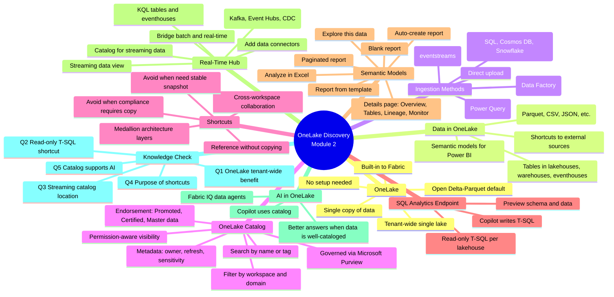

# Module 2 — Discover and connect to data in OneLake

> [!info] Module map
> This module is the **hands-on discovery layer** of the Fabric Analytics Engineer track. It covers *what* OneLake is (tenant-wide unified lake), *how* to find data (OneLake catalog + Real-Time hub), and *how* to connect to it (shortcuts, SQL analytics endpoint, semantic models). Where Module 1 explained **why** Fabric exists, this module explains **how** to actually locate and reuse data already in the tenant.

## 🎯 Learning objectives (synthesized from unit-level goals)

By the end of this module you should be able to:

1. **Describe** OneLake as a tenant-wide, unified data lake for all Fabric workloads.
2. **Discover** existing data assets using the OneLake catalog (search by name/tag, filter by workspace/domain, read metadata).
3. **Connect** to data across workspaces using **shortcuts** and the **SQL analytics endpoint** without copying data.
4. **Explore** semantic models in the catalog and create reports (auto-create, blank, template, paginated, Excel).
5. **Discover** streaming data sources via the **Real-Time hub** and decide whether to consume existing streams or add new ones.
6. **Apply** the medallion architecture pattern using shortcuts for raw / enriched / curated layers.

## 🧠 Module mind map

> [!tip] How to use
> The mind map below is duplicated as a standalone Mermaid file (`Module-2-Mind-Map.md`) you can open in Obsidian's Mermaid preview or the [Mermaid Live Editor](https://mermaid.live). It is the **single-page view** of the entire module.

## 📑 Unit breakdown

| # | Unit | XP | Minutes | Focus |
|---|------|----|---------|-------|
| 1 | [Introduction](./Unit-1-Introduction.md) | 100 | 2 | Why discovery matters in a shared lake |
| 2 | [Understand OneLake](./Unit-2-Understand-OneLake.md) | 100 | 5 | Tenant-wide lake, catalog, data types, ingestion, AI |
| 3 | [Browse and connect to data in OneLake](./Unit-3-Browse-Connect-OneLake.md) | 100 | 5 | Catalog search, shortcuts, SQL endpoint, semantic models |
| 4 | [Discover streaming data in Real-Time hub](./Unit-4-Discover-Streaming-Data.md) | 100 | 4 | Eventstreams, KQL tables, Real-Time hub |
| 5 | [Exercise — Discover and connect to data in OneLake](./Unit-5-Exercise.md) | 100 | 30 | Hands-on lab: lakehouse, shortcuts, SQL endpoint, semantic models |
| 6 | [Knowledge check](./Unit-6-Knowledge-Check.md) | 200 | 3 | 5 knowledge-check questions |
| 7 | [Summary](./Unit-7-Summary.md) | 100 | 2 | Recap + learn-more links |

**Total: 800 XP · ~51 minutes**

## 🔗 Knowledge-check answers (unit 6)

> [!warning] Answer provenance
> Microsoft Learn intentionally does not publish the correct answers for knowledge-check questions. The answers below are **derived from the unit content** for this module and the wording of each question. Treat them as best-effort study notes — verify against the live module if you fail the check.

| Q | Question | Correct answer |
|---|----------|---------------|
| 1 | What is the primary benefit of OneLake being a tenant-wide data lake? | **All Fabric workloads read from and write to the same storage location, eliminating data silos.** |
| 2 | An analytics engineer needs read-only access to tables in a lakehouse managed by another team. Which approach provides T-SQL query access without copying data? | **Use the lakehouse's SQL analytics endpoint.** |
| 3 | Where would an analytics engineer discover eventstreams and streaming data sources in Microsoft Fabric? | **Real-Time hub** |
| 4 | What is the purpose of shortcuts in OneLake? | **To reference data from other workspaces or external locations without copying it.** |
| 5 | How does well-cataloged data in OneLake support AI capabilities in Microsoft Fabric? | **Copilot and Fabric IQ use the same catalog to search and locate relevant data for queries.** |

## 🧭 Downstream links

- [[Unit-1-Introduction]] · [[Unit-2-Understand-OneLake]] · [[Unit-3-Browse-Connect-OneLake]] · [[Unit-4-Discover-Streaming-Data]] · [[Unit-5-Exercise]] · [[Unit-6-Knowledge-Check]] · [[Unit-7-Summary]]
- [[Module-2-Mind-Map]]
- Sister module: [Module 1 — Intro to Fabric](../01-Module-Intro-to-Fabric/_MOC.md)

## 📚 External references

- Microsoft Learn module page: <https://learn.microsoft.com/en-us/training/modules/discover-data-onelake/>
- OneLake shortcuts: <https://learn.microsoft.com/en-us/fabric/onelake/onelake-shortcuts>
- Get started with Real-Time hub: <https://learn.microsoft.com/en-us/fabric/real-time-hub/get-started-real-time-hub>
- Eventstreams overview: <https://learn.microsoft.com/en-us/fabric/real-time-intelligence/event-streams/overview>
- Fabric trial: <https://learn.microsoft.com/en-us/fabric/get-started/fabric-trial>
