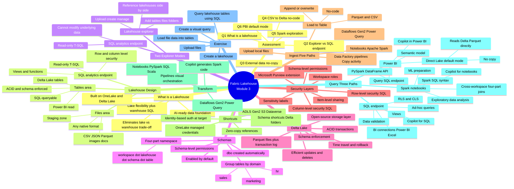

# Module 3 — Get started with lakehouses in Microsoft Fabric · Mind Map

## 🧭 How to view

- **Obsidian**: open this file, Obsidian will render the Mermaid block natively.
- **Web**: paste into <https://mermaid.live> for an editable SVG.
- **Export**: use the Mermaid CLI (`mmdc`) to render PNG/SVG.

## 🔗 Related

- [[_MOC]] — full module index
- [[Unit-1-Introduction]] · [[Unit-2-Lakehouse-Features]] · [[Unit-3-Ingest-and-Transform]] · [[Unit-4-Query-and-Analyze]] · [[Unit-5-Exercise-Create-Lakehouse]] · [[Unit-6-Module-Assessment]] · [[Unit-7-Summary]]
