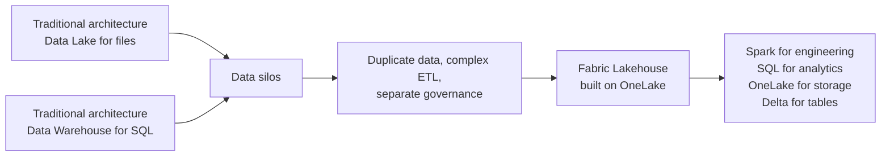

# Unit 1 — Introduction

> [!quote] Source
> Microsoft Learn · Module 3 · Unit 1 · "Introduction"
> <https://learn.microsoft.com/en-us/training/modules/get-started-lakehouses/1-introduction/>

## 🎯 Purpose

A short framing unit that sets up the problem Fabric's lakehouse is built to solve: organizations stuck between a **data warehouse** (great for structured analytics, expensive, weak on diverse data) and a **data lake** (cheap, flexible, but lacks structure/performance for business analytics). The **lakehouse** is the unification.

## 🔑 Key takeaways

- A **lakehouse in Microsoft Fabric** combines:
  - The **flexible and scalable storage** of a data **lake**.
  - The ability to **query and analyze data** of a data ware**house**.
- It uses **Apache Spark and SQL compute engines** to process and analyze data at scale.
- It is built on the **OneLake** storage layer.
- **The problem it solves:** traditional warehouses handle structured transactional data well but struggle with semi-structured and unstructured data from **application logs, IoT devices, and external feeds** — forcing separate systems, data silos, and complex integration.
- **The promise:** one unified platform handling **both structured AND unstructured data** while keeping strong analytical capabilities.

> [!important] Why it matters
> Without a lakehouse, you typically run two systems: a lake for files + a warehouse for SQL analytics. With a Fabric lakehouse, both live in OneLake, governed in one place.

## 🧠 Visual

## 📚 What this module teaches

Per the source page, you will learn:

- How **lakehouses address** the lake-vs-warehouse dilemma.
- **How to create a lakehouse.**
- **How to ingest and transform data** in a lakehouse.
- **How to query lakehouse data** using SQL and Spark.
- How well-structured lakehouse data powers **downstream analytics and AI-powered experiences** across Fabric.

## 🧭 Next

→ [[Unit-2-Lakehouse-Features]]
← [[_MOC]]
