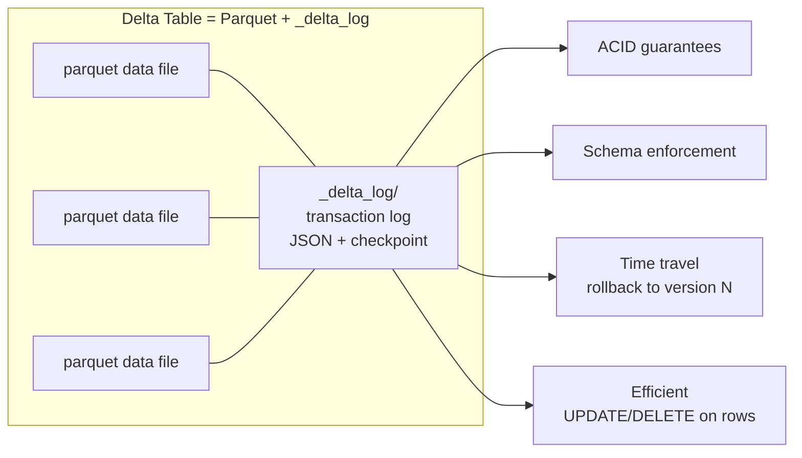
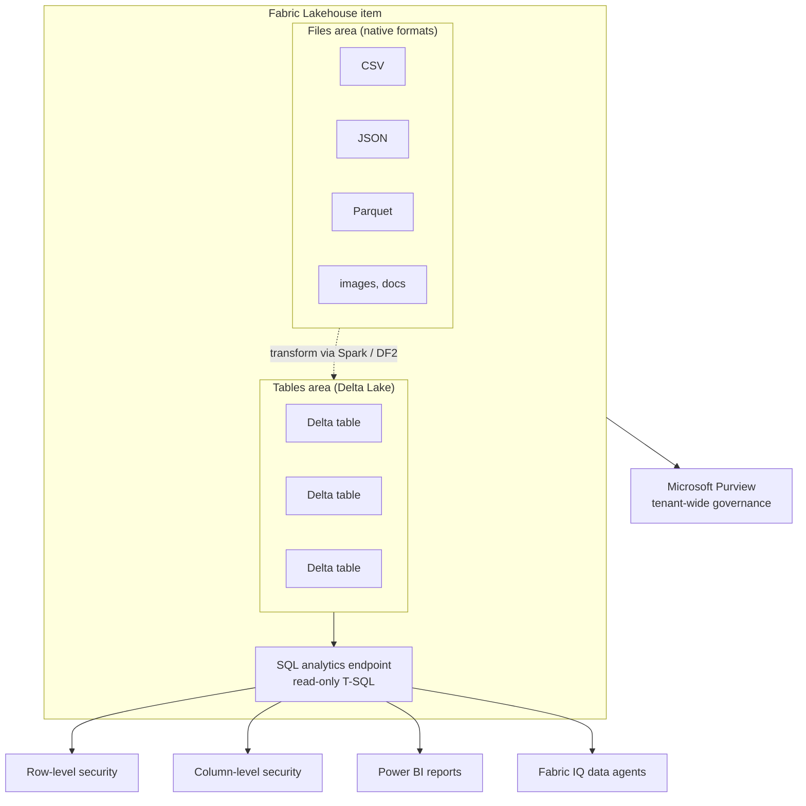

# Unit 2 — Describe lakehouse features and capabilities

> [!quote] Source
> Microsoft Learn · Module 3 · Unit 2 · "Describe lakehouse features and capabilities"
> <https://learn.microsoft.com/en-us/training/modules/get-started-lakehouses/2-fabric-lakehouse/>

## 🎯 The unit in one sentence

A lakehouse **organizes data into two areas — Tables (Delta Lake) and Files (native formats)** — and layers a **SQL analytics endpoint** on top, with Delta delivering ACID + time travel, and Fabric's governance adding row/column/schema-level security on the SQL side.

## 🏛️ Tables vs Files (the two-area layout)

The lakehouse splits your data so raw and curated can coexist in the same item.

| Area | Format | Schema | SQL? | ACID? | Use case |
|------|--------|--------|------|-------|----------|
| **Tables** | Delta Lake | Enforced | ✅ (via SQL endpoint) | ✅ | Curated data for SQL / Spark / Power BI |
| **Files** | Any native format (CSV, JSON, Parquet, images, docs) | Not enforced | ❌ | ❌ | Raw / semi-structured land zone, staging, exploration |

### What Tables give you

- SQL queries through the **SQL analytics endpoint**.
- **Schema enforcement** + **ACID transactions**.
- Direct access in **Power BI** for reporting.
- **Automatic optimization and maintenance** (vacuum, optimize, V-Order).

### What Files give you

- **Any file format** (CSV, JSON, Parquet, images, documents).
- **Flexibility** for exploration and processing.
- A **staging zone** before transformation into tables.
- No schema enforcement and no native SQL queries — process via Spark / Dataflows Gen2, then **load the results into Tables**.

> [!tip] Why two areas?
> You keep **raw data** (for compliance, reprocessing, or audit) **and structured tables** (for analytics) in the same lakehouse. One item, two roles.

## 🧱 Delta Lake tables — what makes the data trustworthy

> [!info] Definition
> **Delta Lake** is an **open-source storage layer** that brings **database-like reliability** to data lakes. Lakehouse tables are stored in **Delta format** on top of OneLake.

| Delta Lake feature | What it does |
|--------------------|--------------|
| **ACID transactions** | Consistency even when multiple users read/write simultaneously |
| **Schema enforcement** | Writes are validated against the table schema — no corrupt data |
| **Time travel** | Transaction log lets you query previous versions or **roll back changes** |
| **Efficient updates and deletes** | Unlike plain Parquet, Delta supports UPDATE / DELETE on rows |

> [!note] Both batch and streaming
> Because the transaction log tracks every change, the **same Delta table** supports both **batch and streaming** workloads reliably. That's the architectural payoff.

## 🛡️ Lakehouse security — layered access control

| Layer | When to use | Granularity |
|-------|-------------|-------------|
| **Workspace roles** | Collaborators who need access to **all items** | Workspace |
| **Item-level sharing** | **Read-only** access for specific needs (e.g. analyst building a report) | Single item |
| **SQL row-level security** | Restrict which **rows** a user sees when querying through SQL | Per-row |
| **SQL column-level security** | Restrict which **columns** a user sees | Per-column |
| **Schema-level permissions** | Restrict access to whole schemas (group tables by business domain) | Per-schema |
| **Sensitivity labels** | Tag and govern sensitive data | Item-level metadata |
| **Microsoft Purview** | Extend governance across the **whole Fabric tenant** | Tenant |

> [!warning] Centralize data = centralize access decisions
> "When you centralize data in your lakehouse, protecting that data becomes critical." Fabric provides layered controls at every level: workspace → item → schema → row → column.

## 🧠 A foundation for intelligent analytics

> [!important] The AI-readiness thesis
> The data you structure in a lakehouse **doesn't just serve reports and dashboards** — it becomes the **foundation intelligent experiences depend on**. Well-named columns + clear schemas = AI that actually returns useful answers.

Concrete AI consumers of good lakehouse data:

- **Fabric IQ data agents** — translate natural language → SQL against your lakehouse tables through the SQL endpoint. Answer quality **=** your schema + naming quality.
- **Copilot in Power BI** — generates reports and answers business questions when it can reason over clearly defined tables and relationships.
- **Semantic models** built from lakehouse tables feed **natural-language exploration in Microsoft 365** experiences.

> [!tip] Pay it forward
> Investment in organizing, naming, and structuring lakehouse data pays dividends **beyond immediate analytics** — it's a reusable foundation for intelligent experiences across the platform.

## 🧠 Visual — the lakehouse item end-to-end

## 🔑 Key terms (flashcards)

- **Lakehouse** — Fabric item combining data-lake storage flexibility with warehouse-grade SQL analytics, all on OneLake with Delta tables.
- **Tables area** — Stores Delta Lake tables; SQL-queryable, schema-enforced, ACID-compliant.
- **Files area** — Stores raw/semi-structured files in native format; not queryable via SQL.
- **SQL analytics endpoint** — Read-only T-SQL interface auto-created on top of the Tables area.
- **Delta Lake** — Open-source storage layer with ACID, schema enforcement, time travel, and efficient UPDATE/DELETE.
- **Time travel** — Ability to query prior versions of a Delta table using the transaction log.
- **Row-level security (RLS)** — Restrict rows visible to a user in SQL queries.
- **Column-level security (CLS)** — Restrict columns visible to a user in SQL queries.
- **Schema-level permission** — Control access to a whole schema as a unit (e.g. `sales`, `marketing`, `hr`).
- **Sensitivity label** — Metadata tag classifying data sensitivity for governance.

## 🧭 Next

→ [[Unit-3-Ingest-and-Transform]]
← [[Unit-1-Introduction]]
↑ [[_MOC]]
