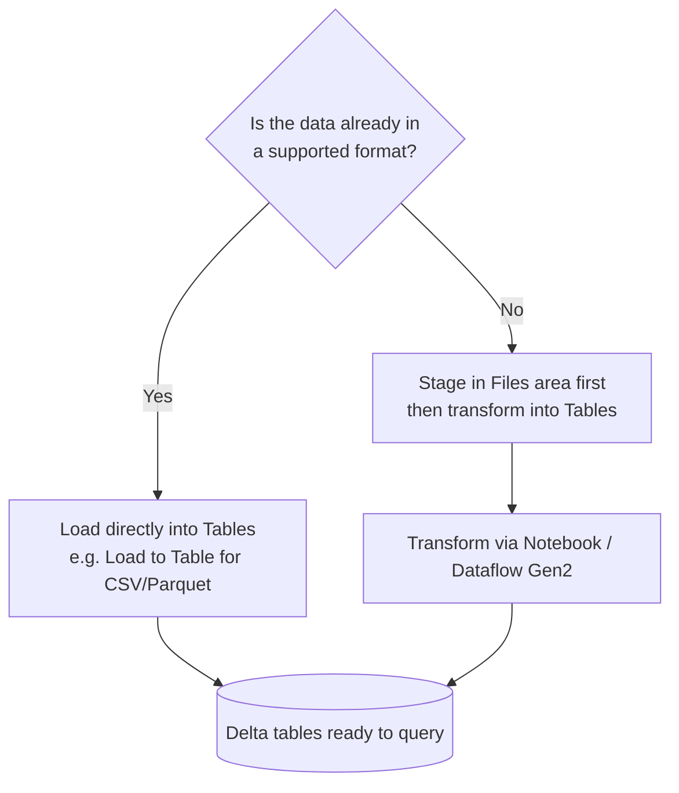
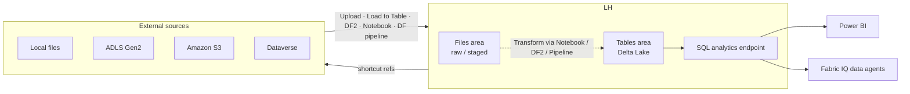

# Unit 3 — Ingest and transform data in a lakehouse

> [!quote] Source
> Microsoft Learn · Module 3 · Unit 3 · "Ingest and transform data in a lakehouse"
> <https://learn.microsoft.com/en-us/training/modules/get-started-lakehouses/3-work-lakehouse/>

## 🎯 The unit in one sentence

A lakehouse has **two storage areas** (Tables + Files) and a **SQL analytics endpoint**; you get data into it via **5 ingestion paths**, you **avoid copy jobs by using shortcuts**, and you transform with the **same tools you ingest with**.

## 🏗️ Anatomy of a lakehouse item

| Component | What it stores | Schema | Queryable? | Mutability |
|-----------|----------------|--------|------------|------------|
| **Tables** | Delta Lake tables | Enforced | ✅ via SQL endpoint | Schema-managed |
| **Files** | CSV / JSON / Parquet / images / docs in native format | None | ❌ (process via Spark / Dataflows Gen2) | Free upload/edit |
| **SQL analytics endpoint** | T-SQL interface over the Tables area | — | ✅ read-only | **Read-only** by design |

### Two explorer modes

> [!info] How you work with it
> - **Lakehouse explorer** — add and interact with tables, files, and folders. **Manage** data: upload files, create tables, make changes. You can add **reference lakehouses** to the pane so you can browse multiple lakehouses side to side.
> - **SQL analytics endpoint** — query Delta tables with **T-SQL in read-only mode**. You can create **views**, **functions**, and apply **SQL security**, but you **cannot modify underlying data**.

## 🧩 Schemas are on by default

> [!important] Modern default
> When you create a lakehouse, **schemas are enabled by default** and a schema named **dbo** is created automatically.

- Schemas group tables by **business domain or function** (e.g. `sales`, `marketing`, `hr`).
- You can create **more schemas** as the lakehouse grows.
- Schemas enable:
  - **Schema-level permissions** (grant access to a whole schema as a unit).
  - **Cross-workspace queries** using the **four-part namespace**: `workspace.lakehouse.schema.table`.

> [!tip] Why bother with schemas?
> Clear schema organization improves discoverability **for everyone** — including Fabric IQ data agents that translate natural language into SQL against your tables. Better schemas → better agent answers.

## 📥 The 5 ingestion paths

| # | Path | Best for | Skill |
|---|------|----------|-------|
| 1 | **Upload** | Throw a file or folder onto the Files area | Click-through |
| 2 | **Load to Table** | Turn a file/folder in Files into a **Delta table without writing code** (Parquet + CSV; append or overwrite) | Click-through |
| 3 | **Dataflows Gen2** | Import + transform using **Power Query** | Power Query / Excel-style |
| 4 | **Notebooks** | Programmatic ingest + transform with **Apache Spark** | PySpark / SQL / Scala |
| 5 | **Data Factory pipelines** | Ingest from many external sources via the **Copy data activity** | Pipeline orchestration |

### Pick your loading pattern

> [!note] Design choice
> Raw → Files → Transform → Tables is the classic medallion-style flow (bronze/silver). Use Tables-direct when the data is already clean and correctly typed.

## 🔗 Shortcuts — data without copy jobs

> [!tip] Zero-copy
> **Shortcuts** are references (not copies) to data in external storage. They appear as **folders in your lakehouse**, but the bytes stay where they are.

- **Target storage** — another storage account, **another cloud provider**, or **other Fabric items**.
- **Permissions** — **OneLake manages source credentials**. When you traverse a shortcut to **another OneLake location**, OneLake uses **your identity** to authorize — so the target access still depends on your permissions **at the target**.

### Schema shortcuts

You can also create **schema shortcuts** that map **an entire schema** to a folder of **Delta tables** in another lakehouse or in **ADLS Gen2**. **All referenced tables appear as local tables within the schema**.

## 🔄 Transform with the same tools you ingest with

You typically ingest raw into **Files**, then transform, then load into **Tables**. The transformation toolset is the **same** as the ingestion toolset:

| Tool | Style | Picked by |
|------|-------|-----------|
| **Notebooks** | Programmatic — **PySpark, SQL, Scala** | Data engineers |
| **Dataflows Gen2** | Visual — **Power Query** | Excel / Power BI users |
| **Pipelines** | Visual orchestration — sequence/parallel **activities** | Workflow builders |

> [!tip] Copilot for notebooks
> **Copilot in notebooks** can **generate transformation code from natural language descriptions** and **explain existing Spark code** — handy when you need a quick scaffold.

## 🧠 Visual — full ETL flow

## 🔑 Key terms (flashcards)

- **Lakehouse explorer** — Manage-mode UI for tables, files, folders. Can pin **reference lakehouses** for multi-lake browsing.
- **SQL analytics endpoint** — Read-only T-SQL interface over the Tables area. Create **views**, **functions**, **SQL security**, no DML.
- **Schema (lakehouse)** — Logical grouping of tables by business domain. **Enabled by default** with a `dbo` schema auto-created.
- **Four-part namespace** — `workspace.lakehouse.schema.table` for **cross-workspace** queries.
- **Load to Table** — No-code ingestion from a file/folder in Files → Delta table (Parquet + CSV; append or overwrite).
- **Dataflows Gen2** — Power-Query-based ingest and transform inside Fabric.
- **Schema shortcut** — A shortcut that maps a whole schema to a folder of Delta tables in another lakehouse or ADLS Gen2.
- **Identity-based authorization (shortcuts)** — OneLake authorizes shortcut access to other OneLake locations using **your** identity; target permissions still apply.
- **V-Order (Fabric)** — Fabric's optimized write/Parquet format for fast reads (auto-applied; covered in later modules).

## 🧭 Next

→ [[Unit-4-Query-and-Analyze]]
← [[Unit-2-Lakehouse-Features]]
↑ [[_MOC]]
