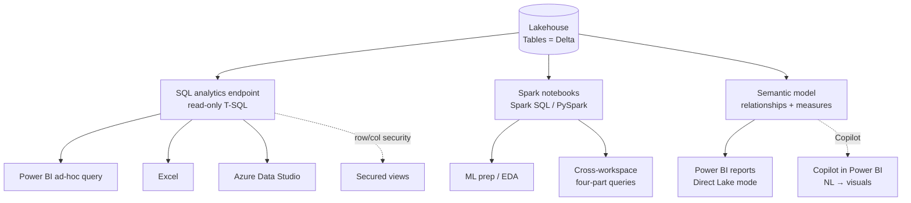

# Unit 4 — Query and analyze lakehouse data

> [!quote] Source
> Microsoft Learn · Module 3 · Unit 4 · "Query and analyze lakehouse data"
> <https://learn.microsoft.com/en-us/training/modules/get-started-lakehouses/4-explore-data-lakehouse/>

## 🎯 The unit in one sentence

A lakehouse in Fabric exposes **three querying paths** — **SQL endpoint** (familiar T-SQL), **Spark notebooks** (programmatic + exploratory), and **Power BI** (BI + Direct Lake) — choose by skill set + workload shape.

## 🗃️ Path 1 — SQL analytics endpoint

> [!info] Definition
> The **SQL analytics endpoint** is **read-only T-SQL** access to lakehouse Delta tables, **automatically created** with every lakehouse. Queries **do not modify** the underlying data files.

### Common use cases

| Use case | Example |
|----------|---------|
| **Ad-hoc queries** | "How many rows landed last week?" |
| **BI connections** | Power BI, Excel, Azure Data Studio retrieve data for reports |
| **Data validation** | Verify transformation results after a load |

### Reusable logic — views

You can create **SQL views** to store reusable query logic.

- Apply **business rules** centrally.
- **Simplify complex joins** for report authors.
- **Curate data** for downstream consumers.
- Example pattern: a view that joins sales + product tables and filters for **active products only**.

### Security

The SQL endpoint also supports **row-level security** and **column-level security** so you control what each user sees when they query.

> [!tip] Copilot for SQL
> **Copilot for SQL queries** can **write T-SQL from natural language descriptions**. Describe what you want to analyze; Copilot drafts the query. Great for learning patterns.

## 🧪 Path 2 — Spark notebooks

> [!info] Definition
> Notebooks give you a **flexible, code-based environment** for querying and analyzing lakehouse data — **Spark SQL** for SQL syntax, **PySpark** for programmatic data manipulation.

### Spark SQL vs PySpark

| Style | When to pick |
|-------|--------------|
| **Spark SQL** | Familiar SQL patterns, simpler readable code, e.g. `SELECT * FROM schema.table` |
| **PySpark** | Complex transformations, Python ecosystem, ML prep, `df.select()` / `df.filter()` DataFrame API, or `spark.sql()` for SQL inside Python |

### Common notebook use cases

- **Exploratory data analysis** — patterns, outliers, relationships.
- **Complex transformations** — business logic that's easier in code than SQL.
- **Cross-workspace queries** — use the **four-part namespace** `workspace.lakehouse.schema.table` to join across multiple lakehouses in a single query.

> [!tip] Copilot for notebooks
> **Copilot** can **generate PySpark / Spark SQL code** from natural language prompts and **explain existing code**. Speeds up authoring and teaches Spark syntax as you work.

## 📊 Path 3 — Power BI

> [!info] Power BI role
> Power BI is the **BI and reporting layer** in Fabric — the **consumption layer** where business users access data through **interactive reports and dashboards**.

### Two ways to connect

| Approach | When | What it does |
|----------|------|--------------|
| **Query the SQL analytics endpoint** | Analysts want **ad-hoc exploration** before building a report | Run queries from Power BI or Excel |
| **Create a semantic model** | You want a **reusable, curated model** with relationships + measures + business logic | Defines what Power BI reports consume |

### Direct Lake — the default mode

> [!important] Default behavior
> When you build reports on a **lakehouse semantic model**, Power BI uses **Direct Lake** mode **by default**. Direct Lake **reads directly from Delta Lake Parquet files without importing or copying** the data. Fast + always current.

### Copilot over a semantic model

When you define **clear relationships** and **business measures** in a semantic model, **Copilot in Power BI** can generate visualizations and answer business questions by reasoning over your lakehouse data.

## 🧠 Visual — three query paths from one lakehouse

## 🧠 Decision matrix — which path do I use?

| If you want to… | Use |
|-----------------|-----|
| Run familiar SQL joins quickly | **SQL analytics endpoint** |
| Hand report authors curated data | **Views** on the SQL endpoint |
| Restrict rows/cols per user in SQL | **RLS / CLS** on the SQL endpoint |
| Explore data interactively in code | **Spark notebook (PySpark / Spark SQL)** |
| Combine Python ML libraries with the data | **Spark notebook with PySpark** |
| Join across multiple lakehouses | **Spark notebook** with four-part namespace |
| Build a reusable, governed model for reports | **Semantic model** over lakehouse tables |
| Serve reports that always reflect the latest Delta data | **Power BI report in Direct Lake mode** |

## 🔑 Key terms (flashcards)

- **SQL analytics endpoint** — Read-only T-SQL surface auto-created on every lakehouse; supports views, functions, RLS, CLS.
- **Spark SQL** — SQL syntax inside a notebook cell against lakehouse tables.
- **PySpark** — Python DataFrame API for Spark; supports `df.select()` / `df.filter()` / `spark.sql()`.
- **EDA** — Exploratory data analysis; typical notebook workload.
- **Four-part namespace** — `workspace.lakehouse.schema.table` for cross-workspace joins.
- **Semantic model** — Curated model of relationships + measures + business logic over lakehouse tables.
- **Direct Lake mode** — Default Power BI connection that reads **Parquet directly from Delta Lake** — no copy, always current.
- **Import mode** — Copies data into Power BI (not the default for lakehouses).
- **DirectQuery mode** — Queries the source in real time without copying (legacy option; usually slower than Direct Lake).
- **Copilot in Power BI** — Generative-AI assistant that builds reports / answers NL questions against a semantic model.

## 🧭 Next

→ [[Unit-5-Exercise-Create-Lakehouse]]
← [[Unit-3-Ingest-and-Transform]]
↑ [[_MOC]]
