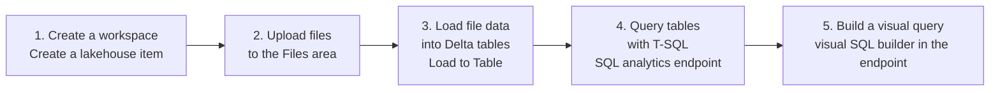

# Unit 5 — Exercise — Create a Microsoft Fabric lakehouse

> [!quote] Source
> Microsoft Learn · Module 3 · Unit 5 · "Exercise - Create a Microsoft Fabric lakehouse"
> <https://learn.microsoft.com/en-us/training/modules/get-started-lakehouses/5-exercise-lakehouse/>

> [!warning] About this note
> This page is a **summary** of the hands-on lab. The full lab runs in a hosted sandbox — Microsoft Learn intentionally hides the step-by-step procedure from the public page so users run it inside the sandbox UI. Below is **what the lab covers**, the **skills it exercises**, and how to **set yourself up before launching**.

> [!important] Prerequisites
> - You need a **Microsoft Fabric trial license** (free).
> - Your tenant must have the **Fabric preview enabled**.
> - See [Getting started with Fabric](https://learn.microsoft.com/en-us/fabric/get-started/fabric-trial) if you don't yet have access.
> - Launch link (from the MS Learn page): <https://go.microsoft.com/fwlink/?linkid=2352753>

## 🎯 The unit in one sentence

A 30-minute, sandboxed, hands-on build of a complete lakehouse: **create → upload files → load to table → SQL query → visual query**. The lab is the single best way to lock in everything from units 2–4.

## 🧱 What the lab builds

The lab exercises the full lakehouse lifecycle on a Fabric trial tenant:

| Step | What you do | Tool / mode | Skills exercised |
|------|-------------|-------------|------------------|
| **1** | Create a new lakehouse inside a Fabric-enabled workspace | Fabric portal → New item → Lakehouse | Fabric navigation, item creation |
| **2** | Upload sample data files | Lakehouse explorer → Upload | Files area, native format ingestion |
| **3** | Turn those files into **Delta tables** with no code | Lakehouse explorer → **Load to Table** | Click-through ETL, Delta-table creation |
| **4** | Query the resulting tables using T-SQL | **SQL analytics endpoint** | Read-only T-SQL, schema-aware queries |
| **5** | Build a visual query (no hand-coding) | Visual query builder in the SQL endpoint | Power-Query-style authoring for analysts |

## 🧠 Concepts the lab demonstrates (mapped to the rest of the module)

| Lab step | Demonstrates | Cross-ref |
|----------|--------------|-----------|
| Create lakehouse | The lakehouse item is created with **Tables** + **Files** + **SQL analytics endpoint** | [[Unit-2-Lakehouse-Features]] |
| Upload files | The Files area accepts **any native format** (CSV, JSON, etc.) without a schema | [[Unit-2-Lakehouse-Features]] · [[Unit-3-Ingest-and-Transform]] |
| Load to Table | **No-code** path from File to **Delta table**; no notebook required | [[Unit-3-Ingest-and-Transform]] |
| SQL queries | Read-only T-SQL via the SQL endpoint; understand schema-vs-files split | [[Unit-4-Query-and-Analyze]] |
| Visual query | Same SQL endpoint, **visual builder** — same engine, no-code surface for analysts | [[Unit-4-Query-and-Analyze]] |

> [!tip] Why load to table is the headline trick
> This lab deliberately picks **Load to Table** as its first transformation step because it's the **fastest way to see a Delta table come into existence** — the same underlying action runs whether you trigger it from the UI, a notebook, or a pipeline.

## 🔧 Before you start

> [!warning] Setup checklist
> 1. **Fabric trial** activated on your tenant — see [Getting started with Fabric](https://learn.microsoft.com/en-us/fabric/get-started/fabric-trial).
> 2. **Capacity** — make sure you have an active Fabric capacity (F2 Trial or higher). The sandbox needs compute to run.
> 3. **Browser** — Edge or Chrome latest; the lab UI uses the Fabric portal.
> 4. **Sign-in** — use the Microsoft account tied to your Fabric trial.

## 📁 Sample data used in the lab

The hosted sandbox ships with a small sample dataset (CSV files representing something like sales / customer / product rows — exact filenames vary by lab version). All you need to know is:

- They land in **Files**.
- They're intended to demo the **Load to Table** → **SQL query** → **visual query** flow.
- Don't expect production-sized data; expect ~handful-of-rows sized samples.

## 🤔 Things to notice while running it

- The **Tables** and **Files** areas appear side by side in the explorer.
- After **Load to Table**, you can immediately query the resulting table from the SQL endpoint without writing any code.
- The **visual query builder** produces the same T-SQL as hand-written queries — useful for analysts who think in clicks.

> [!success] Learning outcomes
> After completing this exercise you should be able to:
> - Create a Fabric lakehouse item from scratch.
> - Upload files and use **Load to Table** to create Delta tables without writing code.
> - Query a lakehouse using **T-SQL** through the SQL analytics endpoint.
> - Build a **visual query** that wraps SQL authoring in a no-code surface.

## 🧭 Next

→ [[Unit-6-Module-Assessment]]
← [[Unit-4-Query-and-Analyze]]
↑ [[_MOC]]
