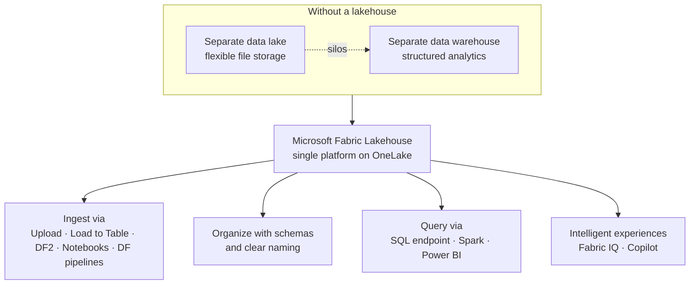

# Unit 7 — Summary

> [!quote] Source
> Microsoft Learn · Module 3 · Unit 7 · "Summary"
> <https://learn.microsoft.com/en-us/training/modules/get-started-lakehouses/7-summary/>

## 📝 Verbatim recap

> In this module, you learned how to create a lakehouse, bring data in through multiple ingestion methods, and query that data using SQL and Spark. You also explored how organizing lakehouse data with clear schemas and naming conventions creates a foundation that supports not only traditional reporting through Power BI, but also intelligent experiences powered by Fabric IQ and Copilot.
>
> Without a lakehouse, organizations often maintain separate systems for flexible file storage and structured analytics, leading to data silos, duplication, and complex integration. A lakehouse in Microsoft Fabric eliminates that divide by combining both capabilities in a single platform, built on OneLake.

## 🧠 Key takeaway diagram

## 🔑 One-paragraph synthesis

A **Microsoft Fabric lakehouse** collapses the divide between file storage and structured analytics. You get **two areas in one item** — **Tables** (Delta Lake, schema-enforced, ACID) and **Files** (any native format) — plus a **SQL analytics endpoint** (read-only T-SQL) for warehouse-style querying. **Ingestion is five paths**: upload, **Load to Table** (no-code Delta creation for Parquet/CSV), **Dataflows Gen2** (Power Query), **Spark notebooks**, and **Data Factory pipelines**. **Shortcuts** let you reference external data without copy jobs. **Query** via SQL (ad-hoc, BI connections, RLS/CLS, views), Spark (PySpark/Spark SQL, EDA, ML prep, four-part cross-workspace joins), or **Power BI** (with **Direct Lake** as the default mode for lakehouse semantic models). The investment pays forward into **AI**: well-structured tables are queried by **Fabric IQ data agents** and **Copilot** across Power BI, SQL, and notebooks.

## 📚 Learn more (Microsoft docs)

- [Data Engineering in Microsoft Fabric](https://learn.microsoft.com/en-us/fabric/data-engineering/)
- [Lakehouse overview](https://learn.microsoft.com/en-us/fabric/data-engineering/lakehouse-overview)
- [OneLake shortcuts](https://learn.microsoft.com/en-us/fabric/onelake/onelake-shortcuts)
- [Get data into a Fabric lakehouse](https://learn.microsoft.com/en-us/fabric/data-engineering/load-data-lakehouse)
- [Security in Microsoft Fabric](https://learn.microsoft.com/en-us/fabric/security/security-overview)

## 🧭 Done with Module 3

← [[Unit-6-Module-Assessment]]
↑ [[_MOC]]

Next module candidate (per typical DP-600 path): likely **"Implement a lakehouse with Microsoft Fabric"** or a downstream Data Engineering / Data Factory / Warehouse module.
