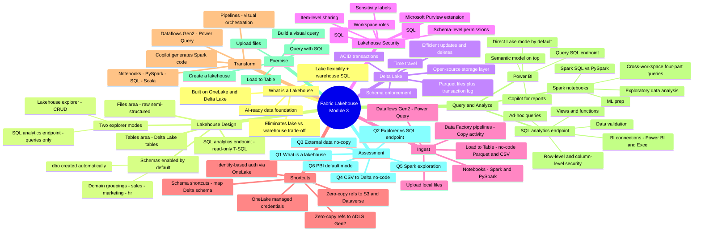

# Module 3 — Get started with lakehouses in Microsoft Fabric

> [!info] Module map
> This module zooms into **the lakehouse item** — Fabric's unified answer to "we have a data lake *and* a data warehouse, can we please just have one thing?". It covers the **Tables / Files** split, **Delta Lake** under the hood, ingestion + shortcut patterns, SQL + Spark + Power BI querying, and a hands-on exercise to build one yourself.

## 🎯 Learning objectives (synthesized from unit-level goals)

By the end of this module you should be able to:

1. **Describe** what a Microsoft Fabric lakehouse is and how it combines data-lake flexibility with warehouse-style SQL analytics on top of OneLake.
2. **Identify** the roles of the **Tables** area (Delta Lake), the **Files** area (raw/semi-structured), and the **SQL analytics endpoint** (read-only T-SQL).
3. **Ingest** data into a lakehouse via upload, **Load to Table**, Dataflows Gen2, Spark notebooks, and Data Factory pipelines.
4. **Use shortcuts** to reference external data (ADLS Gen2, S3, Dataverse, other lakehouses) **without copying**.
5. **Query** lakehouse data through the **SQL analytics endpoint**, **Spark notebooks** (Spark SQL / PySpark), and **Power BI** semantic models in **Direct Lake** mode.
6. **Recognize** that well-structured lakehouse data is the foundation for AI experiences (Fabric IQ data agents, Copilot in Power BI / SQL / notebooks).
7. **Create** a working lakehouse end-to-end in a hands-on exercise.

## 🧠 Module mind map

> [!tip] How to use
> The mind map below is duplicated as a standalone Mermaid file (`Module-Mind-Map.md`) you can open in Obsidian's Mermaid preview or the [Mermaid Live Editor](https://mermaid.live). It is the **single-page view** of the entire module.

## 📑 Unit breakdown

| # | Unit | XP | Minutes | Focus |
|---|------|----|---------|-------|
| 1 | [Introduction](./Unit-1-Introduction.md) | 100 | 2 | Why lakehouses exist; lake+warehouse framing |
| 2 | [Describe lakehouse features and capabilities](./Unit-2-Lakehouse-Features.md) | 100 | 5 | Tables vs Files, Delta Lake, security, AI foundation |
| 3 | [Ingest and transform data in a lakehouse](./Unit-3-Ingest-and-Transform.md) | 100 | 7 | Create lakehouse, 5 ingest paths, shortcuts, transforms |
| 4 | [Query and analyze lakehouse data](./Unit-4-Query-and-Analyze.md) | 100 | 7 | SQL endpoint, Spark notebooks, Power BI + Direct Lake |
| 5 | [Exercise - Create a Microsoft Fabric lakehouse](./Unit-5-Exercise-Create-Lakehouse.md) | 100 | 30 | Hands-on: create, upload, load, query, visual query |
| 6 | [Module assessment](./Unit-6-Module-Assessment.md) | 200 | 5 | 6 knowledge-check questions |
| 7 | [Summary](./Unit-7-Summary.md) | 100 | 2 | Recap + "Data Engineering in Microsoft Fabric" link |

**Total: 800 XP · ~58 minutes**

## 🔗 Knowledge-check answers (unit 6)

| Q | Question | Correct answer |
|---|----------|----------------|
| 1 | What is a Microsoft Fabric lakehouse? | **An analytical store that combines the file storage flexibility of a data lake with the SQL-based query capabilities of a data warehouse.** |
| 2 | What is the main difference between the lakehouse explorer and SQL analytics endpoint? | **Lakehouse explorer enables interaction with tables, files, and folders, while SQL analytics endpoint provides read-only T-SQL querying of Delta tables.** |
| 3 | You want external ADLS Gen2 data in your lakehouse without copying it. What should you do? | **Create a shortcut.** |
| 4 | You have CSVs in the Files area and want Delta tables without writing code. What should you use? | **Load to Table** |
| 5 | You want to use Apache Spark to interactively explore data in a file in the lakehouse. What should you do? | **Create a notebook.** |
| 6 | What connection mode does Power BI use by default when connecting to a lakehouse semantic model? | **Direct Lake mode, which reads directly from Delta Lake files without copying data.** |

## 🧭 Downstream links

- [[Unit-1-Introduction]] · [[Unit-2-Lakehouse-Features]] · [[Unit-3-Ingest-and-Transform]] · [[Unit-4-Query-and-Analyze]] · [[Unit-5-Exercise-Create-Lakehouse]] · [[Unit-6-Module-Assessment]] · [[Unit-7-Summary]]
- [[Module-Mind-Map]]
- Career/DP-600 index (parent MOC) — *to be created*

## 📚 External references

- Microsoft Learn module page: <https://learn.microsoft.com/en-us/training/modules/get-started-lakehouses/>
- Data Engineering in Microsoft Fabric: <https://learn.microsoft.com/en-us/fabric/data-engineering/>
- Lakehouse overview: <https://learn.microsoft.com/en-us/fabric/data-engineering/lakehouse-overview>
- Lakehouse security: <https://learn.microsoft.com/en-us/fabric/security/security-overview>
- OneLake shortcuts: <https://learn.microsoft.com/en-us/fabric/onelake/onelake-shortcuts>
- Get data into a Fabric lakehouse: <https://learn.microsoft.com/en-us/fabric/data-engineering/load-data-lakehouse>
