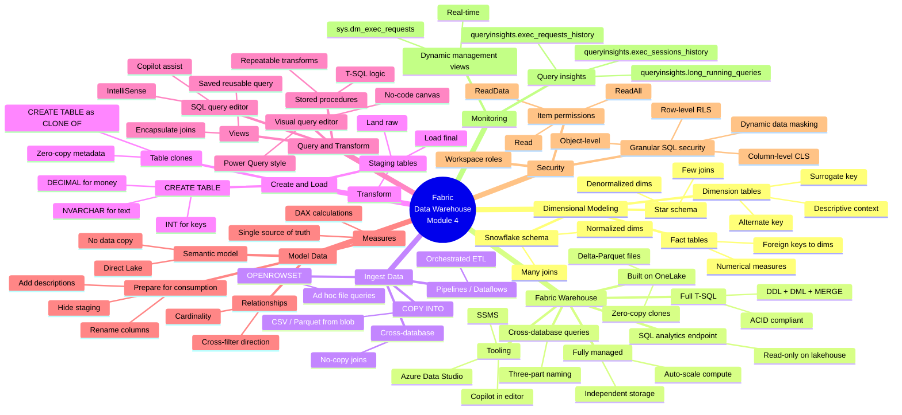

# Module 4 Mind Map — Get started with data warehouses in Microsoft Fabric

> [!info] Companion file
> This is the **standalone, single-page Mermaid mind map** for Module 4. It is duplicated inside [[_MOC]] for inline reading; this file exists so you can open it directly in Obsidian's Mermaid preview, or paste into the [Mermaid Live Editor](https://mermaid.live) for export/zoom.

> [!tip] Navigation
> Return to [[_MOC]] for the full module index, unit breakdown, and knowledge-check answers.