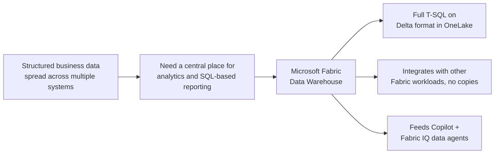

# Unit 1 — Introduction

> [!quote] Source
> Microsoft Learn · Module 4 · Unit 1 · "Introduction"
> <https://learn.microsoft.com/en-us/training/modules/get-started-data-warehouse/1-introduction>

## 🎯 Purpose

A short framing unit that explains **why** a Fabric data warehouse exists and **what you'll build** by the end of the module. The scenario: a retail organization with structured business data spread across multiple systems that needs to be centralized for analytics and reporting using familiar SQL tools.

> [!note] Framing
> The source content for this unit is conceptual scene-setting — most of the substantive material begins in [[Unit-2-Understand-Data-Warehouse]] and [[Unit-3-Understand-Warehouses-Fabric]].

## 🔑 Key takeaways

- **Relational data warehouses are at the center** of most enterprise BI solutions — they provide a structured, SQL-based environment for storing, querying, and analyzing business data at scale.
- A **Microsoft Fabric data warehouse** is a fully managed warehouse with **full transactional T-SQL** (CREATE TABLE, INSERT, UPDATE, DELETE).
- Warehouse data is stored in **Delta format on OneLake** — so it integrates seamlessly with other Fabric workloads without data movement.
- The warehouse is a **core component of the intelligent data foundation** that supports Copilot experiences and AI-driven insights.
- By the end of this module you'll know how to build a warehouse that serves **both human analysts and AI-powered experiences**.

## 🧠 Visual

## 🧭 Next

→ [[Unit-2-Understand-Data-Warehouse]]
↑ [[_MOC]]