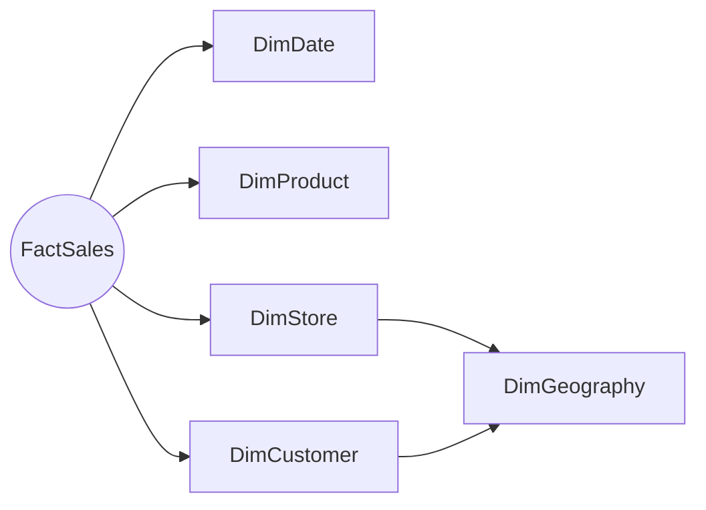
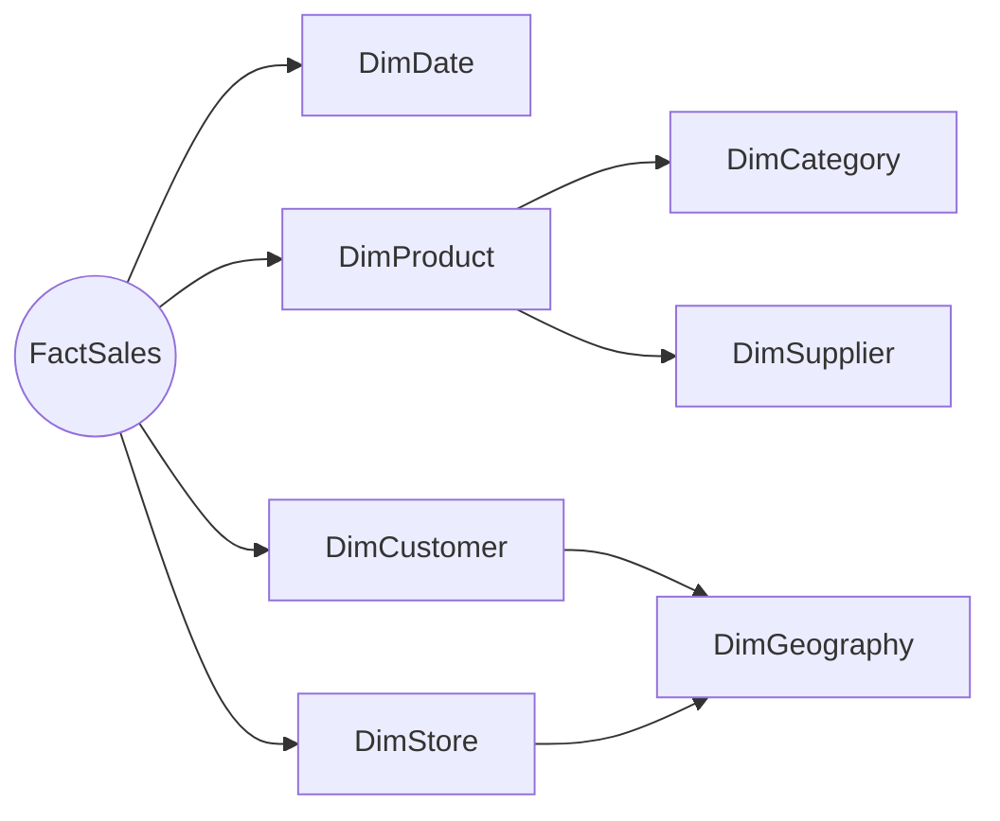
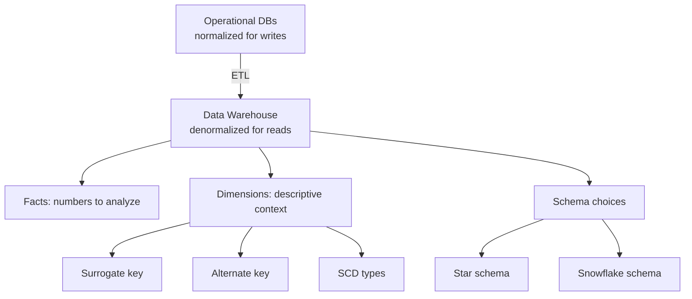

# Unit 2 — Understand data warehouses

> [!quote] Source
> Microsoft Learn · Module 4 · Unit 2 · "Understand data warehouses"
> <https://learn.microsoft.com/en-us/training/modules/get-started-data-warehouse/2-understand-data-warehouse>

## 🎯 Purpose

Define **what a data warehouse is**, contrast it with operational databases, and explain the **dimensional modeling** approach (facts, dimensions, surrogate/alternate keys, star vs. snowflake) that warehouse tables are organized around.

## 🏗️ What is a data warehouse?

A **centralized, structured store designed for analytical queries and reporting**. Unlike operational databases that handle day-to-day business transactions, a warehouse consolidates data from multiple sources into a format optimized for analysis.

> [!info] Four stages of building a modern warehouse
> 1. **Data ingestion** — Move data from source systems into the warehouse.
> 2. **Data storage** — Store the data in a format optimized for analytics.
> 3. **Data processing** — Transform the data into a format ready for analytical tools.
> 4. **Data analysis and delivery** — Analyze the data and deliver insights to the business.

## 📊 Dimensional modeling

Data warehouse tables are organized in a schema optimized for **multidimensional modeling** — numerical event data grouped by different attributes (e.g. total sales on a date at a store).

### Fact tables vs. dimension tables

| | Fact tables | Dimension tables |
|---|---|---|
| **Contain** | Numerical data you want to analyze | Descriptive context |
| **Row count** | Large (the primary analytical source) | Smaller (one row per entity) |
| **Examples** | `FactSales` with `SalesAmount`, `Quantity` | `DimCustomer`, `DimProduct`, `DimDate` |
| **Join keys** | Foreign keys pointing to dimensions | Primary keys (surrogate + alternate) |

### Two key columns on a dimension

- **Surrogate key** — A unique identifier for each row in the dimension, typically an integer auto-generated by the DBMS. Specific to the warehouse — keeps consistency and accuracy.
- **Alternate key** — A natural or business key from the source system (e.g. product code, customer ID). Specific to the source system — keeps traceability between warehouse and source.

> [!tip] Why both?
> You need **surrogate keys** for warehouse-side stability and **alternate keys** for source-side traceability. They serve different purposes.

### Special dimension types

- **Time dimensions** — Provide time-period context (year, quarter, month, day) so analysts can aggregate over temporal intervals.
- **Slowly changing dimensions (SCD)** — Track changes to dimension attributes over time (customer address changes, product price changes). Essential for analyzing how data has changed.

## 🌟 Star vs. snowflake schema

In most **transactional** databases, data is **normalized** to reduce duplication. In a **data warehouse**, dimension data is **denormalized** to reduce the number of joins required to query the data.

### Star schema

A **fact table relates directly** to the dimension tables. Dimension attributes group fact-table numbers at different levels (whole region vs. one customer), and you can store information for each level in the same dimension table.

> [!tip] More on star schemas
> See [What is a star schema?](https://learn.microsoft.com/en-us/power-bi/guidance/star-schema) for designing star schemas in Fabric.

### Snowflake schema

When there are **lots of levels or attributes shared by different things**, normalize some dimensions into a snowflake. Each row in `DimProduct` holds key values for `DimCategory` and `DimSupplier`; `DimGeography` is shared by `DimCustomer` and `DimStore`.

> [!warning] Star vs. snowflake tradeoff
> **Star** = fewer joins, faster queries, easier for analysts. **Snowflake** = less redundancy, but more joins and a steeper cognitive load. Most Fabric warehouses aim for a star schema; snowflake only when the hierarchy demands it.

## 🧠 Visual summary

## 🔑 Key takeaways

- A data warehouse is **centralized, structured, and optimized for analytical queries** — not for transaction processing.
- **Fact tables** hold numbers; **dimension tables** hold context.
- Each dimension typically has a **surrogate key** (warehouse-internal) and an **alternate key** (source-system identifier).
- **Time dimensions** and **slowly changing dimensions** are special types you'll use in nearly every warehouse.
- **Star schemas** minimize joins; **snowflake schemas** normalize deeper hierarchies. Most Fabric warehouses use a star schema.

## 🧭 Next

→ [[Unit-3-Understand-Warehouses-Fabric]]
← [[Unit-1-Introduction]]
↑ [[_MOC]]