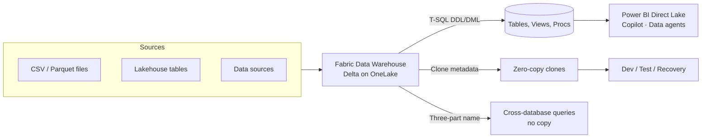

# Unit 3 — Understand data warehouses in Fabric

> [!quote] Source
> Microsoft Learn · Module 4 · Unit 3 · "Understand data warehouses in Fabric"
> <https://learn.microsoft.com/en-us/training/modules/get-started-data-warehouse/3-understand-data-warehouse-fabric>

## 🎯 Purpose

Translate the dimensional-modeling concepts from [[Unit-2-Understand-Data-Warehouse]] into **what Microsoft Fabric specifically provides**: a fully managed T-SQL warehouse on Delta/OneLake, plus how to create it, ingest data into it, and create zero-copy table clones.

## 🏛️ A Fabric data warehouse — what it is

A **fully managed, enterprise-scale relational database built on OneLake** with full transactional T-SQL:

- **DDL**: `CREATE`, `ALTER`, `DROP`
- **DML**: `INSERT`, `UPDATE`, `DELETE`, `MERGE`
- **ACID compliant** for data consistency

> [!info] Storage model
> Data is stored in **open Delta format on OneLake**, so other Fabric workloads can access the same data **without duplication**.

### Key capabilities

| Capability | What it means |
|---|---|
| **Full T-SQL support** | Write DDL/DML including `MERGE` for upsert scenarios, using familiar SQL Server syntax |
| **Fully managed** | No infrastructure to configure. Compute scales automatically and independently from storage |
| **OneLake integration** | Warehouse data lives in Delta; other workloads read it without copying |
| **Cross-database querying** | Query across warehouses and lakehouses using three-part naming `db.schema.table` |
| **Familiar tooling** | SSMS, Azure Data Studio, or any TDS-compatible SQL client |
| **Copilot assistance** | Generates SQL from natural language, completes code, explains/fixes existing queries |

## ⚖️ Warehouse vs. SQL analytics endpoint

A Fabric workspace can contain two SQL-based items that serve different purposes.

| Capability | Warehouse | SQL analytics endpoint |
|---|---|---|
| Read data | ✅ | ✅ |
| Write data (`INSERT`, `UPDATE`, `DELETE`, `MERGE`) | ✅ | ❌ |
| Create tables (DDL) | ✅ | ❌ |
| Create views & stored procedures | ✅ | ✅ |
| Data source | Native warehouse tables | Lakehouse Delta tables |

> [!tip] When to use which
> Use a **warehouse** when you need full read/write T-SQL. Use a **SQL analytics endpoint** when you need read-only SQL access to lakehouse data.

## ➕ Create a data warehouse

Create from the **Create hub** or within a **workspace**. After creation, add tables, views, and other objects via the SQL query editor.

## 📥 Ingest data into a warehouse

| Method | Use case |
|---|---|
| **`COPY INTO`** | Bulk-load data from external files (CSV, Parquet) in Azure storage into warehouse tables |
| **`OPENROWSET`** | Query files directly from external storage or OneLake for ad-hoc analysis without creating tables |
| **Pipelines & Dataflows Gen2** | Orchestrated data movement and transformation |
| **Cross-database queries** | Read lakehouse tables directly via three-part naming — **no copy** |

### `COPY INTO` example — load CSV into `dbo.Region`

```sql
COPY INTO dbo.Region
FROM 'https://mystorageaccount.blob.core.windows.net/data/Region.csv'
WITH (
    FILE_TYPE = 'CSV',
    CREDENTIAL = (
        IDENTITY = 'Shared Access Signature',
        SECRET = 'xxx'
    ),
    FIRSTROW = 2
);
GO
```

> [!tip] Skip the copy
> If you already have tables in a lakehouse that you want to query from your warehouse without changes, use **cross-database querying** — you don't need to copy the data.

## 🛠️ Create tables and load data

Define tables with T-SQL `CREATE TABLE`. Pick data types that balance precision with storage efficiency:

- `INT` for key columns
- `NVARCHAR` for text that may include special characters
- `DECIMAL` for financial values that require precision

```sql
CREATE TABLE dbo.DimCustomer
(
    CustomerKey    INT         NOT NULL,
    CustomerAltKey NVARCHAR(10)  NOT NULL,
    CustomerName   NVARCHAR(100) NOT NULL,
    Region         NVARCHAR(50)  NULL
);
GO

CREATE TABLE dbo.FactSales
(
    SalesKey    INT             NOT NULL,
    CustomerKey INT             NOT NULL,
    ProductKey  INT             NOT NULL,
    DateKey     INT             NOT NULL,
    SalesAmount DECIMAL(10,2)   NOT NULL,
    Quantity    INT             NOT NULL
);
GO
```

### Use staging tables for data loading

Land raw data in **staging tables** that mirror the source structure, then transform and load into final dimension/fact tables. This keeps source data intact while you apply business rules and key lookups.

```sql
INSERT INTO dbo.FactSales (SalesKey, CustomerKey, ProductKey, DateKey, SalesAmount, Quantity)
SELECT
    s.OrderID,
    c.CustomerKey,
    p.ProductKey,
    d.DateKey,
    s.Amount,
    s.Qty
FROM dbo.StgSales AS s
INNER JOIN dbo.DimCustomer AS c ON s.CustomerID  = c.CustomerAltKey
INNER JOIN dbo.DimProduct  AS p ON s.ProductID  = p.ProductAltKey
INNER JOIN dbo.DimDate     AS d ON s.OrderDate  = d.DateValue;
GO
```

> [!success] Pattern: stage → transform → load
> **Stage** (raw, source-shape) → **transform** (joins, business rules, surrogate lookups) → **load** into star-schema `Fact` and `Dim` tables.

## 🧬 Table clones

Create **zero-copy table clones** in a Fabric warehouse. Clones copy **table metadata only** while still referencing the same underlying data files in OneLake. The data itself is not duplicated, which keeps storage costs low.

```sql
-- Clone within the same schema
CREATE TABLE dbo.Employee AS CLONE OF dbo.EmployeeUSA;
```

> [!info] When to use clones
> - **Development and testing** — give devs a sandbox without doubling storage.
> - **Data recovery** — snapshot before a risky release.
> - **Historical reporting** — preserve data at specific points in time.
>
> See [Clone table in Microsoft Fabric](https://learn.microsoft.com/en-us/fabric/data-warehouse/clone-table).

## 🧠 Visual



## 🔑 Key takeaways

- A Fabric warehouse = **full T-SQL on Delta files in OneLake** — no data duplication, no infra to manage.
- **Cross-database querying** lets you join warehouse and lakehouse tables without copying.
- **`COPY INTO`** is the workhorse bulk loader from external storage; **`OPENROWSET`** is the ad-hoc file query.
- Use **staging tables** to land raw data before transforming into your star schema.
- **Table clones** give you dev/test/recovery sandboxes at zero storage cost.

## 🧭 Next

→ [[Unit-4-Query-Transform-Data]]
← [[Unit-2-Understand-Data-Warehouse]]
↑ [[_MOC]]