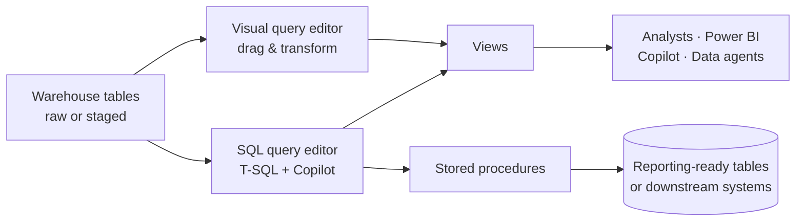

# Unit 4 — Query and transform data

> [!quote] Source
> Microsoft Learn · Module 4 · Unit 4 · "Query and transform data"
> <https://learn.microsoft.com/en-us/training/modules/get-started-data-warehouse/4-query-transform-data>

## 🎯 Purpose

Show the **two querying surfaces** in a Fabric warehouse (SQL editor + Visual editor) and how to **save reusable transformation logic** as views and stored procedures.

> [!info] Why transformation matters
> Raw data rarely arrives in the exact format you need for analysis. You might need to join tables, filter rows, aggregate values, or restructure data before it's useful for reporting.

## ⌨️ SQL query editor (code-first)

A familiar T-SQL experience with **IntelliSense, code completion, syntax highlighting, client-side parsing, and validation** — the same feel as SSMS or Azure Data Studio.

- Create a new query with the **New SQL query** button in the menu.
- **Copilot for Data Warehouse** is available in the editor to:
  - Generate queries from **natural language**
  - Complete code **as you type**
  - Explain or **fix existing queries**

## 🎨 Visual query editor (no-code)

A no-code experience similar to the [Power Query online diagram view](https://learn.microsoft.com/en-us/power-query/diagram-view). Create a new visual query with **New visual query**.

- Drag a table from your warehouse onto the canvas to start.
- Use the **Transform** menu at the top of the screen — or the **(+)** button on the visual itself — to add columns, filters, and other transformations.

## ♻️ Save transformation logic as views and stored procedures

Beyond ad-hoc queries, save logic as reusable warehouse objects so every consumer runs the same code.

### Views

A **view is a saved query you reference like a table**. Use views to:

- **Standardize how analysts access data** — combine fact + dimension tables into a reporting-friendly shape, or filter rows to a specific business context.
- **Improve Copilot / data agent accuracy** — well-named views become stable, predictable surfaces for natural-language queries.

```sql
CREATE VIEW dbo.vw_SalesByRegion
AS
SELECT
    c.Region,
    SUM(f.SalesAmount) AS TotalSales,
    COUNT(f.OrderID)   AS OrderCount
FROM dbo.FactSales AS f
INNER JOIN dbo.DimCustomer AS c
    ON f.CustomerKey = c.CustomerKey
GROUP BY c.Region;
```

> [!tip] Views also help AI
> Copilot and Fabric IQ **data agents** query views just like tables — standardizing data access through well-named views improves the accuracy of natural-language queries.

### Stored procedures

A **stored procedure is T-SQL logic you execute on demand**. Use stored procedures for **repeatable transformation tasks**, such as loading staging data into final tables or applying business rules.

> [!success] Views vs. stored procedures — when to use which
> - **Views** → encapsulate a query (joins, filters, column selections) that consumers reference like a table.
> - **Stored procedures** → execute T-SQL logic on demand (parameterized transforms, ELT loads, business rules).

## 🧠 Visual



## 🔑 Key takeaways

- Two query surfaces: **SQL editor** (code-first, Copilot-assisted) and **Visual query editor** (no-code, Power Query-style).
- **Views** capture reusable query logic and present a stable, named surface for humans and AI.
- **Stored procedures** capture repeatable T-SQL logic for ELT and business-rule tasks.
- Both views and stored procedures make data more **accessible to AI-powered tools** (Copilot, data agents).

## 🧭 Next

→ [[Unit-5-Model-Data]]
← [[Unit-3-Understand-Warehouses-Fabric]]
↑ [[_MOC]]