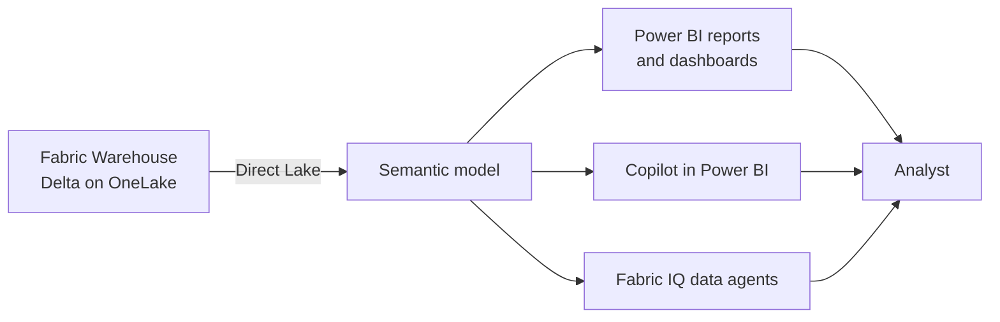

# Unit 5 — Model data in a warehouse

> [!quote] Source
> Microsoft Learn · Module 4 · Unit 5 · "Model data in a warehouse"
> <https://learn.microsoft.com/en-us/training/modules/get-started-data-warehouse/5-model-data>

## 🎯 Purpose

Explain **why modeling matters** in a Fabric warehouse, what to clean up for consumers, how relationships work, when to use views vs. measures, and how to publish a **Direct Lake semantic model** for Power BI.

> [!quote] The why
> Without data modeling, every consumer has to figure out which tables relate to each other, write their own aggregation logic, and guess at column meanings. Data modeling solves this by **embedding structure, business logic, and documentation directly into the warehouse**.

These modeling choices affect **every** downstream experience: T-SQL queries, Power BI reports, and AI-driven natural-language analytics.

## 🧹 1. Prepare data for consumption

Before you define relationships or add calculations, clean up what consumers see. Raw warehouse tables often contain staging tables, surrogate key columns, and internal flags meant for ETL — not for analysis. They create noise.

In the **model view**, take these steps:

- **Hide internal objects** — staging tables, surrogate key columns, ETL artifacts that clutter the field list.
- **Rename columns** — use business-friendly names where the warehouse column names are technical or abbreviated (e.g. `CustRgn` → `Customer Region`).
- **Add descriptions** — to tables and columns so consumers understand what the data represents without referring to external documentation.

> [!important] Modeling = AI accuracy
> **Copilot in Power BI** and **Fabric IQ data agents** rely on table names, column names, and descriptions to interpret natural-language questions and generate accurate SQL or DAX. A column named `Customer Region` with description *"Geographic region of the customer's primary address"* produces better natural-language results than `CustRgn` with no description.

## 🔗 2. Relationships between tables

A **relationship** is a logical connection between two tables that enables filtering, grouping, and aggregation across them. In a star schema, relationships connect **fact tables** to **dimension tables** through shared key columns.

Example: a `CustomerKey` column exists in both `FactSales` and `DimCustomer`, establishing the link that enables analysis of sales by customer attributes like region, segment, or account type.

### Two important properties of every relationship

| Property | Meaning | Star-schema default |
|---|---|---|
| **Cardinality** | How rows in the two tables correspond | Many-to-one (many fact rows → one dimension row) |
| **Cross-filter direction** | Which way filters propagate | **Single direction** — dimension filters fact |

> [!tip] Why single-direction?
> Standard setting for most star-schema designs because it **keeps filter behavior predictable and performant**.

> [!note] Why bother with relationships?
> Without defined relationships, every consumer who wants to combine data across tables has to write explicit `JOIN` logic. Relationships **encode the connection once**. When you create a semantic model from the warehouse, these relationships inform how **Power BI**, **Copilot**, and **Fabric IQ data agents** interpret the data — data agents use relationships to generate accurate joins when translating natural-language questions into SQL.

## 📐 3. Standardize data access with views and measures

Once tables are clean and connected, give consumers reliable, consistent ways to query and calculate against that data. Without standardization, each team writes its own join logic, applies its own filters, defines its own formulas → **conflicting results**.

### Views — for T-SQL consumers

A view **encapsulates join logic, filters, and column selections** into a reusable query that consumers reference like a table. Example: a view that joins fact + dimension tables, filters to completed orders, and surfaces only the columns analysts need gives every T-SQL consumer a reliable starting point. Views also serve as **stable data sources for reports** — point reports at views instead of base tables that may change.

### Measures — for DAX calculations

A **measure is a reusable DAX expression** that defines a calculation (total, average, ratio, count). You create measures directly in the warehouse **model view** by selecting a table and adding a new measure.

Example: a `Total Sales` measure that sums the `SalesAmount` column ensures every consumer uses the **same calculation**.

> [!success] Single source of truth
> Because the measure definition lives with the data, it becomes the single source of truth for that metric. When the business changes how it calculates revenue, update the measure in one place rather than tracking down every report that contains its own formula.

> [!tip] Coverage in other modules
> DAX formulas and advanced measure design are covered in depth in later modules. For views and stored procedures, see [[Unit-4-Query-Transform-Data]].

## 📊 4. Create a semantic model for Power BI reporting

With prepared tables, defined relationships, and standardized views and measures, the warehouse is ready for downstream reporting. Teams that query the warehouse directly by T-SQL or through third-party tools can use the warehouse model as-is. But when you want to build **interactive Power BI reports and dashboards**, the next step is a semantic model.

### Direct Lake mode

Semantic models created from a Fabric warehouse use **Direct Lake mode**:

- Unlike traditional **import mode** (which copies data into Power BI memory), Direct Lake **reads data directly from OneLake Parquet files**.
- Reports reflect the **latest warehouse data without scheduled refreshes**.
- You avoid the storage and processing overhead of maintaining a separate copy of the data.

> [!tip] More on semantic models
> Semantic model design and scalability patterns are covered in greater depth in [Design scalable semantic models](https://learn.microsoft.com/en-us/training/modules/design-power-bi-application-lifecycle-management-strategy/). This unit focuses on modeling in the warehouse itself.

## 🔑 Key takeaways

- **Prepare** the warehouse for consumers: hide internals, rename columns, add descriptions — this directly improves AI accuracy.
- **Define relationships** between facts and dimensions with correct cardinality and cross-filter direction.
- **Views** standardize T-SQL access; **measures** standardize DAX calculations. Both become the **single source of truth** for that metric.
- **Direct Lake semantic models** read straight from OneLake — no copies, no scheduled refreshes.

## 🧭 Next

→ [[Unit-6-Security-Monitor]]
← [[Unit-4-Query-Transform-Data]]
↑ [[_MOC]]