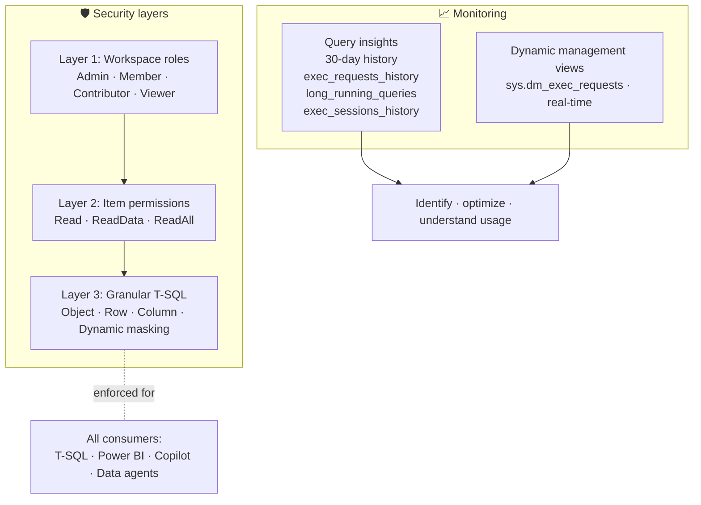

# Unit 6 — Secure and monitor a warehouse

> [!quote] Source
> Microsoft Learn · Module 4 · Unit 6 · "Secure and monitor a warehouse"
> <https://learn.microsoft.com/en-us/training/modules/get-started-data-warehouse/6-security-monitor>

## 🎯 Purpose

Show the **multiple layers of access control** in a Fabric warehouse (workspace → item → granular SQL) and the **monitoring tools** (Query insights + DMVs) that surface performance and activity.

> [!info] Layered defense
> Fabric warehouse security operates at multiple levels, from workspace access down to individual rows and columns. This design supports the distinct needs of your organization while still allowing the **democratization of data — but with governance**.

## 🛡️ Security

### Layer 1 — Workspace roles

Data in Fabric is organized into **workspaces**, and workspace roles are the first layer of access control. Assign users to appropriate roles based on the level of access they need:

- **Admin** — full control
- **Member / Contributor** — can create and edit
- **Viewer** — can view items but can't make changes

> [!tip] More on workspace roles
> See [Workspaces in Power BI](https://learn.microsoft.com/en-us/power-bi/collaborate-share/service-new-workspaces#roles-and-licenses).

### Layer 2 — Item permissions

In addition to workspace roles, you can grant **item permissions** to share individual warehouses **without granting access to the entire workspace**. This granularity is useful when you need to share a warehouse for downstream consumption with specific users.

| Permission | Allows |
|---|---|
| **Read** | Connect using the SQL analytics endpoint |
| **ReadData** | Read data from any table or view in the warehouse |
| **ReadAll** | Read raw parquet files in OneLake |

> [!warning] Read required
> A user connection to the **SQL analytics endpoint fails without `Read` permission at a minimum**.

### Layer 3 — Granular SQL security

For more precise access control, Fabric warehouse supports granular security using T-SQL. These features **restrict data visibility without changing the underlying tables**:

| Feature | What it restricts |
|---|---|
| **Object-level security** | Specific tables, views, or procedures |
| **Row-level security (RLS)** | Which rows a user can see, using `WHERE`-clause predicates |
| **Column-level security (CLS)** | Which columns are visible to specific users |
| **Dynamic data masking** | Masks sensitive values (emails, account numbers) from non-privileged users |

> [!important] Security is enforced everywhere
> Securing warehouse data is important for both regulatory compliance and for ensuring that **AI-powered tools like Copilot and data agents operate within governed boundaries**. Security policies you define in T-SQL are enforced **regardless of how the data is accessed**.

> [!tip] Deeper coverage
> RLS, CLS, and dynamic data masking are covered in depth in [Secure a Microsoft Fabric data warehouse](https://learn.microsoft.com/en-us/training/modules/secure-data-warehouse-in-microsoft-fabric/).

## 📈 Monitoring

Monitoring warehouse activity helps you identify performance issues, optimize queries, and understand usage patterns.

### Query insights

**Query insights** provides a central location for **historical query data** and **actionable performance information**. It retains data for **30 days** and helps you identify long-running queries, track performance changes over time, and understand which queries consume the most resources.

Query insights uses **system views** you can query directly:

| System view | Returns |
|---|---|
| `queryinsights.exec_requests_history` | Information about each completed SQL request |
| `queryinsights.long_running_queries` | Queries ranked by execution time |
| `queryinsights.exec_sessions_history` | Information about completed sessions |

### Dynamic management views (DMVs)

DMVs let you **monitor active connections, sessions, and requests in real time**. Example: use `sys.dm_exec_requests` to find currently running queries.

```sql
SELECT request_id, session_id, start_time, total_elapsed_time
FROM sys.dm_exec_requests
WHERE status = 'running'
ORDER BY total_elapsed_time DESC;
```

> [!warning] Kill requires Admin
> You must be a workspace **Admin** to run the `KILL` command to terminate long-running sessions. Members, Contributors, and Viewers can see their own results but **can't see other users' queries**.

## 🧠 Visual



## 🔑 Key takeaways

- **Workspace roles** are the first access gate; **item permissions** add per-warehouse granularity.
- **Granular T-SQL security** (object / row / column / masking) is enforced regardless of how the data is accessed — including AI tools.
- **Query insights** gives 30 days of historical performance data; **DMVs** give real-time activity.
- Only **workspace Admins** can `KILL` long-running sessions; others see only their own results.

## 🧭 Next

→ [[Unit-7-Exercise]]
← [[Unit-5-Model-Data]]
↑ [[_MOC]]