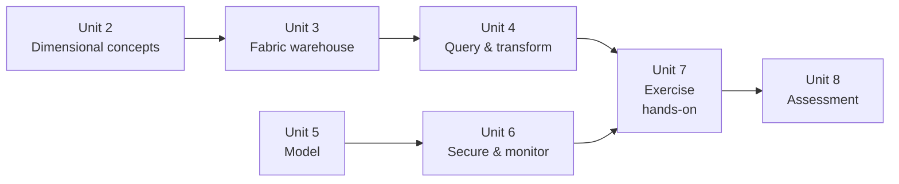

# Unit 7 — Exercise: Create and query a warehouse

> [!quote] Source
> Microsoft Learn · Module 4 · Unit 7 · "Exercise - Create and query a warehouse"
> <https://learn.microsoft.com/en-us/training/modules/get-started-data-warehouse/7-exercise>

## 🎯 Purpose

A **30-minute hands-on lab** that puts units [[Unit-3-Understand-Warehouses-Fabric]] and [[Unit-4-Query-Transform-Data]] into practice. You create a Fabric data warehouse and run queries against it.

> [!warning] Prerequisites
> You need a **Microsoft Fabric trial license** with the **Fabric preview enabled** in your tenant. See [Getting started with Fabric](https://learn.microsoft.com/en-us/fabric/get-started/fabric-trial) to enable your trial license.

## 🔬 What the lab does

The exercise walks you through the end-to-end workflow of standing up a warehouse and exploring it with SQL:

1. **Provision a warehouse** in a Fabric-enabled workspace (Create hub or workspace context).
2. **Use the SQL query editor** — familiar T-SQL experience with IntelliSense and Copilot assistance.
3. **Run queries against the warehouse** to validate that ingestion and transformations work as expected.
4. (Likely) **ingest sample data** via one of the supported paths — `COPY INTO`, `OPENROWSET`, pipelines, or cross-database queries from a lakehouse — depending on the lab's design.

> [!info] Format note
> Per the task specification, this unit is a **summary of what the lab does, not the lab itself**. The full step-by-step lab lives behind the [launch exercise link](https://go.microsoft.com/fwlink/?linkid=2259608) on the Microsoft Learn page.

## 🔑 Skills practiced

| Skill | From unit |
|---|---|
| Create a Fabric data warehouse | [[Unit-3-Understand-Warehouses-Fabric]] |
| Write T-SQL in the SQL query editor | [[Unit-4-Query-Transform-Data]] |
| Validate queries return expected results | [[Unit-4-Query-Transform-Data]] |
| (Likely) ingest data using a supported method | [[Unit-3-Understand-Warehouses-Fabric]] |

## 🧠 Visual — where this lab sits in the module

## 🔗 Launch the exercise

> [!success] Launch
> [Launch the exercise on Microsoft Learn →](https://go.microsoft.com/fwlink/?linkid=2259608)

## 🧭 Next

→ [[Unit-8-Module-Assessment]]
← [[Unit-6-Security-Monitor]]
↑ [[_MOC]]