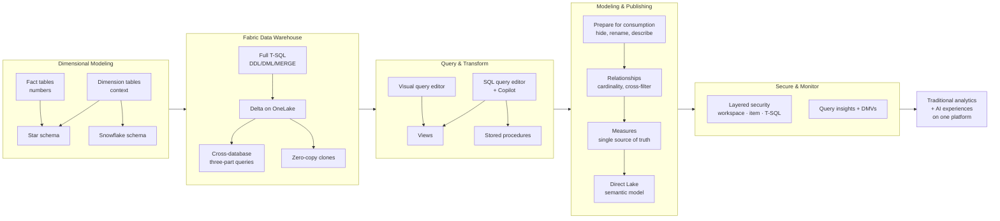

# Unit 9 — Summary

> [!quote] Source
> Microsoft Learn · Module 4 · Unit 9 · "Summary"
> <https://learn.microsoft.com/en-us/training/modules/get-started-data-warehouse/9-summary>

## 📝 Verbatim recap

> In this module, you learned how data warehouses use dimensional modeling to organize data into fact and dimension tables, and what makes a Fabric data warehouse unique. You explored querying and transforming data with T-SQL and the visual query editor, structured tables into a star schema, and applied security features like row-level security and dynamic data masking to protect your data.
>
> Without a platform like Microsoft Fabric, building this kind of warehouse environment would require provisioning and managing dedicated SQL infrastructure, configuring separate storage and compute, and manually integrating data across siloed systems. A Fabric data warehouse eliminates that complexity by combining full T-SQL capabilities with OneLake integration in a single, governed platform that supports both traditional analytics and AI-powered experiences.
>
> To learn advanced T-SQL transformation patterns like staging workflows, incremental loads, and MERGE-based upserts, continue to the [Transform data using T-SQL](https://learn.microsoft.com/en-us/training/modules/modify-data-with-transact-sql/) module.

## 🧠 Key takeaway diagram

## 🔑 One-paragraph synthesis

A Fabric data warehouse gives you **full transactional T-SQL on Delta files in OneLake** — facts and dimensions organized into a star schema, ingested via `COPY INTO` / `OPENROWSET` / pipelines / cross-database queries, queried through the SQL or Visual editor, and transformed via views and stored procedures. Modeling choices — hidden internals, business-friendly names, descriptions, defined relationships, and centralized measures — make the warehouse intelligible to analysts **and** to AI tools like Copilot and Fabric IQ data agents. **Direct Lake semantic models** publish that data straight to Power BI without copies. Layered security (workspace roles → item permissions → object/row/column/masking) governs who sees what, and **Query insights + DMVs** keep watch on performance. Result: one governed platform for both traditional analytics and AI-powered experiences.

## 📚 Learn more (Microsoft docs)

- [What is Fabric Data Warehouse?](https://learn.microsoft.com/en-us/fabric/data-warehouse/data-warehousing)
- [Query the warehouse](https://learn.microsoft.com/en-us/fabric/data-warehouse/query-warehouse)
- [Transform data using T-SQL (next module)](https://learn.microsoft.com/en-us/training/modules/modify-data-with-transact-sql/)
- [Design dimensional models in Microsoft Fabric](https://learn.microsoft.com/en-us/training/modules/design-dimensional-models-fabric)
- [Secure a Microsoft Fabric data warehouse](https://learn.microsoft.com/en-us/training/modules/secure-data-warehouse-in-microsoft-fabric/)

## 🧭 Done with Module 4

← [[Unit-8-Module-Assessment]]
↑ [[_MOC]]

**Next module candidate:** "Transform data using T-SQL" — advanced staging workflows, incremental loads, and MERGE-based upserts.