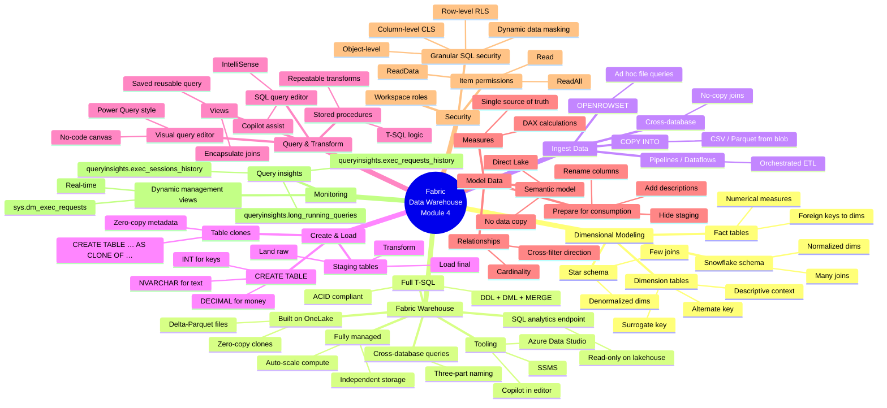

# Module — Get started with data warehouses in Microsoft Fabric

> [!info] Module map
> Path 1 Module 4 in the **Fabric Analytics Engineer** (DP-600) track. This module is the **warehouse deep-dive**: dimensional modeling fundamentals, what makes Fabric's warehouse unique (full T-SQL on Delta/OneLake), how to query/transform/model data, and how to secure and monitor the warehouse.

## 🎯 Learning objectives (synthesized from unit-level goals)

By the end of this module you should be able to:

1. **Explain** dimensional modeling — facts vs. dimensions, surrogate vs. alternate keys, star vs. snowflake schemas.
2. **Describe** a Fabric data warehouse and how it differs from a SQL analytics endpoint.
3. **Create** a warehouse, **define** tables with T-SQL, **ingest** data with `COPY INTO` / `OPENROWSET` / pipelines / cross-database queries, and **clone** tables.
4. **Query** data with the SQL query editor and the Visual query editor, and **transform** data with views and stored procedures.
5. **Model** data in a warehouse — hide internals, define relationships, add measures, and **publish a Direct Lake semantic model**.
6. **Secure** a warehouse with workspace roles, item permissions, RLS, CLS, dynamic data masking, and **monitor** it with Query insights and DMVs.

## 🧠 Module mind map

> [!tip] How to use
> The mind map below is duplicated as a standalone Mermaid file (`Module-Mind-Map.md`) you can open in Obsidian's Mermaid preview or the [Mermaid Live Editor](https://mermaid.live). It is the **single-page view** of the entire module.

## 📑 Unit breakdown

| # | Unit | XP | Minutes | Focus |
|---|------|----|---------|-------|
| 1 | [Introduction](./Unit-1-Introduction.md) | 100 | 3 | Why Fabric warehouse exists |
| 2 | [Understand data warehouses](./Unit-2-Understand-Data-Warehouse.md) | 100 | 7 | Facts, dimensions, star & snowflake |
| 3 | [Understand data warehouses in Fabric](./Unit-3-Understand-Warehouses-Fabric.md) | 100 | 8 | T-SQL on Delta, ingestion, clones |
| 4 | [Query and transform data](./Unit-4-Query-Transform-Data.md) | 100 | 6 | SQL editor, Visual editor, views, procs |
| 5 | [Model data in a warehouse](./Unit-5-Model-Data.md) | 100 | 7 | Relationships, measures, semantic model |
| 6 | [Secure and monitor a warehouse](./Unit-6-Security-Monitor.md) | 100 | 4 | RLS/CLS/masking + Query insights/DMVs |
| 7 | [Exercise — Create and query a warehouse](./Unit-7-Exercise.md) | 100 | 30 | Hands-on lab |
| 8 | [Module assessment](./Unit-8-Module-Assessment.md) | 200 | 10 | 13 knowledge-check questions |
| 9 | [Summary](./Unit-9-Summary.md) | 100 | 1 | Recap + learn-more links |

**Total: 1000 XP · ~76 minutes (~1 hr 16 min)**

## 🔗 Knowledge-check answers (unit 8)

Microsoft Learn does not display the correct answers; the table below is derived from the unit content.

| # | Question topic | Correct answer |
|---|----------------|----------------|
| 1 | Table type for supplier attribute details (claims aggregation) | **Dimension table** |
| 2 | What is a semantic model in the warehouse experience? | **A business-oriented data model that provides a consistent and reusable representation of data across the organization** |
| 3 | Purpose of item permissions in a workspace | **To grant access to individual warehouses for downstream consumption** |
| 4 | Fabric warehouse capability that SQL analytics endpoint lacks | **Writing data using INSERT, UPDATE, DELETE, and MERGE statements** |
| 5 | Key benefit of a star schema | **It simplifies complex queries by reducing the number of joins required** |
| 6 | Restrict sales data to sales-department employees | **Implement Row-level security (RLS) to filter rows based on department** |
| 7 | Snowflake schema dimension structure | **Dimension tables are normalized and split into additional tables based on hierarchical relationships** |
| 8 | Zero-copy clone of `Sales` | **`CREATE TABLE dbo.SalesClone AS CLONE OF dbo.Sales;`** |
| 9 | User sees no rows after RLS is applied | **The user does not meet any condition in the RLS policy's predicate** |
| 10 | Primary role of a dimension table in a star schema | **To provide descriptive context for the numerical data stored in fact tables** |
| 11 | Show financial data to finance department only | **Row-level security (RLS)** |
| 12 | Transform raw sales data via staging into final fact table | **Use INNER JOINs with the DimCustomer and DimProduct tables to merge data from the staging table** |
| 13 | Frequent `DimProduct` updates without duplicating rows | **MERGE statement to efficiently update and insert product details** |

See [[Unit-8-Module-Assessment]] for full reasoning.

## 🧭 Downstream links

- [[Unit-1-Introduction]] · [[Unit-2-Understand-Data-Warehouse]] · [[Unit-3-Understand-Warehouses-Fabric]] · [[Unit-4-Query-Transform-Data]] · [[Unit-5-Model-Data]] · [[Unit-6-Security-Monitor]] · [[Unit-7-Exercise]] · [[Unit-8-Module-Assessment]] · [[Unit-9-Summary]]
- [[Module-Mind-Map]]
- Parent MOC — `../02-Study-Guide-Index/_MOC.md`

## 📚 External references

- Microsoft Learn module page: <https://learn.microsoft.com/en-us/training/modules/get-started-data-warehouse/>
- [Fabric data warehouse docs](https://learn.microsoft.com/en-us/fabric/data-warehouse/data-warehousing)
- [Query the warehouse](https://learn.microsoft.com/en-us/fabric/data-warehouse/query-warehouse)
- [Clone table in Microsoft Fabric](https://learn.microsoft.com/en-us/fabric/data-warehouse/clone-table)
- [What is a star schema?](https://learn.microsoft.com/en-us/power-bi/guidance/star-schema)