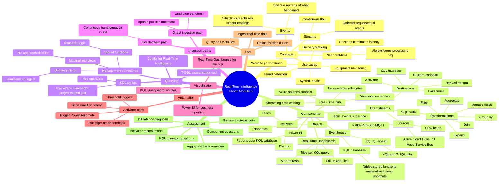

# Module 5 — Real-Time Intelligence in Microsoft Fabric · Mind Map

## 🧭 How to view

- **Obsidian**: open this file, Obsidian will render the Mermaid block natively.
- **Web**: paste into <https://mermaid.live> for an editable SVG.
- **Export**: use the Mermaid CLI (`mmdc`) to render PNG/SVG.

## 🔗 Related

- [[_MOC]] — full module index
- [[Unit-1-Introduction]] · [[Unit-2-Real-Time-Analytics]] · [[Unit-3-RTI-Components]] · [[Unit-4-Ingest-Transform]] · [[Unit-5-Store-Query-KQL]] · [[Unit-6-Visualize-Real-Time]] · [[Unit-7-Automate-Actions]] · [[Unit-8-Exercise]] · [[Unit-9-Module-Assessment]] · [[Unit-10-Summary]]