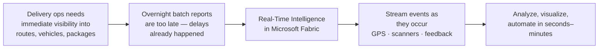

# Unit 1 — Introduction

> [!quote] Source
> Microsoft Learn · Path 1 · Module 5 · Unit 1 · "Introduction"
> <https://learn.microsoft.com/en-us/training/modules/get-started-kusto-fabric/1-introduction>

## 🎯 Purpose

A short framing unit that sets up the **Real-Time Intelligence** scenario before diving into the architecture. The opening uses a delivery-ops scenario: monitoring package movements, vehicle GPS, warehouse scanners, and customer feedback as events occur rather than waiting for overnight batch reports.

## 🏢 Scenario (verbatim from source)

> [!quote] Scenario
> Imagine you're a data analyst for a delivery company, responsible for monitoring package delivery performance across your network of distribution centers, delivery vehicles, and customer routes. Your operations team needs to know immediately when delivery delays occur, which routes are experiencing issues, and how customer satisfaction is trending in real time. Currently, your delivery reports are generated overnight, meaning by the time you identify a problem — such as a vehicle breakdown or weather-related delays — hundreds of packages might already be behind schedule and customers are left waiting without updates.

## 🔑 Key takeaways

- **Real-Time Intelligence in Microsoft Fabric** lets you work with streaming data from GPS trackers, scanners, and notification platforms **as events occur** — not after overnight batch runs.
- Unlike batch, RTI lets you **spot route delays quickly, estimate delivery windows based on current conditions, set up automated customer notifications, and trigger workflows for route optimization**.
- By the end of this module you will understand:
  - **How** the Real-Time Intelligence components work together end-to-end.
  - **How to ingest, process, store, and query** real-time data.
  - **How to visualize** data in motion.
  - **How to automate responses** to changing conditions.

## 🧠 Visual

## 🧭 Next

→ [[Unit-2-Real-Time-Analytics]]
← [[_MOC]]