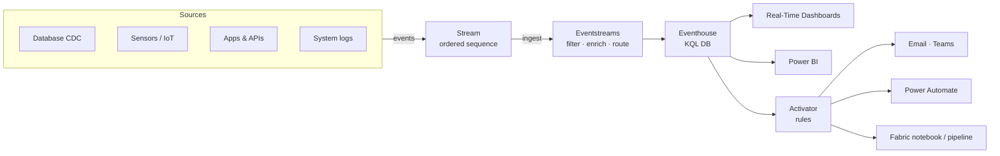

# Unit 2 — What is real-time data analytics?

## 🎯 Why this matters

Before touching any Fabric component, you need the **vocabulary and mental model** for "data in motion". This unit defines *events*, *streams*, and the *five capabilities* every real-time analytics solution must provide.

> [!info] Definition
> **Real-time analytics** is the practice of processing, analyzing, and acting on data as it's generated, typically within **seconds to minutes** of when events occur. Real-time analytics operates on data that's actively flowing through your systems, enabling immediate insights and rapid responses to changing conditions. This approach is also known as **near real-time analytics**, since there's always some degree of processing and network latency involved.

## 🌊 Understand events and streams

> [!info] Event
> An **event** is a **record of something that happens** in a system — a digital record or log entry that documents activity. Examples:
> - Website clicks
> - Stock price changes
> - Customer purchases
> - Patient vital sign changes
> - Equipment sensor readings

> [!info] Stream
> A **stream** is **a sequence of events**, typically ordered by the time an event occurred. Each event in the stream represents something that happened at a specific moment. Examples:
> - A stream of equipment temperature sensor readings contains temperature readings over many points in time.
> - Events flow through streams continuously as they occur.

> [!important] Streams are the delivery mechanism
> Streams carry events from where they happen to where they need to be processed, analyzed, or acted upon. The continuous flow lets you detect patterns over time, identify opportunities or risks, and take action **immediately after something happens** — or in *real-time*.

## 🧩 Components of real-time analytics solutions

| # | Capability | What it does | Fabric realization |
|---|-----------|--------------|--------------------|
| 1 | **Real-time data ingestion** | Collect data from multiple sources simultaneously as information is generated (CDC, sensors, logs, APIs) | **Eventstreams** |
| 2 | **Stream processing** | Transform and analyze data while it flows: filter, aggregate, join, detect patterns with minimal latency | **Eventstream transformations** |
| 3 | **Low-latency storage** | Specialized databases for high-velocity writes and fast queries | **Eventhouse** (KQL databases) |
| 4 | **Interactive dashboards** | Visualizations that update automatically as new data arrives | **Real-Time Dashboards**, **Power BI** |
| 5 | **Automated decision making** | Event-driven rules/triggers that initiate actions, alerts, or workflows | **Activator** |

## 🎯 What real-time analytics enables

- **Respond immediately** to opportunities or problems as they emerge
- **Optimize operations** by adjusting resources and configurations based on current conditions
- **Enhance customer experiences** through personalized, contextual interactions
- **Prevent issues** by detecting anomalies before they become critical problems

## 🏗️ How Real-Time Intelligence fits

> [!quote] Source
> Real-Time Intelligence in Microsoft Fabric brings all these capabilities together in a single platform. Through components like **Eventstreams** for data ingestion and transformation, **Eventhouses** for analytics-optimized storage, the **Real-Time hub** for data discovery, **Real-Time Dashboards** for visualization, and **Activator** for automated alerts and actions, Real-Time Intelligence enables you to **monitor critical events, trigger automated responses, track business processes, and analyze patterns in real-time**, turning what happens in your systems into actionable insights.

## 🧠 Visual

## 🔑 Key terms (flashcards)

- **Event** — A record of something that happened at a specific moment.
- **Stream** — A sequence of events ordered by time.
- **Near real-time** — Real-time analytics with some processing/network latency (seconds to minutes, not zero).
- **Eventstream** — Fabric's ingestion + transformation component for streaming data.
- **Eventhouse** — Fabric's analytics-optimized storage layer (KQL databases).
- **Activator** — The no-code automation layer that turns conditions into actions.
- **Real-Time hub** — The streaming-data catalog and discovery surface.

## 🧭 Next

→ [[Unit-3-RTI-Components]]
← [[Unit-1-Introduction]]
↑ [[_MOC]]