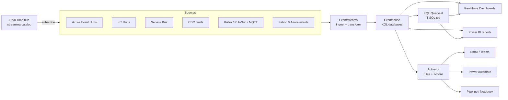

# Unit 3 — Real-Time Intelligence in Microsoft Fabric

## 🎯 Why this matters

This is the **component-overview unit** — the module's "what's in the box" page. Before any of the four pipeline stages, you need a working mental map of the six Real-Time Intelligence components and how they hand work to each other.

## 🌍 Use cases

| Use case | Description |
|----------|-------------|
| **Delivery tracking** | Monitor vehicle locations to alert customers when packages are delayed |
| **Equipment monitoring** | Track machine temperature to prevent costly breakdowns |
| **Fraud detection** | Analyze purchase patterns to block suspicious transactions immediately |
| **Website performance** | Monitor page load times to improve user experience |
| **System health** | Track application errors to maintain service reliability |

## 🧩 The six RTI components

> [!info] Integrated set
> Real-Time Intelligence is an **integrated set of components** that work together to handle streaming data **from capture through automated response**. Each component handles a specific stage of the real-time analytics process.

### 1️⃣ Eventstreams — ingest & process data in motion

> [!tip] Eventstream
> **Eventstreams** capture streaming data from various sources and apply real-time transformations as data flows through the system. They can **filter, enrich, and transform** your data and **route** it to different destinations.

### 2️⃣ Eventhouse — store real-time data

> [!tip] Eventhouse
> **Eventhouses** store data in **KQL (Kusto Query Language) databases** that are designed for **time-series data** and **fast ingestion of streaming data**. The storage integrates with **OneLake**, making your data available to other Fabric tools.

### 3️⃣ KQL Queryset — analyze data

> [!tip] KQL Queryset
> **KQL Queryset** provides a workspace for running and managing queries against KQL databases. The Queryset lets you **save queries for future use**, **organize multiple query tabs**, and **share queries** for collaboration. It also supports **T-SQL** alongside KQL.

### 4️⃣ Real-Time Dashboard — visualize insights

> [!tip] Real-Time Dashboard
> **Real-Time Dashboards** connect directly to KQL databases and **refresh automatically as new data arrives**. They let you explore data interactively and monitor **current conditions and historical trends**.

### 5️⃣ Activator — act on data

> [!tip] Activator
> **Activator** continuously monitors streaming data against user-defined rules and thresholds. When conditions are met, Activator can **send notifications**, **trigger Power Automate workflows**, or **execute Fabric data pipelines or notebooks** — creating event-driven automation that responds to real-time conditions.

### 6️⃣ Real-Time hub — discover streaming data

> [!info] Real-Time hub
> The Fabric **Real-Time hub** is a central location where you can discover and manage all of the **data-in-motion** you have access to. It gives you a way to **ingest streaming data from Azure and external sources** and lets you **subscribe to Azure and Fabric events**.

> [!quote] Source
> Think of the Real-Time hub as your **streaming data catalog** where you can see what's happening in near real-time across your organization.

## 🗂️ Real-Time hub categories

| Category | What it offers |
|----------|---------------|
| **Data sources** | Browse and connect to available streaming data sources: Microsoft sources, database CDC feeds, external sources from other cloud providers |
| **Azure sources** | Discover and configure Azure streaming sources: Azure IoT Hub, Azure Service Bus, Azure Data Explorer DB, etc. |
| **Fabric events** | Subscribe to system-generated events: job status changes, actions on files/folders in OneLake, Fabric workspace item changes |
| **Azure events** | Subscribe to system events from Azure services (e.g., actions on files/folders in Azure Blob Storage) |

> [!tip] Accessing the Real-Time hub
> Select the **Real-Time** icon in the main Fabric menu bar.

> [!important] From discovery to action
> Once you have configured a connection to a data source or event source, those items become the **foundation for event-driven decision making** and a wide range of real-time analytics solutions — from building dashboards and setting up alerts to triggering automated workflows and analyzing trends.

## 🧠 Visual — end-to-end RTI pipeline

## 🔑 Key terms (flashcards)

- **Eventstream** — Ingestion + transformation component for streaming data.
- **Eventhouse** — Analytics-optimized storage layer hosting KQL databases.
- **KQL (Kusto Query Language)** — Pipe-syntax query language for time-series data.
- **KQL Queryset** — Workspace for authoring, saving, and sharing KQL queries.
- **Real-Time Dashboard** — KQL-tile-based dashboard that refreshes as new data arrives.
- **Activator** — Rules engine that turns streaming conditions into notifications / workflows.
- **Real-Time hub** — Streaming-data catalog and discovery surface in Fabric.
- **OneLake** — Fabric's single, unified data lake (Eventhouse data lands here too).

## 🧭 Next

→ [[Unit-4-Ingest-Transform]]
← [[Unit-2-Real-Time-Analytics]]
↑ [[_MOC]]