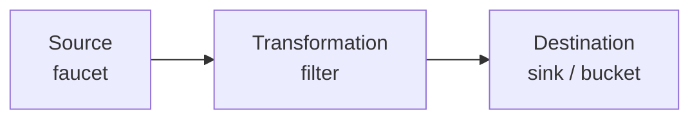
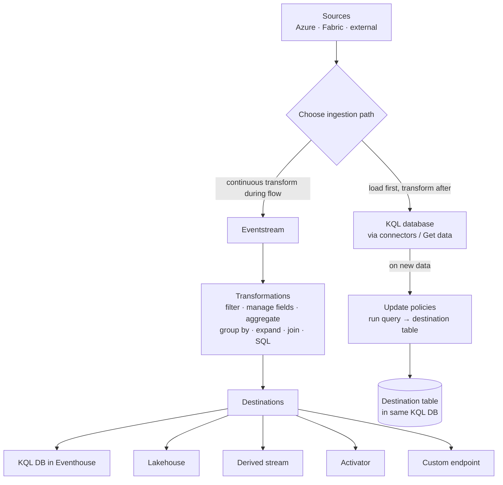

# Unit 4 — Ingest and transform real-time data

## 🎯 Why this matters

This unit is about **how data gets in** and **how it gets reshaped** before storage. There are **two primary paths** into a real-time analytics solution in Fabric:

1. **Eventstream path** — continuous ingestion with in-line transformation.
2. **Direct-ingestion path** — load directly into a KQL database, then transform with **update policies**.

> [!important] Two paths, different timing
> **Eventstream** transforms *during* stream processing, **before** data reaches a destination. **Direct ingestion** lands data in the KQL database *first*, then transforms it via update policies.

## 🛠️ Eventstreams for data ingestion and transformation

> [!info] Eventstream
> Eventstreams bring real-time events into Fabric, transform them, and route them to a destination.

### The three Eventstream components (water-pipe analogy)

> [!quote] Source
> Think of the Eventstream components like a water pipe system. The **source** is your faucet, **transformations** are filters along the way, and you need a **destination** like a sink or bucket to collect and use the water.

## 📥 Data sources for Eventstreams

| Source category | Examples |
|-----------------|----------|
| **Microsoft sources** | Azure Event Hubs, Azure IoT Hubs, Azure Service Bus, CDC feeds in database services |
| **Azure events** | Azure Blob Storage events |
| **Fabric events** | Changes to items in a Fabric workspace, data changes in OneLake data stores, Fabric job events |
| **External sources** | Apache Kafka, Google Cloud Pub/Sub, MQTT (preview) |

> [!tip] Full list
> See [Supported sources](https://learn.microsoft.com/en-us/fabric/real-time-intelligence/event-streams/add-manage-eventstream-sources?pivots=enhanced-capabilities#supported-sources).

## 🔄 Eventstream transformations

> [!important] Why transform
> Raw data from a source system is rarely in the exact format you need for analysis or storage. Transformations are what make your data **useful and actionable**.

You can transform data **as it flows** in an Eventstream, enabling you to filter, summarize, and reshape it **before storing it**.

Available transformations include:

- **SQL code**
- **Filter**
- **Manage fields**
- **Aggregate**
- **Group by**
- **Expand**
- **Join**

> [!tip] Full list
> See [Process event data with event processor editor](https://learn.microsoft.com/en-us/fabric/real-time-intelligence/event-streams/process-events-using-event-processor-editor) and [Process events using SQL code editor](https://learn.microsoft.com/en-us/fabric/real-time-intelligence/event-streams/process-events-using-sql-code-editor).

## 🎯 Data destinations in Eventstreams

> [!quote] Source
> Streaming data flows continuously and is temporary by nature. It requires immediate processing and storage to retain its value. The destination in an eventstream is what makes your real-time data processing actionable.

Destinations you can load to:

- **KQL database** in an Eventhouse
- **Lakehouse**
- **Derived stream**
- **Fabric Activator**
- **Custom endpoint**

> [!tip] Full list
> See [Add and manage a destination in an eventstream](https://learn.microsoft.com/en-us/fabric/real-time-intelligence/event-streams/add-manage-eventstream-destinations).

## 🗄️ Direct ingestion into a KQL database in an Eventhouse

> [!info] Direct ingestion
> Data can also be directly ingested into a KQL (Kusto Query Language) database in an Eventhouse. Some examples of data ingestion sources include: **local files, Azure storage, Amazon S3, Azure Event Hubs, OneLake, and more**.

Data ingestion is configured using **connectors** or through the **Get data** option in a KQL database.

> [!tip] Full list
> See [Data sources](https://learn.microsoft.com/en-us/fabric/real-time-intelligence/get-data-overview) and [Data connectors overview](https://learn.microsoft.com/en-us/fabric/real-time-intelligence/data-connectors/data-connectors).

## 🔧 Data transformation with update policies

> [!important] After-arrival transformation
> When directly ingesting data into a KQL database, data **first lands in the database**, then can be transformed using **update policies**. This is different from Eventstream transformations that occur **during** stream processing, before routing data to a destination.

> [!info] Update policies
> **Update policies** are automation mechanisms triggered when new data is written to a table. They run a query to **transform ingested data** and **save the result to a destination table**.

## 🧠 Visual — choose your path

## 🔑 Key terms (flashcards)

- **Eventstream** — Source → transformation → destination pipeline for streaming data.
- **Source** — Where stream data originates (Azure, Fabric, external).
- **Transformation** — In-line reshape (filter, aggregate, join, etc.) before storage.
- **Destination** — Where transformed stream lands (KQL DB, Lakehouse, Activator, …).
- **Direct ingestion** — Loading data straight into a KQL database without an Eventstream.
- **Update policy** — A triggered query that transforms newly-ingested data into a destination table.

## 🧭 Next

→ [[Unit-5-Store-Query-KQL]]
← [[Unit-3-RTI-Components]]
↑ [[_MOC]]