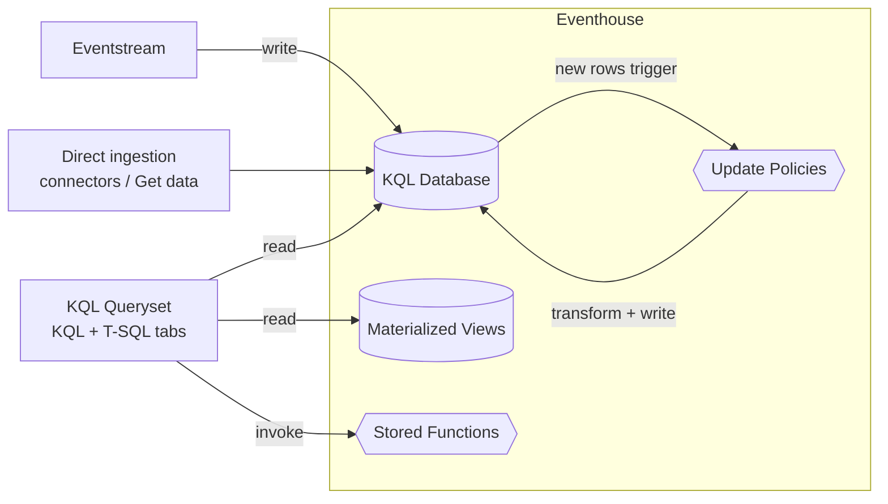

# Unit 5 — Store and query real-time data

## 🎯 Why this matters

Once data has landed (via [[Unit-4-Ingest-Transform]]), the **KQL database in an Eventhouse** is where it lives and where you **query it**. This unit teaches the data model inside an Eventhouse, the **KQL query language**, and the **management commands** that automate ongoing processing.

## 🏛️ Eventhouse structure

> [!info] Eventhouse
> Within an Eventhouse you can create:
>
> - **KQL databases** — Real-time-optimized data stores that host a collection of **tables**, **stored functions**, **materialized views**, **shortcuts**, and **data streams**.
> - **KQL querysets** — Collections of KQL queries you can use to work with data in KQL database tables. A KQL queryset supports queries written using **Kusto Query Language (KQL)** or a **subset of the T-SQL** language.

## ⚡ The power of KQL

> [!quote] Source
> **KQL is specifically designed for analyzing large volumes of structured, semi-structured, and unstructured data with exceptional performance.** KQL databases are optimized for **time-series data** and **index incoming data by ingestion time** and **partition it for optimal query performance**.

> [!tip] Where else KQL is used
> KQL is the same language used in **Azure Data Explorer**, **Azure Monitor Log Analytics**, **Microsoft Sentinel**, and **Microsoft Fabric**. Learning KQL once transfers across all of them.

## 📝 KQL syntax

> [!info] Syntax
> KQL queries are made of one or more **query statements**. A query statement consists of a **table name** followed by operators that **take**, **filter**, **transform**, **aggregate**, or **join** data.

### Basic — print 10 rows

```kql
stock
| take 10
```

### Intermediate — average price over last 5 minutes

```kql
stock
| where ["time"] > ago(5m)
| summarize avgPrice = avg(todouble(bidPrice)) by symbol
| project symbol, avgPrice
```

> [!tip] Full language reference
> See [Kusto Query Language (KQL) overview](https://learn.microsoft.com/en-us/kusto/query/).

### Common pipe operators

| Operator | Purpose | Example fragment |
|----------|---------|------------------|
| `take` | Return the first *N* rows | `| take 10` |
| `where` | Filter rows | `\| where ["time"] > ago(5m)` |
| `summarize` | Aggregate (group-by) | `\| summarize avgPrice = avg(bidPrice) by symbol` |
| `project` | Select / rename columns | `\| project symbol, avgPrice` |
| `extend` | Compute new columns | `\| extend day = startofday(["time"])` |
| `join` | Combine two tables on a key | `\| join kind=inner SymbolRef on symbol` |
| `sort` / `order` | Order rows | `\| sort by avgPrice desc` |

## ⚙️ Automate data processing with management commands

> [!important] Beyond basic queries
> Beyond basic querying, you can automate data processing through **management commands**. These run server-side and persist as part of the database.

| Command | What it does |
|---------|--------------|
| **Update policies** | Automatically transform incoming data and save it to different tables as it arrives. |
| **Materialized views** | Precalculate and store summary results for faster queries. |
| **Stored functions** | Save frequently used query logic that you can reuse across multiple queries. |

> [!tip] Deep dive
> See [Work with real-time data in a Microsoft Fabric Eventhouse](https://learn.microsoft.com/en-us/training/modules/query-data-kql-database-microsoft-fabric/) — detailed examples of update policies, materialized views, and stored functions.

## 🧮 Other query options

### Using T-SQL

> [!info] T-SQL subset
> KQL databases in Eventhouses support a **subset of common T-SQL expressions** for data professionals already familiar with T-SQL syntax. Example:

```sql
SELECT TOP 10 * FROM stock;
```

### Copilot for Real-Time Intelligence

> [!tip] Copilot
> Microsoft Fabric includes **Copilot for Real-Time Intelligence**, which can help you write queries to extract insights from your Eventhouse data. Copilot uses AI to understand what you're looking for and can **generate the required query code**.

> See [Copilot for Real-Time Intelligence](https://learn.microsoft.com/en-us/fabric/real-time-intelligence/copilot-writing-queries).

## 🧠 Visual — query pipeline



## 🔑 Key terms (flashcards)

- **KQL (Kusto Query Language)** — Pipe-syntax, time-series-optimized query language.
- **KQL Queryset** — Workspace for authoring, saving, and sharing KQL queries.
- **T-SQL subset** — SQL surface available inside a KQL database.
- **Update policy** — Triggered transform of newly ingested rows.
- **Materialized view** — Pre-aggregated table that speeds up dashboards.
- **Stored function** — Reusable, parameterized KQL logic.
- **Copilot for RTI** — AI assistant that generates KQL from natural language.

## 🧭 Next

→ [[Unit-6-Visualize-Real-Time]]
← [[Unit-4-Ingest-Transform]]
↑ [[_MOC]]