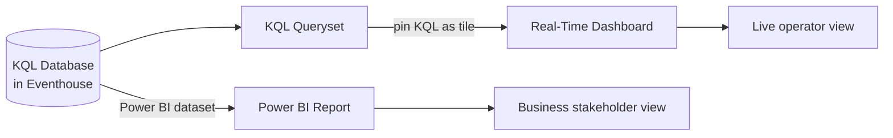

# Unit 6 — Visualize real-time data

## 🎯 Why this matters

After ingestion ([[Unit-4-Ingest-Transform]]) and storage/query ([[Unit-5-Store-Query-KQL]]), you need a **surface** where business users can watch the data move. Fabric RTI gives you two complementary options:

- **Real-Time Dashboards** — KQL-native tiles, optimized for *live* signal.
- **Power BI reports** — Familiar BI surface over a KQL database.

## 📊 Real-Time Dashboards

> [!info] Real-Time Dashboard
> Real-Time Dashboards provide a way to **pin data visualizations** to a single visual interface, enabling you to surface real-time insights at a glance. Each **tile** in a dashboard shows you different information based on a **KQL query** that extracts real-time data from tables in an Eventhouse.

### How a dashboard is composed

| Building block | Description |
|----------------|-------------|
| **Dashboard** | A workspace-level artifact that hosts one or more tiles. |
| **Tile** | A visualization driven by a single KQL query expression. |
| **Default visualization** | Table (the raw query result). |
| **Custom visualization** | Edit the tile to change the chart type and formatting. |

> [!tip] Two creation paths
> You can create a Real-Time Dashboard in a workspace and then configure its source, **or** create one directly from a **KQL queryset** in an Eventhouse.

### Interactive behavior

When published, tiles let you **explore the data interactively**:

- **Drill into** the underlying data.
- **Filter and aggregate** through the visual interface.
- **Change the visualization type** on the fly.

> [!tip] Full guide
> See [Create a Real-Time Dashboard](https://learn.microsoft.com/en-us/fabric/real-time-intelligence/dashboard-real-time-create).

## 📈 Visualize real-time data with Power BI

> [!quote] Source
> You also can create **Power BI reports** from your KQL database data.

> [!tip] Full guide
> See [Visualize data in a Power BI report](https://learn.microsoft.com/en-us/fabric/real-time-intelligence/create-powerbi-report).

## 🧠 Visual — two visualization surfaces

## 🤔 When to use which?

| Scenario | Better fit |
|----------|-----------|
| Live operational monitoring (NOC-style tiles, low-latency refresh) | **Real-Time Dashboard** |
| Rich, paginated, governance-friendly business reporting | **Power BI** |
| Ad-hoc KQL exploration that you want to share | **KQL Queryset → pin to Dashboard** |
| Existing Power BI estate and audience | **Power BI over KQL** |

## 🔑 Key terms (flashcards)

- **Real-Time Dashboard** — Tiled dashboard surface where each tile runs a KQL query.
- **Tile** — A single KQL-driven visualization inside a Real-Time Dashboard.
- **Power BI over KQL** — Power BI report authored against a KQL database.
- **KQL Queryset → Dashboard** — The quick path from a saved query to a pinned tile.

## 🧭 Next

→ [[Unit-7-Automate-Actions]]
← [[Unit-5-Store-Query-KQL]]
↑ [[_MOC]]