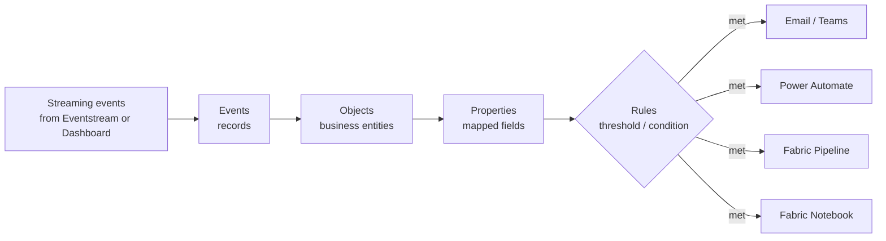

# Unit 7 — Automate actions

## 🎯 Why this matters

Dashboards ([[Unit-6-Visualize-Real-Time]]) tell humans what's happening. **Activator** turns the same conditions into **automated responses** — no human in the loop. It is the **act on data** component of the RTI pipeline.

> [!info] Activator
> **Activator** is a technology in Microsoft Fabric that enables automated processing of events that trigger actions. For example, you can use Activator to **notify you by email** when a value in an Eventstream deviates from a specific range, or to **run a notebook** to perform some Spark-based data processing logic when a Real-Time Dashboard is updated.

> [!quote] Source
> Activator can help you in various scenarios, such as **dynamic inventory management**, **real-time customer engagement**, and **effective resource allocation in cloud environments**. It's a powerful tool for any circumstance that requires real-time data analysis and automated actions.

## 🧠 Activator's four core concepts

> [!important] The mental model
> Activator operates based on **four core concepts**: **Events**, **Objects**, **Properties**, and **Rules**.

| Concept | Definition | Example |
|---------|------------|---------|
| **Event** | Each record in a stream of data represents an *event* that has occurred at a specific point in time. | A sensor reading at 10:01:23 |
| **Object** | The data in an event record can be used to represent an *object*, such as a sales order, a sensor, or some other business entity. | The freezer whose temperature was just measured |
| **Property** | The fields in the event data can be mapped to *properties* of the business object, representing some aspect of its state. | A `temperature` field → a property of the freezer; a `total_amount` field → the sales-order total |
| **Rule** | The key to using Activator to automate actions based on events is to define *rules* that set conditions under which an action is triggered based on the property values of objects referenced in events. | Email the maintenance manager if a freezer's `temperature` property exceeds a threshold |

> [!quote] Source
> For example, you might define a rule that **sends an email to a maintenance manager if the temperature measured by a sensor exceeds a specific threshold**.

## 🎯 Use cases for Activator

> [!quote] Source
> Use Activator to:
>
> - Initiate marketing actions when product sales drop.
> - Send notifications when temperature changes could affect perishable goods.
> - Flag real-time issues affecting the user experience on apps and websites.
> - Trigger alerts when a shipment hasn't been updated within an expected time frame.
> - Send alerts when a customer's account balance crosses a certain threshold.
> - Respond to anomalies or failures in data processing workflows immediately.
> - Run ads when same-store sales decline.
> - Alert store managers to **move food from failing grocery store freezers before it spoils**.

## 🛠️ Actions Activator can trigger

| Action | Typical use |
|--------|-------------|
| **Email / Teams notification** | On-call alerts when a threshold trips |
| **Power Automate flow** | Broader orchestration: ticketing, approvals, CRM updates |
| **Fabric data pipeline** | Downstream ETL/ELT in response to a condition |
| **Fabric notebook** | Custom Spark processing when a dashboard updates |

## 🧠 Visual — Activator data flow

## 🔑 Key terms (flashcards)

- **Activator** — The no-code automation layer of Fabric RTI.
- **Event** — A record in a stream at a point in time.
- **Object** — A business entity represented by event data.
- **Property** — A mapped field representing an aspect of an object.
- **Rule** — A condition over property values that triggers an action.
- **Event-driven automation** — Pattern where streaming conditions initiate workflows.

## 🧭 Next

→ [[Unit-8-Exercise]]
← [[Unit-6-Visualize-Real-Time]]
↑ [[_MOC]]